# Lab 1 - Proactive Outbound Reach 📞

## Lab Purpose

In this lab, you will configure the **Webex Contact Center (WxCC) Campaign Manager** to initiate proactive outbound calls to customers with an upcoming debt maturity. This lab builds the complete outbound infrastructure that **Lab 2** relies on — the AI Agent you configure there will handle every live call launched here.

**Webex Campaign Management** is an add-on module for the **Webex Contact Center** platform that gives administrators and supervisors the tools to configure, manage, and optimise outbound communication campaigns. It is accessed through **Webex Control Hub**, the unified administration console that centralises management of all WxCC services.

The module supports agent-assisted campaigns using preview, progressive, and predictive dialling modes, as well as fully agentless IVR campaigns that automate outbound interactions without live agent involvement.

**Key features include:**

- **Dialling Schedule Management**: Define allowable calling windows to ensure compliance with time-based regulations and customer preferences.
- **Contact List Handling**: Upload one or more contact lists from a local system or SFTP location for targeted outreach.
- **Suppression Rules**: Apply suppression rule sets to avoid calling restricted or unwanted numbers.
- **Automated Retry Logic**: Configure retry attempts with customisable intervals for contacts not reached or calls that failed.
- **Compliance Enforcement**: Integrate compliance settings directly into campaign workflows, including Do Not Contact (DNC) lists and regional restrictions.

???+ purpose "Lab Objectives"
    The purpose of this lab is to build the full outbound campaign infrastructure for the **Proactive Debt Collection** use case.

    Key objectives include:

    * **Control Hub Configuration:** Create users, teams, queues, and global variables that the campaign depends on.
    * **Flow Builder:** Build a dummy validation flow and the outbound campaign flow with complete event handling.
    * **Campaign Manager Setup:** Configure all pre-requisites — contact modes, field mappings, suppression rules, meta-tags, telephony outcomes, and wrap-up codes.
    * **Campaign Activation:** Create, activate, and validate a Progressive IVR outbound campaign end to end.

???+ Challenge "Lab Outcome"
    By the end of Lab 1, you will have a fully operational outbound campaign infrastructure. The campaign will be capable of:

    1. **Dialling contacts** from an uploaded CSV contact list using Progressive IVR mode.
    2. **Routing answered calls** through a WxCC flow that passes customer data to a destination flow.
    3. **Handling all call outcomes** — AMD, Abandoned, and Live Voice — using event-driven flow logic.
    4. **Delivering a confirmation message** to verify that the full outbound path works end to end.

---

## Pre-requisites

In order to be able to complete this lab, you must:

* [x] Have access to a **Webex Contact Center** tenant with **Campaign Manager** enabled
* [x] Have **administrator access** to Webex Control Hub
* [x] Have completed the [Pre-requisites](pre_req_wxcc.md) section of this Bootcamp

---

## Lab Overview 📌

A high-level architecture overview of the different WxCC modules involved in this lab:

<figure markdown>

</figure>

In this lab you will perform the following tasks:

1. Configure Agents, Teams, Queues, and Global Variables in Control Hub
2. Create a dummy validation flow
3. Create the Outbound Campaign Flow with full event handling
4. Create the Entry Point (Channel) and configure the Outdial ANI
5. Configure Business Hours in Control Hub
6. Configure all Campaign Manager pre-requisites
7. Create and activate the Campaign
8. Upload the Contact List and test end to end

---

## Lab 1.1 - Configure Agents and Teams in Control Hub

Before building any flows or campaigns, you need to set up the foundational WxCC resources: a licensed agent user, a team, an out-dial queue, and the global variables that carry customer data through the entire lab series.

### Create a User and Assign the Contact Center Licence

???+ webex "Create User and Assign Licence"

    1. Navigate to [Control Hub](https://admin.webex.com) and go to **Users**.
    2. Click **Manage Users** and add or invite the user account that will act as the agent for this lab.
    3. Open the user profile and assign the **Webex Contact Center** licence — select either **Standard** or **Premium** depending on your tenant configuration.

    <figure markdown>
    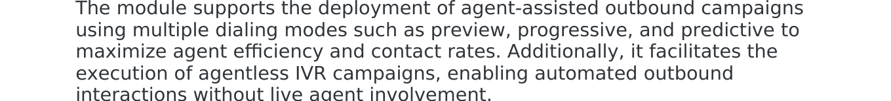
    </figure>

    <figure markdown>
    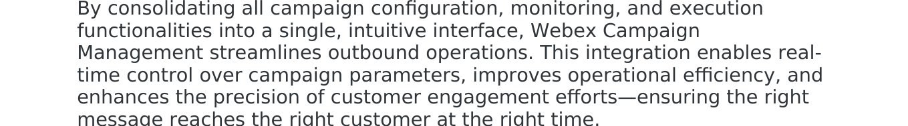
    </figure>

### Create a Team

???+ webex "Create Team"

    1. In Control Hub, navigate to **Contact Center** → **Teams**.
    2. Click **Create Team**.
    3. Enter a meaningful team name (e.g. `DebtCollection_Team`) and associate the user created above.
    4. Click **Save**.

    <figure markdown>
    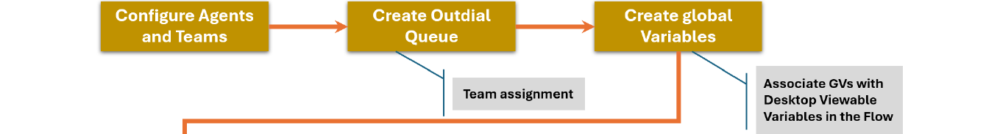
    </figure>

### Enable Contact Center for the User

???+ webex "Enable Contact Center and Configure Agent"

    1. Navigate to **Users** and open the user you created.
    2. Under the **Contact Center** tab, set **Contact Center Enabled** to **On**.
    3. Assign the team and configure the desktop profile as appropriate.
    4. Click **Save**.

    <figure markdown>
    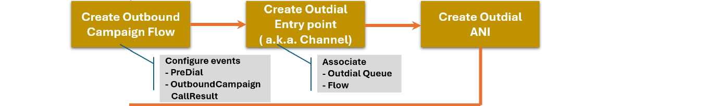
    </figure>

### Create an Out-Dial Queue

The out-dial queue is the routing destination for answered outbound calls. Campaign Manager uses this queue to connect live calls to agents or IVR flows.

???+ webex "Create Out-Dial Queue"

    1. Navigate to **Contact Center** → **Queues**.
    2. Click **Create Queue**.
    3. Set the **Queue Type** to **Outdial**.
    4. Enter a name (e.g. `OutDial_DebtCollection`) and assign the team you created above.
    5. Click **Save**.

    <figure markdown>
    
    </figure>

    <figure markdown>
    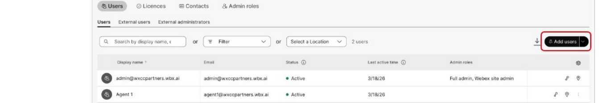
    </figure>

### Configure Global Variables

Global variables carry customer data — first and last name — from the contact list through the campaign flow and all the way to the AI Agent in Lab 2. They also appear on the Agent Desktop during escalated calls.

???+ webex "Create Global Variables"

    1. In Control Hub, navigate to **Contact Center** → **Flows** → **Global Variables**.
    2. Create the following two variables:

        | Variable Name | Type | Description |
        | :--- | :--- | :--- |
        | `firstName` | `String` | Customer first name, mapped from the contact list |
        | `lastName` | `String` | Customer last name, mapped from the contact list |

    3. Click **Save** after creating each variable.

    <figure markdown>
    
    </figure>

    ???+ warning
        These exact variable names — `firstName` and `lastName` — are referenced by the AI Agent in Lab 2. Do not use different casing or names, or the data mapping will break downstream.

### Configure a Wrap-up Code

Wrap-up codes are applied by agents after a call to classify the interaction outcome. Campaign Manager uses them to determine whether a contact should be retried. At least one must be configured before creating the campaign.

???+ webex "Create Wrap-up Code"

    1. In Control Hub, navigate to **Contact Center** → **Wrap-up Codes**.
    2. Click **Create Wrap-up Code**.
    3. Enter the name `debt` and a short description.
    4. Click **Save**.

    <figure markdown>
    
    </figure>

---

## Lab 1.2 - Create the Dummy Validation Flow

Before building the campaign flow, you will create a simple dummy destination flow. Its only purpose is to confirm that an outbound call successfully reached its destination — it plays a congratulations message and ends the call. You will reuse this same flow as the target in Lab 2 until the AI Agent is configured.

???+ webex "Create the Dummy Flow"

    1. Navigate to **Contact Center** → **Flows** and click **Create Flow**.
    2. Name the flow: <copy>`Dummy_Lab1_Validation`</copy>
    3. Select **Start from Scratch** and click **Create**.
    4. Open **Flow Properties** and add `firstName` and `lastName` as **Global Variables** — this is required so the Lab 2 flow can map values into this flow correctly.

    <figure markdown>
    
    </figure>

    5. Drag a **Play Message** node onto the canvas and connect it to the **Start** node.
    6. In the node properties, enable **Text-to-Speech** and set the connector to **Cisco Cloud Text-to-Speech**. Enter the following message:

        ```text
        Congratulations, you have completed Lab 1.
        ```

    7. Connect the **Play Message** node to the **Disconnect Contact** node.
    8. Click **Validate**, then **Save and Publish** the flow.

    <figure markdown>
    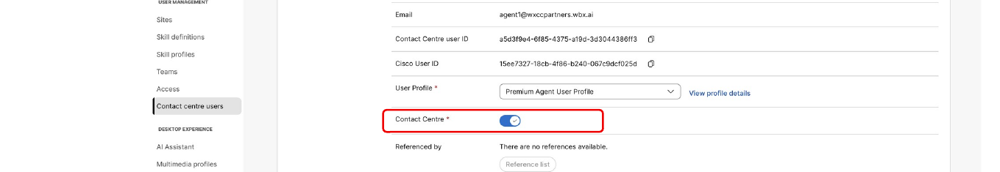
    </figure>

---

## Lab 1.3 - Create the Outbound Campaign Flow

The outbound campaign flow is the core of the Lab 1 WxCC configuration. It handles the lifecycle of each dialled call and routes answered calls to the correct destination based on the call result.

### Main Flow

???+ webex "Create the Outbound Campaign Flow"

    1. Navigate to **Contact Center** → **Flows** and click **Create Flow**.
    2. Name the flow: <copy>`Outbound_DebtCollection`</copy>
    3. Select **Start from Scratch** and click **Create**.
    4. Open **Flow Properties** and add `firstName` and `lastName` as **Global Variables** — Campaign Manager populates these from the contact list and the Go To node passes them downstream to the AI Agent flow.

    <figure markdown>
    
    </figure>

### Event Flows

The outbound campaign uses **Event Flows** to handle different call lifecycle events. Click the **Event Flows** tab at the top of the flow editor to configure them.

<figure markdown>

</figure>

#### OutboundCampaignCallResult Event

This event fires when the dialler receives a result for a call attempt. You will use a **Case** node to branch the logic based on the CPA (Call Progress Analysis) outcome.

???+ webex "Configure OutboundCampaignCallResult"

    1. In the **Event Flows** tab, select the **OutboundCampaignCallResult** event.

    <figure markdown>
    
    </figure>

    2. Drag a **Case** node onto the canvas and connect the event trigger to it.
    3. In the Case node properties, set the **Variable** to the `CPA` output from the preceding node.
    4. Create **three output branches**:

        | Branch Name | Meaning |
        | :--- | :--- |
        | `AMD` | Answer Machine Detection — voicemail or answering machine picked up |
        | `Abandoned` | Call was abandoned before connection |
        | `Live_Voice_IVR_CAM` | A live person answered the call |

    <figure markdown>
    
    </figure>

    **Handle AMD and Abandoned outcomes:**

    5. Drag a **Play Message** node onto the canvas.
    6. Connect **both** the `AMD` and `Abandoned` outputs of the Case node to it.
    7. Enable **Text-to-Speech**, select **Cisco Cloud Text-to-Speech**, and enter:

        ```text
        Goodbye.
        ```

    <figure markdown>
    
    </figure>

    **Handle Live Voice outcome:**

    8. Drag a **Go To** node onto the canvas and connect the `Live_Voice_IVR_CAM` output to it.
    9. Configure the **Go To** node to point to the `Dummy_Lab1_Validation` flow created in Lab 1.2.

    ???+ warning
        You **must map the Global Variables** (`firstName`, `lastName`) from the current flow to the destination flow in the Go To node configuration. Without this mapping, the AI Agent in Lab 2 will not receive customer name data.

    <figure markdown>
    
    </figure>

#### AgentAnswered Event

This event fires when an agent answers an escalated call. Configuring it now enables the AI Assistant media streaming features used in Lab 2 and Lab 3.

???+ webex "Configure AgentAnswered Event"

    1. In the **Event Flows** tab, select the **AgentAnswered** event.
    2. Drag a **StartMediaStream** node onto the canvas and connect the event trigger to it.
    3. Leave the default configuration and connect the node to an **End** node.

    <figure markdown>
    
    </figure>

4. Click **Validate**, then **Save and Publish** the flow.

---

## Lab 1.4 - Create the Entry Point and Configure the Outdial ANI

### Create the Entry Point (Channel)

The Entry Point — also called a Channel — is the outbound dialling gateway. It ties together the telephony type, the flow, and the queue into a single callable resource that Campaign Manager uses when launching calls.

???+ webex "Create the Entry Point"

    1. In Control Hub, navigate to **Contact Center** → **Channels**.
    2. Click **Create Channel**.
    3. Fill in the following details:

        | Parameter | Value |
        | :--- | :--- |
        | **Name** | `OutDial_DebtCollection_EP` |
        | **Channel Type** | `Outbound Telephony` |
        | **Flow** | Select `Outbound_DebtCollection` |
        | **Outbound Queue** | Select the out-dial queue created in Lab 1.1 |

    4. Click **Save**.

    <figure markdown>
    
    </figure>

### Configure the Outdial ANI

The Outdial ANI is the PSTN number displayed to customers when the campaign dials them. Without it, outbound calls may show as unknown or be blocked by mobile carriers.

???+ webex "Configure Outdial ANI"

    1. In Control Hub, navigate to **Contact Center** → **Outdial ANI**.
    2. Click **Create Outdial ANI**.
    3. Enter a valid PSTN number in E.164 format (e.g. `+12025551234`) and give it a descriptive name.
    4. Click **Save**.

    <figure markdown>
    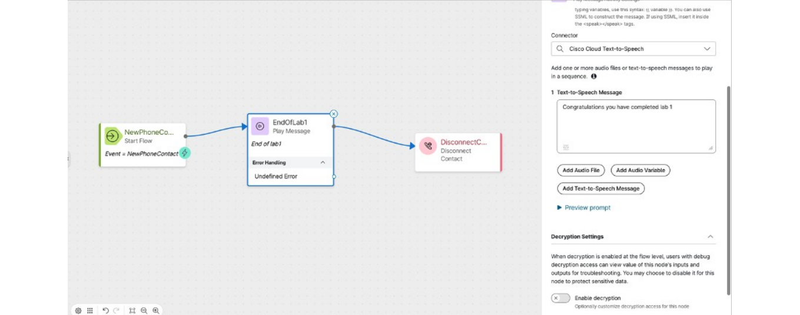
    </figure>

---

## Lab 1.5 - Configure Business Hours

Campaign Manager reads Business Hours directly from Webex Control Hub. Within Campaign Manager you can only enable or disable individual days — the schedule structure is always defined in Control Hub first.

???+ webex "Create Business Hours"

    1. In Control Hub, navigate to **Contact Center** → **Business Hours**.
    2. Click **Create Business Hours** and give it a name (e.g. `DebtCollection_BusinessHours`).
    3. Configure the schedule type and working hours as shown below.

    <figure markdown>
    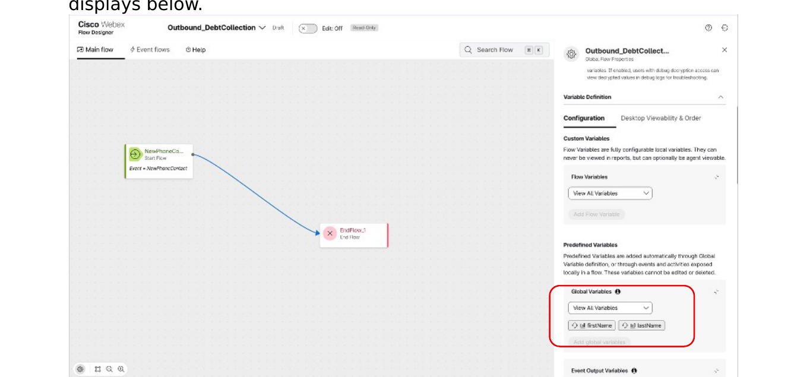
    </figure>

    <figure markdown>
    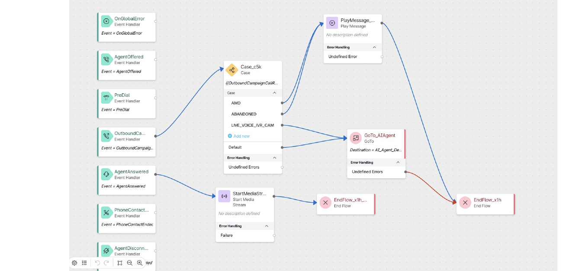
    </figure>

    ???+ info
        For simplification purposes we will not configure any Holidays or Overrides in this lab. In a production deployment, you would add public holidays here so the campaign automatically pauses on those dates.

---

## Lab 1.6 - Configure Campaign Manager Pre-requisites

Before creating the campaign itself, Campaign Manager requires several configuration objects. Navigate to the **Webex Campaign Management** portal — accessible from Control Hub under **Contact Center** → **Campaign Manager**.

<figure markdown>
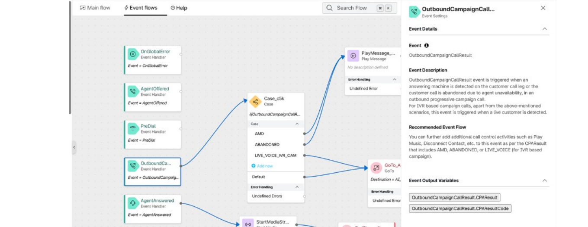
</figure>

### Business Days

Campaign Manager receives Business Hours from Control Hub. Within Campaign Manager you can only enable or disable individual days.

???+ webex "Enable Business Days"

    1. In Campaign Manager, navigate to **Administration** → **Business Days**.
    2. Enable **Monday through Friday**. Leave Saturday and Sunday disabled.

    <figure markdown>
    
    </figure>

### Contact Modes

Contact Modes define the type of phone number in your contact list — Mobile, Home, Office, etc. Since the lab contact list has a single phone number column, you only need one Contact Mode.

???+ webex "Create a Contact Mode"

    1. Navigate to **Voice Campaigns** → **Contact Modes** and click **Create contact mode**.
    2. Fill in the following fields:

        | Field | Value |
        | :--- | :--- |
        | **Contact mode name** | `Mobile` (or any meaningful name) |
        | **Description** | `Customer mobile number` |
        | **Minimum length** | Keep default |
        | **Maximum length** | Keep default |

    3. You can keep all default values. Click **Save**.

    <figure markdown>
    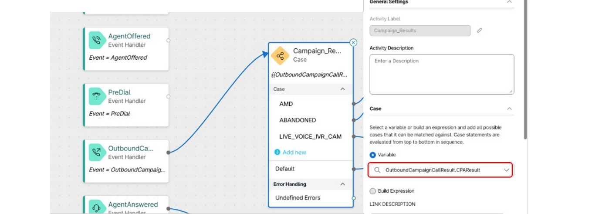
    </figure>

### DNC Lists

Webex Campaign Management supports multiple Do Not Contact (DNC) lists. Contacts on DNC lists are excluded from all Target Groups before a campaign is deployed.

???+ info "DNC Lists — Not configured for this lab"
    For the purpose of this lab we will **not** configure any DNC lists. In a production deployment you would import numbers registered with national DNC registries here.

### Global Variables in Campaign Manager

Campaign Manager reads global variables from Webex Control Hub. The `firstName` and `lastName` variables you created in Lab 1.1 appear here so you can map them to CSV columns during Field Mapping.

<figure markdown>
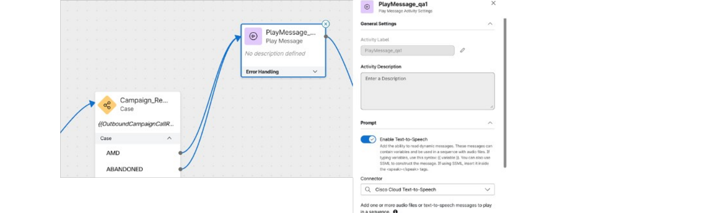
</figure>

???+ info
    When a new tenant is created, you must also designate variables as `customer-unique-identifier` and `account-unique-identifier` to enable call-attempt compliance. For this lab we are not using unique identifiers, so we will skip this step.

### Field Mappings

Field Mappings define the structure of the contact list CSV and tell Campaign Manager how to interpret each column — which column is the phone number, which map to global variables, what data types they are, and so on.

**Before creating the Field Mapping, prepare your CSV contact list** with the following column structure:

<figure markdown>
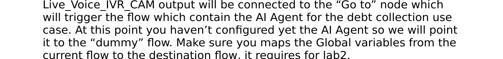
</figure>

The CSV must include at minimum: a phone number column, and `firstName` and `lastName` columns that will be mapped to the Global Variables you created.

???+ webex "Create Field Mapping"

    Navigate to **Administration** → **Field Mappings** and click **Create field mapping**, then follow the six-step wizard:

    ---

    **Step 1 — Upload sample file**

    1. Click **Choose file** and select your CSV contact list.
    2. Once uploaded, the system displays the column headers it detected.
    3. Keep the **File charset** at its default value.

    <figure markdown>
    
    </figure>

    ---

    **Step 2 — Map contact modes**

    4. For each header, use the drop-down to assign the Contact Mode you created (`Mobile`). This ensures the correct number type is dialled on schedule.

    <figure markdown>
    
    </figure>

    ---

    **Step 3 — Specify country and phone number format**

    5. Select the **Country** for the field mapping.
    6. Select the phone number format — use the format **with `+`** (E.164 international format).

    <figure markdown>
    
    </figure>

    ---

    **Step 4 — Map source of timezones**

    7. Keep the default timezone configuration.

    ---

    **Step 5 — Map Global Variables**

    8. Use the drop-downs to map the `firstName` and `lastName` CSV columns to the corresponding Global Variables.

    <figure markdown>
    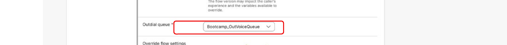
    </figure>

    ---

    **Step 6 — Specify data types**

    9. The system auto-populates data types from the file content. Leave all columns as `String` (default). You can enable PII protection per column if needed — for this lab, leave all defaults.

    <figure markdown>
    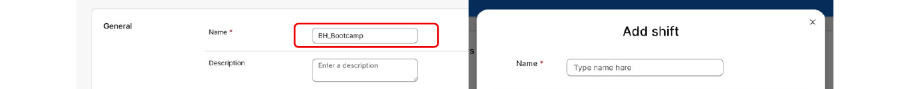
    </figure>

    10. Click **Save** to create the Field Mapping.

### Org Exclusion Dates

Organisation-level exclusion dates prevent any campaign from running on specific calendar dates. These apply globally to all campaigns in the tenant.

???+ webex "Create Org Exclusion Date"

    1. Navigate to **Administration** → **Org Exclusion**.
    2. Click **Add Exclusion Date**.
    3. Set the date to `31/12/2026`.
    4. Click **Save**.

    <figure markdown>
    
    </figure>

    ???+ info
        During an exclusion date, all running campaigns automatically change status to **Pending** and stop dialling. Once the date passes, they automatically resume **Running** status.

### Purpose Meta-tags

Purpose meta-tags categorise campaigns by business intent. At least one purpose tag is mandatory to activate a campaign.

???+ webex "Create Purpose Meta-tag"

    1. Navigate to **Administration** → **Purpose Meta-tags** and click **Create**.
    2. Create a meta-tag with the name: <copy>`debt`</copy>
    3. Click **Save**.

    <figure markdown>
    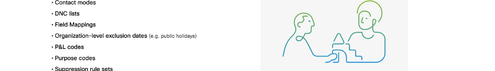
    </figure>

    ???+ warning
        Purpose meta-tags are **not mandatory** to create a campaign, but they are **mandatory to activate** one. Ensure this is in place before reaching the activation step.

### P&L Meta-tags

P&L (Profit and Loss) meta-tags assign campaigns to business divisions, cost centres, or product lines. Like Purpose meta-tags, they are required at activation.

???+ webex "Create P&L Meta-tag"

    1. Navigate to **Administration** → **P&L Meta-tags** and click **Create**.
    2. Create a meta-tag with the name: <copy>`debt`</copy>
    3. Click **Save**.

    <figure markdown>
    
    </figure>

    ???+ warning
        P&L meta-tags are **not mandatory** to create a campaign, but they are **mandatory to activate** one.

### Suppression Rules

Suppression Rules enforce compliance and calling-hours regulations by defining conditions under which a call attempt should be skipped. You will create a rule that prevents the campaign from running overnight.

A Suppression Rule has two parts: a **Rule Set** (the container) and one or more **Rules** within it.

???+ webex "Create Suppression Rule Set and Rule"

    **Step 1 — Create the Rule Set:**

    1. Navigate to **Administration** → **Suppression Rules** and click **Create Rule Set**.
    2. Give it a name (e.g. `No_Overnight_Calls`) and click **Save**.

    <figure markdown>
    
    </figure>

    **Step 2 — Create the Rule within the Set:**

    3. Open the Rule Set you just created and click **Create Rule**.
    4. Give the rule a name and click **Save**.

    <figure markdown>
    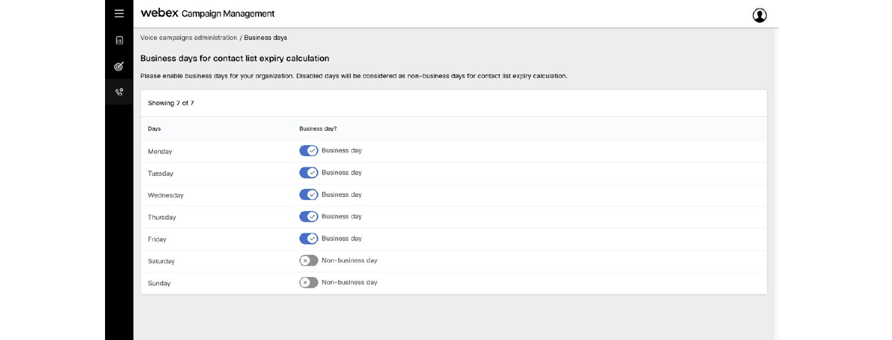
    </figure>

    **Step 3 — Configure the Rule Conditions:**

    5. Configure the conditions to block calls during overnight hours (e.g. 22:00 to 08:00).
    6. Click **Save**.

    <figure markdown>
    
    </figure>

### Telephony Outcomes

A Telephony Outcome Set defines the possible call results reported by the dialler — connected, busy, rejected, no answer, failed, etc. You cannot use the system default directly; you must duplicate it and use your own copy.

???+ webex "Duplicate the Telephony Outcome Set"

    1. Navigate to **Administration** → **Telephony Outcomes**.
    2. You will see the system-created default outcome set.

    <figure markdown>
    
    </figure>

    3. Click the **Duplicate** action on the system outcome set.
    4. Give your copy a name (e.g. `DebtCollection_Outcomes`) and click **Save**.

    <figure markdown>
    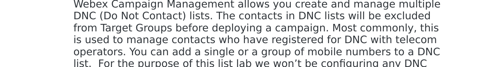
    </figure>

    5. You will now see your duplicated set listed alongside the system default.

    <figure markdown>
    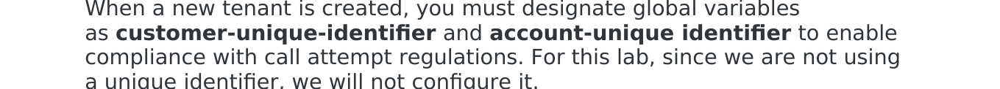
    </figure>

    6. Open your duplicated set to review the individual outcome codes. For this lab, leave all values at their defaults.

    <figure markdown>
    
    </figure>

### UI Users

Webex Campaign Management does **not** synchronise users automatically from Control Hub. User accounts are provisioned on first login via a just-in-time (JIT) sync that creates the Campaign Manager profile based on the Control Hub role.

???+ info "UI Users — automatic provisioning on first login"
    As long as your user has the correct Contact Center role in Control Hub, they will be automatically provisioned in Campaign Manager on first login. No manual action is required here.

    For more information refer to: [https://docs-campaign-for-contact-centers.webexcampaign.com/docs/ui-users](https://docs-campaign-for-contact-centers.webexcampaign.com/docs/ui-users)

<figure markdown>

</figure>

### Wrap-up Code Sets

Wrap-up codes are the tags agents apply after a call to classify the interaction outcome. They are defined in Control Hub and synchronised into Campaign Manager. Campaign Manager uses them to determine whether a contact should be queued for a future retry.

???+ webex "Configure Wrap-up Code Set"

    1. Navigate to **Administration** → **Wrap-up Code Sets**.
    2. Sync the latest codes from Control Hub using the **Fetch** option.
    3. Locate the `debt` wrap-up code created in Lab 1.1 and confirm it appears in the list.
    4. For this lab, leave the default retry configuration.

    ???+ info
        Any changes you make to a wrap-up code's configuration within Campaign Manager will not be overwritten by future Control Hub syncs. This lets you control retry logic independently.

        For more information refer to: [https://docs-campaign-for-contact-centers.webexcampaign.com/docs/wrap-up-code-sets](https://docs-campaign-for-contact-centers.webexcampaign.com/docs/wrap-up-code-sets)

    <figure markdown>
    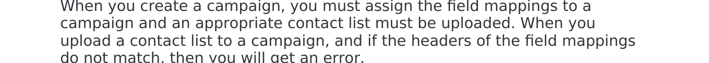
    </figure>

---

## Lab 1.7 - Create and Configure the Campaign

A **Campaign Group** is the container that holds campaigns. You must create one before creating a campaign inside it. A single group can contain multiple campaigns.

### Create a Campaign Group

???+ webex "Create Campaign Group"

    1. In Campaign Manager, navigate to **Voice Campaigns** → **Manage Campaigns**.
    2. Click **Create Campaign Group**.

    <figure markdown>
    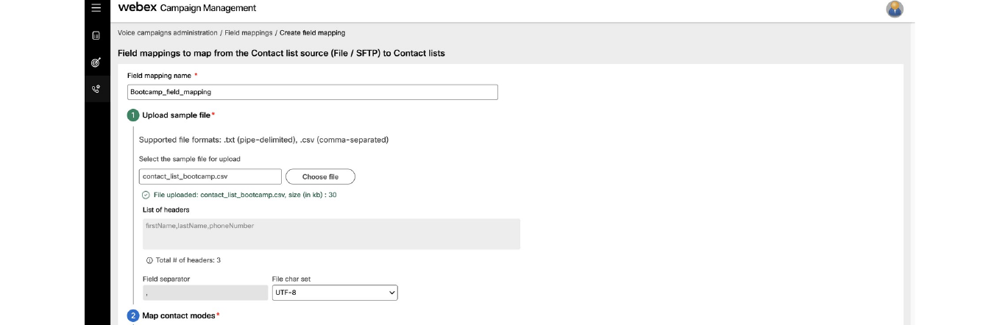
    </figure>

    3. Enter a **Group Name** — this is the only mandatory field. Use something descriptive like `Debt_Collection_2026`.
    4. Click **Save**.

    <figure markdown>
    
    </figure>

    5. The group will now appear in the campaign management list.

    <figure markdown>
    
    </figure>

### Configure the Campaign

Click on the campaign group you created to enter the campaign configuration wizard. Work through each node in order.

#### Node 1 — Dialer Configuration

???+ webex "Configure Dialer"

    1. In the **Dialer Configuration** node, select the Entry Point and Outdial ANI created in Lab 1.4, then set the campaign type:

        | Parameter | Value |
        | :--- | :--- |
        | **Entry Point** | `OutDial_DebtCollection_EP` |
        | **Outdial ANI** | Select the ANI configured in Lab 1.4 |
        | **Campaign Type** | `Progressive IVR` |
        | **CPA (Call Progress Analysis)** | Leave **enabled** (default) |

    <figure markdown>
    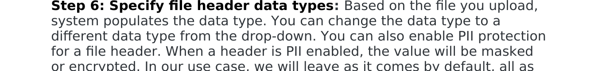
    </figure>

    <figure markdown>
    
    </figure>

#### Node 2 — Contact List Source

???+ webex "Configure Contact List Source"

    1. Set the **Source Type** to **Manual Upload** — you will upload the CSV after activation.
    2. Select the **Field Mapping** created in Lab 1.6.

    ???+ info
        Contact lists can also be imported automatically from an SFTP location or via the Campaign Manager API. For this lab, manual upload is sufficient.

#### Node 3 — Daily Schedule

???+ webex "Configure Daily Schedule"

    1. Configure the daily calling schedule using the values shown below.
    2. Make sure to set the **Time Zone** to your own local time zone.

    <figure markdown>
    
    </figure>

    3. Under **Schedule Exclusion Dates**, select the `31/12/2026` exclusion date created in Lab 1.6.

    <figure markdown>
    
    </figure>

#### Node 4 — Contact Attempt Strategy

???+ webex "Configure Contact Attempt Strategy"

    1. Click into the **Contact Attempt Strategy** node.

    <figure markdown>
    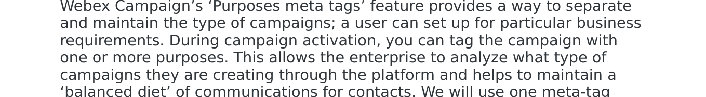
    </figure>

    2. Fill in the following configuration:

        - **Wrap-up Code Set**: Select the `debt` wrap-up code set.
        - **Telephony Outcome Set**: Select the duplicated outcome set from Lab 1.6.
        - **Contact Modes**: The system pre-populates this from your Field Mapping. Leave the single `Mobile` contact mode.
        - **Max Attempts**: Configure as shown in the screenshot below.
        - **Sequential Dialling**: **Disable** this option. Set the **amount of contacts** to `10`.

    <figure markdown>
    
    </figure>

#### Node 5 — Suppression Rules

???+ webex "Add Suppression Rule"

    1. In the **Suppression Rules** node, click **Add Rule Set**.
    2. Select the `No_Overnight_Calls` rule set created in Lab 1.6.
    3. Click **Save** to save the campaign configuration up to this point.

    <figure markdown>
    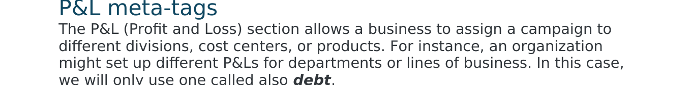
    </figure>

#### Final Step — Campaign Name and Meta-tags

???+ webex "Name the Campaign and Assign Meta-tags"

    1. When prompted to save the campaign, enter a **Campaign Name** (e.g. `DebtCollection_Campaign_2026`).
    2. Assign both meta-tags created in Lab 1.6:
        - **Purpose**: `debt`
        - **P&L**: `debt`
    3. Click **Save Campaign**.

    <figure markdown>
    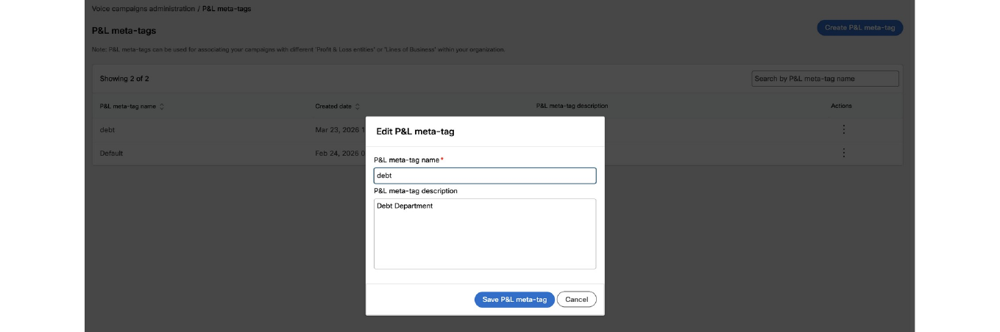
    </figure>

---

## Lab 1.8 - Activate the Campaign and Upload the Contact List

### Activate the Campaign

With all nodes configured and meta-tags assigned, you are ready to activate the campaign.

???+ webex "Activate the Campaign"

    1. Open the campaign you just created and click **Activate Campaign**.

    <figure markdown>
    
    </figure>

    <figure markdown>
    
    </figure>

    2. The campaign status will change to **Running**.

    <figure markdown>
    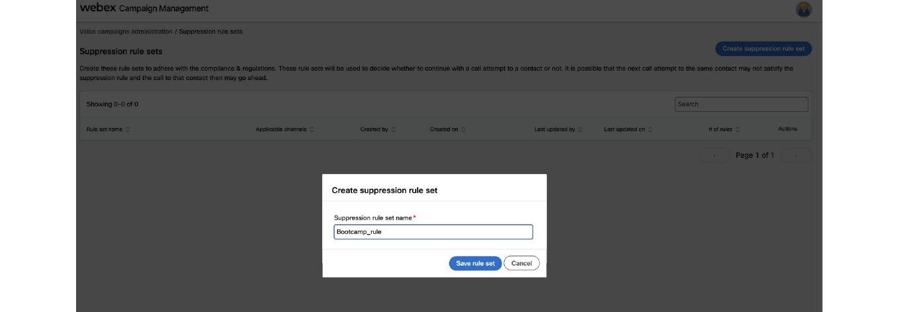
    </figure>

    <figure markdown>
    
    </figure>

### Upload the Contact List

Once the campaign is active, upload your contact list to begin dialling.

???+ webex "Upload the Contact List"

    ???+ info
        Contact lists can also be uploaded programmatically via the Campaign Manager API. For more information, refer to the [Webex Campaign API documentation](https://docs-campaign-for-contact-centers.webexcampaign.com).

    1. In the active campaign view, navigate to the **Contact Lists** section and click **Upload Contact List**.
    2. Select the CSV file you prepared in Lab 1.6. Leave all other configuration at its defaults.

    <figure markdown>
    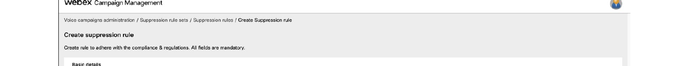
    </figure>

    3. The initial status will show as **Uploading**.

    <figure markdown>
    
    </figure>

    4. If your file is valid, the status will change to **Valid**. The campaign will begin dialling within **2 to 5 minutes**.

    <figure markdown>
    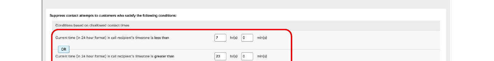
    </figure>

    ???+ warning
        If the file fails to upload, the most common cause is a CSV formatting issue — mismatched headers, incorrect delimiters, or extra whitespace. Check the file structure against the Field Mapping configuration and try again.

---

## Testing 🧪

???+ webex "Validate the End-to-End Flow"

    1. **Wait for the call**: With a valid contact list uploaded, the campaign will dial your test phone number within 2–5 minutes.
    2. **Answer the call**: Pick up on the number listed in your contact list.
    3. **Listen for the confirmation**: You should hear the Text-to-Speech message from the dummy flow:

        ```text
        Congratulations, you have completed Lab 1.
        ```

    4. **Check campaign results**: In Campaign Manager, verify that the call attempt shows as **Connected** and the contact list entry shows as **Processed**.

???+ bug "Troubleshooting"

    If you do not receive a call within 5 minutes, check the following:

    - The campaign status is **Running** (not Paused or Pending)
    - The contact list status is **Valid** (not Uploading or Failed)
    - The phone number in the CSV is in E.164 format with `+` (e.g. `+12025551234`)
    - The **Outdial ANI** is correctly associated with the Entry Point
    - The **Business Hours** schedule covers the current time in your time zone
    - The **Suppression Rule** is not blocking calls at the current time of day

---

## Lab Completion ✅

At this point, you have successfully:

- [x] Created a licensed agent user, team, out-dial queue, and global variables in **Control Hub**
- [x] Built a **dummy validation flow** and an **outbound campaign flow** with AMD, Abandoned, and Live Voice event handling
- [x] Configured an **Entry Point** and **Outdial ANI** for outbound telephony
- [x] Set up all **Campaign Manager pre-requisites**: business days, contact modes, field mappings, org exclusions, purpose and P&L meta-tags, suppression rules, telephony outcomes, and wrap-up code sets
- [x] Created, activated, and validated a **Progressive IVR outbound campaign**

**Congratulations!** You now have a fully operational proactive outbound reach capability. The infrastructure built here is the foundation that the AI Agent in Lab 2 uses to handle every live answered call.

[Next Lab: Lab 2 - Automated Debt Collection](lab2_debt_ai_agent.md){ .md-button .md-button--primary }
