# Lab 1 - Proactive Outbound Reach 📞

## Lab Purpose

**Webex Campaign Management** is an add-on module for the **Webex Contact Center** platform, providing administrators and supervisors the ability to configure, manage, and optimise outbound communication campaigns. This module is accessed through **Webex Control Hub**, a unified administration console that centralises management of all Webex Contact Center services.

The module supports the deployment of agent-assisted outbound campaigns using multiple dialing modes such as preview, progressive, and predictive to maximise agent efficiency and contact rates. Additionally, it facilitates the execution of agentless IVR campaigns, enabling automated outbound interactions without live agent involvement.

**Key features include:**

- **Dialing Schedule Management**: Define allowable calling windows to ensure compliance with time-based regulations and customer preferences.
- **Contact List Handling**: Upload one or more contact lists from a local system or an SFTP location for targeted outreach.
- **Suppression Rules**: Apply suppression rule sets to avoid calling restricted or unwanted numbers.
- **Automated Retry Logic**: Configure retry attempts with customisable intervals for contacts not reached or calls that failed, improving contact rates without manual intervention.
- **Compliance Enforcement**: Integrate compliance settings directly into campaign workflows to adhere to industry regulations, including Do Not Contact (DNC) lists and regional restrictions.

By consolidating all campaign configuration, monitoring, and execution functionalities into a single, intuitive interface, Webex Campaign Management streamlines outbound operations. This integration enables real-time control over campaign parameters, improves operational efficiency, and enhances the precision of customer engagement efforts — ensuring the right message reaches the right customer at the right time.

A high-level architecture flow of the different modules associated with Control Hub within Webex Contact Center:

???+ purpose "Lab Objectives"
    The purpose of this lab is to build the full outbound campaign infrastructure for the **Proactive Debt Collection** use case.

    Key objectives include:

    * **Control Hub Configuration:** Create users, teams, queues, and global variables that the campaign depends on.
    * **Flow Builder:** Build a dummy validation flow and the outbound campaign flow with complete event handling.
    * **Campaign Manager Setup:** Configure all pre-requisites — contact modes, field mappings, suppression rules, meta-tags, telephony outcomes, and wrap-up codes.
    * **Campaign Activation:** Create, activate, and validate a Progressive IVR outbound campaign end to end.

???+ Challenge "Lab Outcome"
    By the end of Lab 1, you will have a fully operational outbound campaign infrastructure capable of:

    1. **Dialling contacts** from an uploaded CSV contact list using Progressive IVR mode.
    2. **Routing answered calls** through a WxCC flow that passes customer data to a destination flow.
    3. **Handling all call outcomes** — AMD, Abandoned, and Live Voice — using event-driven flow logic.
    4. **Delivering a confirmation message** to verify that the full outbound path works end to end.

---

## Pre-requisites

In order to be able to complete this lab, you must:

* [x] Have access to a **Webex Contact Center** tenant with **Campaign Manager** enabled
* [x] Have **administrator access** to Webex Control Hub
* [x] Have completed the [Pre-requisites](pre_req_wxcc.md) section of this Bootcamp

---

## Lab Overview 📌

In this lab you will perform the following tasks:

1. Configure Agents, Teams, Queues, and Global Variables in Control Hub
2. Create a dummy validation flow
3. Create the Outbound Campaign Flow with full event handling
4. Create the Entry Point (Channel) and configure the Outdial ANI
5. Configure Business Hours in Control Hub
6. Configure all Campaign Manager pre-requisites
7. Create and activate the Campaign
8. Upload the Contact List and test end to end

---

## Lab 1.1 - Configure Agents and Teams in Control Hub

### Create a User and Assign the Contact Center Licence

Create the user on Control Hub and assign the Contact Center licence (standard or premium).

???+ webex "Create User and Assign Licence"

    1. Navigate to [Control Hub](https://admin.webex.com) and go to **Users**.
    2. Click **Manage Users** and add or invite the user account.
    3. Open the user profile, navigate to **Licences**, and assign the **Webex Contact Center** licence — select either **Standard** or **Premium** depending on your tenant configuration.
    4. Click **Save**.

    <figure markdown>
    
    </figure>

    <figure markdown>
    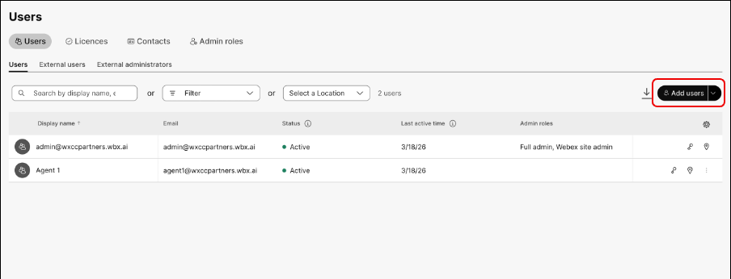
    </figure>

### Create a Team

???+ webex "Create Team"

    1. In Control Hub, navigate to **Contact Center** → **Teams** and click **Create Team**.
    2. Enter a team name (e.g. `Bootcamp_Team`), select the site, set the team type to **Agent-based**, and select a multimedia profile.
    3. Under **Agents**, add the user created above.
    4. Click **Create**.

    <figure markdown>
    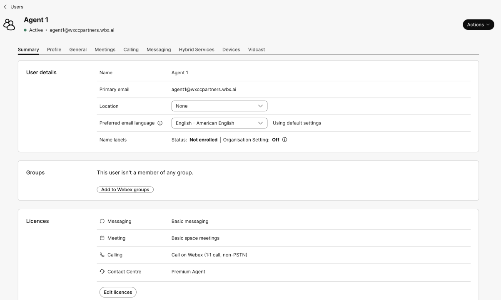
    </figure>

### Enable Contact Center for the User

???+ webex "Enable Contact Center"

    1. Navigate to **Contact Center** → **Contact Centre Users** and open the user you created.
    2. Enable the **Contact Centre** toggle to **Active**.
    3. Assign the **Site**, select the **Bootcamp_Team**, and set the **User Profile** appropriately.
    4. Click **Save**.

    <figure markdown>
    
    </figure>

### Create an Out-Dial Queue

The out-dial queue is the routing destination for answered outbound calls. Campaign Manager uses this queue to connect live calls to agents or IVR flows.

???+ webex "Create Out-Dial Queue"

    1. Navigate to **Contact Center** → **Queues** and click **Create Queue**.
    2. Set the **Contact direction** to `Outbound queue`, **Channel type** to `Telephony`, and enable the **Outbound campaign** toggle.
    3. Enter a name (e.g. `Bootcamp_OutVoiceQueue`) and set **Agent assignment** to `Teams`.
    4. Under **Call distribution**, click **Create a group** and add **Bootcamp_Team**.
    5. Click **Create**.

    <figure markdown>
    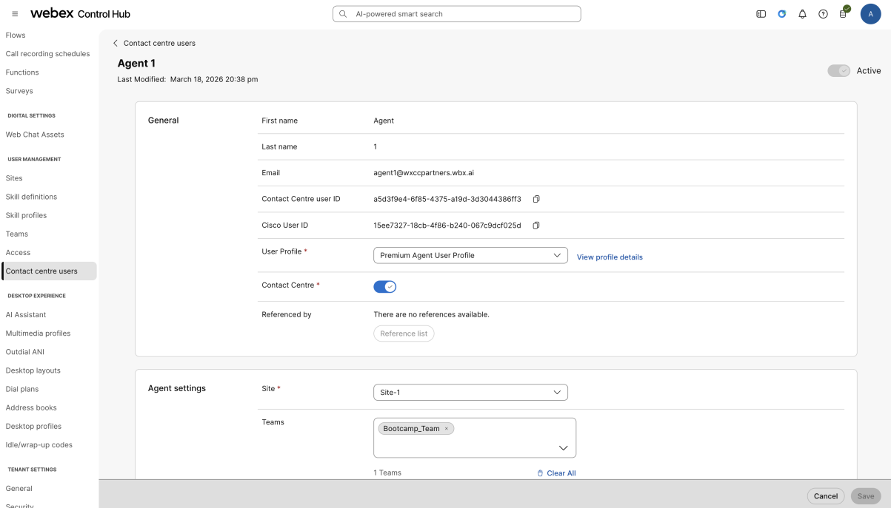
    </figure>

    <figure markdown>
    
    </figure>

### Configure Global Variables

Global variables carry customer data — first and last name — from the contact list through the campaign flow and all the way to the AI Agent in Lab 2. They also appear on the Agent Desktop during escalated calls. Two variables must be created: `firstName` and `lastName`.

???+ webex "Create Global Variables"

    1. Navigate to **Contact Center** → **Flows** → **Global Variables** and click **Create a global variable**.
    2. Create the following two variables:

        | Field | Variable 1 | Variable 2 |
        | :--- | :--- | :--- |
        | **Name** | `firstName` | `lastName` |
        | **Variable type** | `String` | `String` |
        | **Make agent viewable** | Enabled | Enabled |
        | **Desktop label** | `First Name` | `Last Name` |

    3. Click **Create** for each variable.

    <figure markdown>
    
    </figure>

    ???+ warning
        These exact variable names — `firstName` and `lastName` — are referenced by the AI Agent welcome message and the Go To node in Lab 2. Do not change the casing or names.

You will also need to configure at least one wrap-up code to be used later by Campaign Manager.

???+ webex "Create Wrap-up Code"

    1. Navigate to **Contact Center** → **Idle/Wrap-up Codes** and click **Create Wrap-up Code**.
    2. Enter the name `debt`, set **Code type** to `Default Wrapup Work Type`, and toggle it **Active**.
    3. Click **Save**.

    <figure markdown>
    
    </figure>

---

## Lab 1.2 - Create the Dummy Validation Flow

Before creating the campaign flow, you will create a "dummy" flow to test the success of Lab 1. You will reuse this same flow in Lab 2 after completing this one. Make sure you add `firstName` and `lastName` as Global Variables.

???+ webex "Create the Dummy Validation Flow"

    1. Navigate to **Contact Center** → **Flows** and click **Create Flow**.
    2. Name the flow: <copy>`Lab1_completed`</copy>. Select **Start from Scratch** and click **Create**.
    3. Open **Global Flow Properties** and add `firstName` and `lastName` as **Global Variables**.

    <figure markdown>
    
    </figure>

    4. Drag a **Play Message** node onto the canvas and connect it to the **Start** node.
    5. Enable **Text-to-Speech**, set the connector to **Cisco Cloud Text-to-Speech**, and add the following message:

        ```text
        Congratulations, you have completed lab 1.
        ```

    6. Connect the **Play Message** node to the **Disconnect Contact** node.
    7. Click **Validate**, then **Save and Publish** the flow.

    <figure markdown>
    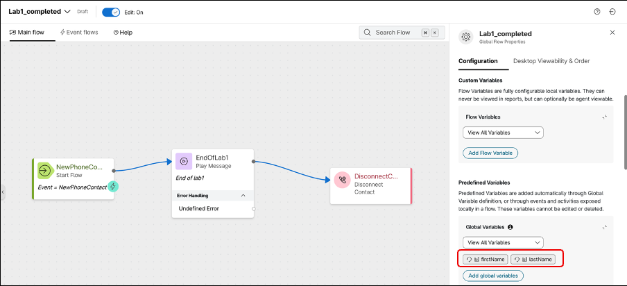
    </figure>

---

## Lab 1.3 - Create the Outbound Campaign Flow

The next step is to create the outbound campaign flow. You will also need to add the Global Variables created before to the flow configuration.

### Main Flow

???+ webex "Create the Outbound Campaign Flow"

    1. Navigate to **Contact Center** → **Flows** and click **Create Flow**.
    2. Name the flow: <copy>`Outbound_DebtCollection`</copy>. Select **Start from Scratch** and click **Create**.
    3. Open **Global Flow Properties** and add `firstName` and `lastName` as **Global Variables**.

    <figure markdown>
    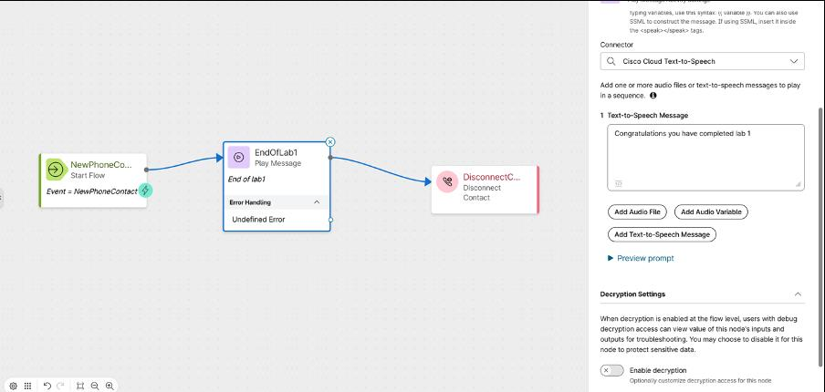
    </figure>

### Event Flows

Then you will need to configure some "event" flows. Click the **Event Flows** tab and create the following.

<figure markdown>

</figure>

We will focus on 2 events. The first is the event for ***OutboundCampaignCallResult***.

#### OutboundCampaignCallResult Event

???+ webex "Configure OutboundCampaignCallResult"

    1. In the **Event Flows** tab, click on the **OutboundCampaignCallResult** event handler.

    <figure markdown>
    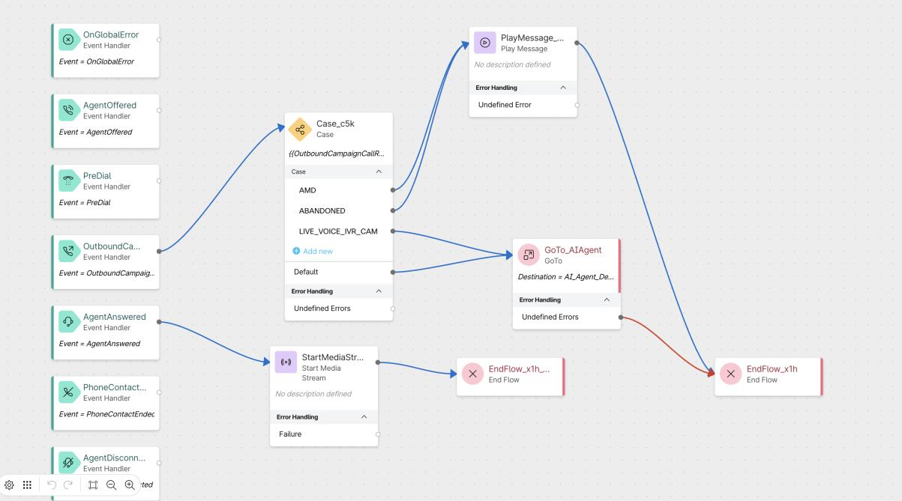
    </figure>

    2. Drag a **Case** node onto the canvas and connect the event trigger to it.
    3. Set the **Variable** to `OutboundCampaignCallResult.CPAResult`. Create **3 outputs**: `AMD` (Answer Machine Detection), `Abandoned`, and `Live_Voice_IVR_CAM`. Make sure you map the **CPA** variable which is an output of the previous node.

    <figure markdown>
    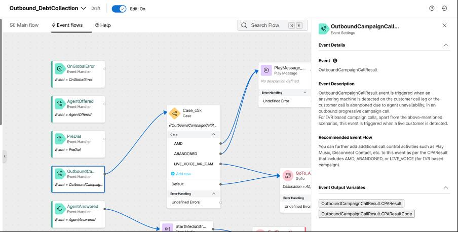
    </figure>

    **AMD and Abandoned** will be connected to a **Play Message** node which will use Text-to-Speech to play "Goodbye":

    4. Drag a **Play Message** node onto the canvas. Connect both the `AMD` and `Abandoned` outputs to it.
    5. Enable **Text-to-Speech** and enter: `Goodbye.`

    <figure markdown>
    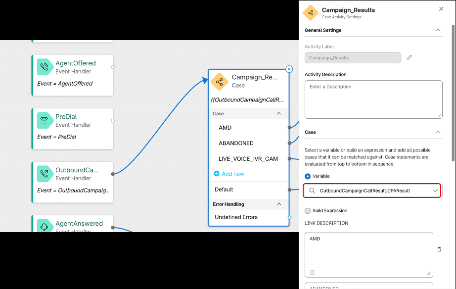
    </figure>

    **Live_Voice_IVR_CAM** output will be connected to the **Go To** node which will trigger the flow containing the AI Agent for the debt collection use case. At this point you haven't configured the AI Agent yet, so we will point it to the dummy flow. Make sure you **map the Global Variables** from the current flow to the destination flow — this is required for Lab 2.

    6. Drag a **Go To** node onto the canvas and connect the `Live_Voice_IVR_CAM` output to it.
    7. Set the destination to `Lab1_completed` and map `firstName` and `lastName` in the **Flow Variable Mapping** section.

    <figure markdown>
    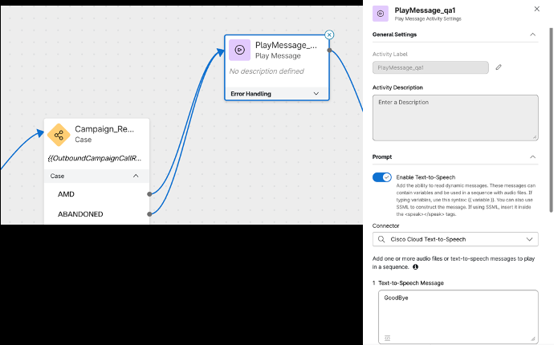
    </figure>

#### AgentAnswered Event

We will be using AI Assistant features as part of the use case, so on the ***AgentAnswered*** event connect a **StartMediaStream** node.

???+ webex "Configure AgentAnswered Event"

    1. In the **Event Flows** tab, click on the **AgentAnswered** event handler.
    2. Drag a **StartMediaStream** node onto the canvas and connect the event trigger to it.
    3. Connect the node to an **End Flow** node.

    <figure markdown>
    
    </figure>

The next step is to create the Channel (aka Entry Point). This is where you need to specify the type of channel (Outbound Telephony) and select the flow and outbound queue previously created.

4. Click **Validate**, then **Save and Publish** the flow.

---

## Lab 1.4 - Create the Entry Point and Configure the Outdial ANI

### Create the Entry Point (Channel)

???+ webex "Create the Entry Point"

    1. In Control Hub, navigate to **Contact Center** → **Channels** and click **Create Channel**.
    2. Fill in:

        | Field | Value |
        | :--- | :--- |
        | **Name** | `Campaign_EP` |
        | **Channel type** | `Outbound telephony` |
        | **Routing flow** | `Outbound_DebtCollection` |
        | **Outdial queue** | `Bootcamp_OutVoiceQueue` |

    3. Click **Create**.

    <figure markdown>
    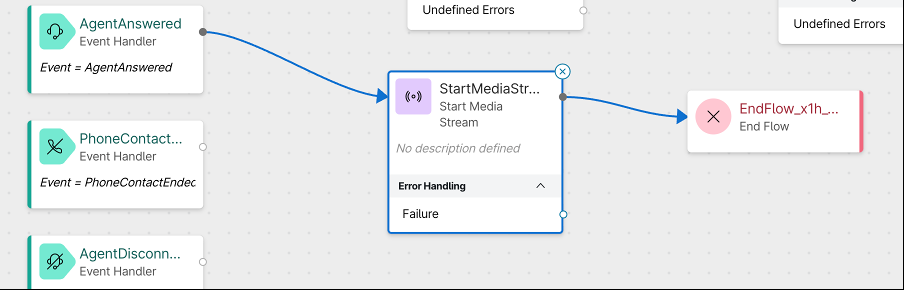
    </figure>

### Configure the Outdial ANI

The campaign will need to show a PSTN number for the outbound call. For that, we will configure an ***Outdial ANI*** on Control Hub.

???+ webex "Configure Outdial ANI"

    1. Navigate to **Contact Center** → **Outdial ANI** and open or create an ANI named `Bootcamp_outANI`.
    2. Add one or more PSTN numbers in E.164 format under **Entry list**.
    3. Click **Save**.

    <figure markdown>
    
    </figure>

---

## Lab 1.5 - Configure Business Hours

Before moving to Campaign Manager, we will add Business Hours setup in Control Hub. Campaign Manager takes the ***Business Hours*** configuration from WxCC — you can only enable or disable individual days within Campaign Manager itself.

???+ webex "Create Business Hours"

    1. In Control Hub, navigate to **Contact Center** → **Business Hours** and click **Create Business Hours**.
    2. Name it `BH_Bootcamp`, set the **Timezone**, and click **Add shift** to configure Monday–Friday calling hours.
    3. Click **Save**, then **Create**.

    <figure markdown>
    
    </figure>

    <figure markdown>
    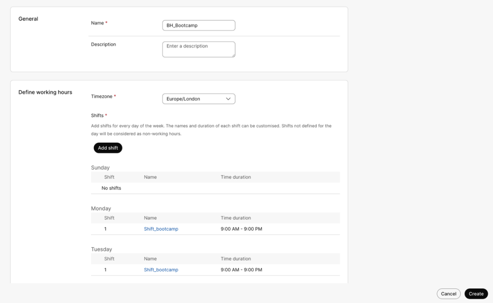
    </figure>

    For simplification purposes we won't configure any Holidays or Overrides.

    <figure markdown>
    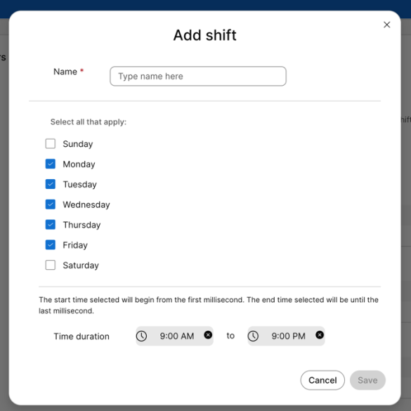
    </figure>

---

## Lab 1.6 - Configure Campaign Manager Pre-requisites

To configure the campaign, you will need to set some pre-required configuration first. Navigate to the **Webex Campaign Management** portal accessible from Control Hub under **Contact Center** → **Campaign Manager**.

<figure markdown>

</figure>

### Business Days

You can create business days or holiday schedules and configure them in a campaign. The campaign intelligently ignores holidays and pauses during that period, resuming on business days.

As mentioned above, business days are created in Control Hub. Webex Campaign Management receives them from Control Hub — you can only enable or disable a business day in Campaign Manager. We will enable Monday to Friday.

???+ webex "Enable Business Days"

    1. Navigate to **Voice campaigns administration** → **Business days**.
    2. Enable **Monday through Friday**. Leave Saturday and Sunday disabled.

    <figure markdown>
    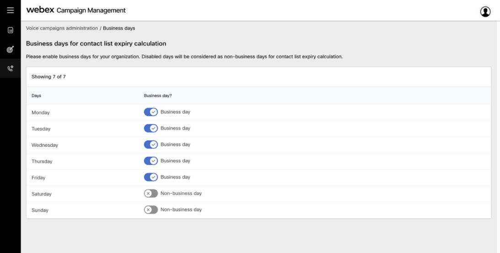
    </figure>

### Contact Modes

You can create different contact modes in Webex Campaign to attribute a particular phone number as a Home or Office number. In this case we will use just one phone number type.

**Create contact mode**

Follow these steps to create a contact mode:

???+ webex "Create Contact Mode"

    1. Navigate to **Voice campaigns administration** → **Contact modes** and click **Create contact mode**.
    2. Enter the following details:
        - **Contact mode name**: Enter a name (e.g. `phone`)
        - **Description**: Enter a meaningful description
        - **Minimum length**: Enter the minimum required length for the phone number
        - **Maximum length**: Enter the maximum required length for the phone number

    You can keep the default values.

    <figure markdown>
    
    </figure>

### DNC Lists

Webex Campaign Management allows you to create and manage multiple DNC (Do Not Contact) lists. Contacts in DNC lists are excluded from Target Groups before deploying a campaign. For the purpose of this lab we won't be configuring any DNC list.

### Global Variables

Global variables refer to the attribute values that identify a customer during calls with agents. These attributes are configured in Control Hub. Webex Campaign receives these variables from Control Hub.

When a new tenant is created, you must designate global variables as **customer-unique-identifier** and **account-unique identifier** to enable compliance with call attempt regulations. For this lab, since we are not using a unique identifier, we will not configure it.

<figure markdown>

</figure>

### Field Mappings

Field mappings refer to the process of uploading a template or sample data and mapping the headers to the headers of the dialler system. You can also define the data type for each header or specify if a header needs to be encrypted.

When you create a campaign, you must assign the field mappings to a campaign and an appropriate contact list must be uploaded. If the headers of the field mappings do not match when uploading a contact list, you will get an error.

Create a Contact List in CSV format with the following structure:

<figure markdown>

</figure>

???+ webex "Create Field Mapping"

    Navigate to **Voice campaigns administration** → **Field mappings** and click **Create field mapping**:

    **Step 1 — Upload sample file**

    Click **Choose file** and select the CSV file you created. Once uploaded, the screen will display the **List of headers**, the **Field separator** in read-only mode, and the **File charset**. Keep the File charset as it is.

    <figure markdown>
    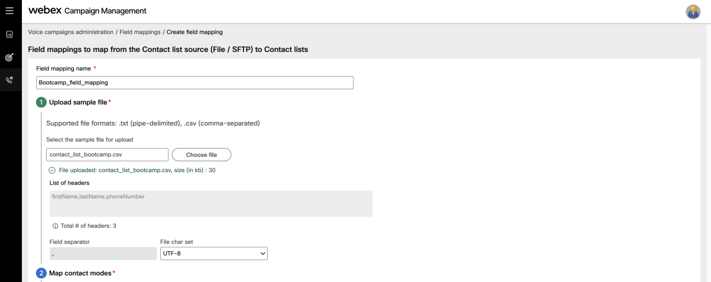
    </figure>

    **Step 2 — Map contact modes**

    Select the drop-down for each header and map it with the contact mode you created. This ensures the appropriate number is dialled based on schedule.

    <figure markdown>
    
    </figure>

    **Step 3 — Specify country and phone number format**

    Select the country for which the field mapping is created. Select the format of the phone number — we will use the one **with `+`** (E.164 format).

    <figure markdown>
    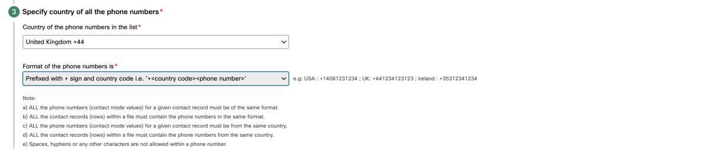
    </figure>

    **Step 4 — Map source of timezones**

    Keep the default configuration.

    **Step 5 — Map Global Variables**

    Select the appropriate header from the drop-down to map with the respective global variables created in Control Hub.

    <figure markdown>
    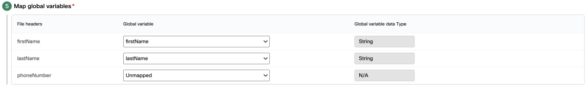
    </figure>

    **Step 6 — Specify file header data types**

    Based on the file you upload, the system populates the data type. You can change the data type from the drop-down and enable PII protection per header. In our use case, leave everything as `String` (default).

    <figure markdown>
    
    </figure>

    Click **Save** to create the Field Mapping.

### Org Exclusion Dates

Organisation-level exclusion dates prevent campaigns from running on specific dates such as national holidays. These exclusions apply to all campaigns. We will use `31/12/2026` as the exclusion date.

During exclusion dates, running campaigns change status to **Pending** and execution stops. Once the exclusion date expires, the campaign automatically resumes **Running** status.

???+ webex "Create Org Exclusion Date"

    1. Navigate to **Voice campaigns administration** → **Org exclusion dates**.
    2. Click **Create organization-level exclusion dates**.
    3. Set the date to `Dec 31, 2026` and add a comment (e.g. `End of the Year`).
    4. Click **Save**.

    <figure markdown>
    
    </figure>

### Purpose Meta-tags

Webex Campaign's Purpose meta-tags feature provides a way to separate and categorise campaigns by business type. During campaign activation, you can tag the campaign with one or more purposes. We will use one meta-tag called ***debt***.

*Note: Purpose meta-tags are not mandatory to **create** a campaign. However, they are **mandatory to activate** one.*

???+ webex "Create Purpose Meta-tag"

    1. Navigate to **Voice campaigns administration** → **Purpose meta-tags**.
    2. Create a meta-tag with the name: <copy>`debt`</copy>
    3. Click **Save**.

    <figure markdown>
    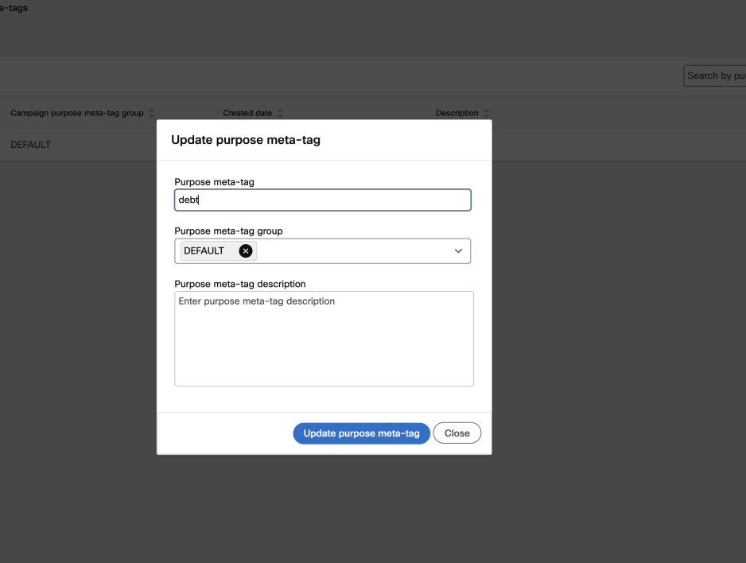
    </figure>

### P&L Meta-tags

The P&L (Profit and Loss) section allows a business to assign a campaign to different divisions, cost centres, or products. In this case, we will only use one called ***debt***.

*Note: P&L meta-tags are not mandatory to **create** a campaign. However, they are **mandatory to activate** one.*

???+ webex "Create P&L Meta-tag"

    1. Navigate to **Voice campaigns administration** → **P&L meta-tags**.
    2. Click **Create P&L meta-tag**.
    3. Enter the name: <copy>`debt`</copy> and click **Save**.

    <figure markdown>
    
    </figure>

### Suppression Rules

Create these rule sets to adhere with compliance & regulations. These rule sets decide whether to continue with a call attempt to a contact. We will configure a rule to prevent running campaigns overnight.

First, create the suppression rule set:

???+ webex "Create Suppression Rule Set and Rule"

    1. Navigate to **Voice campaigns administration** → **Suppression rule sets** and click **Create suppression rule set**.
    2. Enter the name: <copy>`Bootcamp_rule`</copy> and click **Save rule set**.

    <figure markdown>
    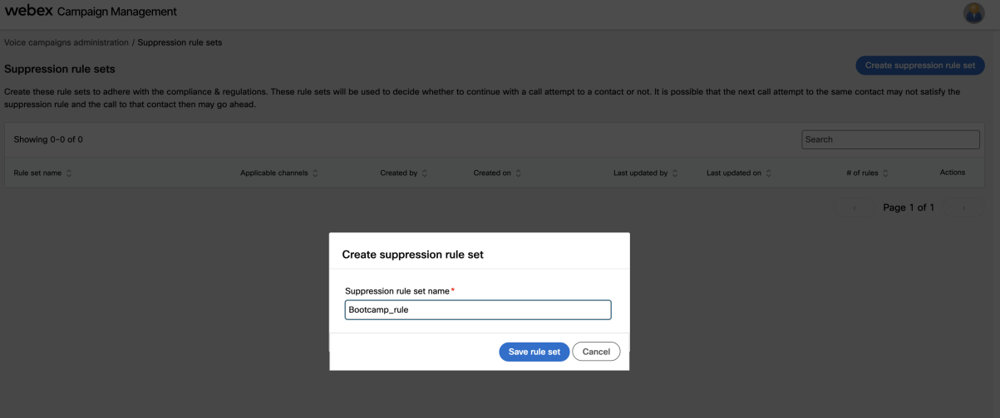
    </figure>

    And then create the rule under the set:

    3. Click **Create suppression rule** inside the set.
    4. Enter the name: <copy>`Bootcamp_rule1`</copy>, set **Suppression rule based on** to `Contact attempt timing window`, and set **Applicable channels** to `Voice`.

    <figure markdown>
    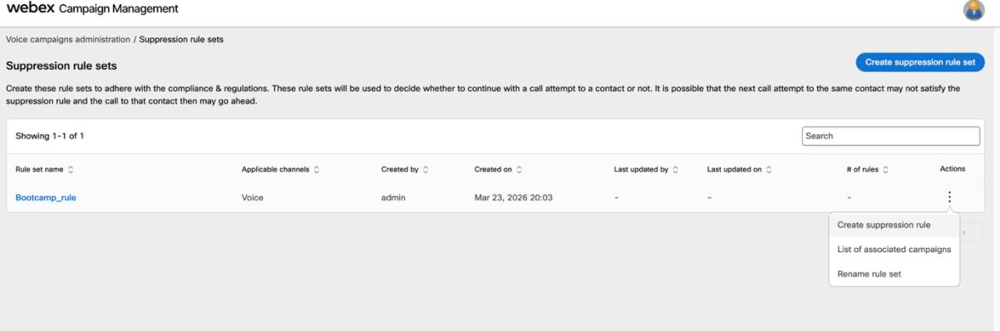
    </figure>

    Configure the conditions to block calls during overnight hours:

    5. Set the time window conditions:
        - **Current time is less than**: `7` hr `0` min
        - **OR Current time is greater than**: `23` hr `0` min
    6. Click **Create**.

    <figure markdown>
    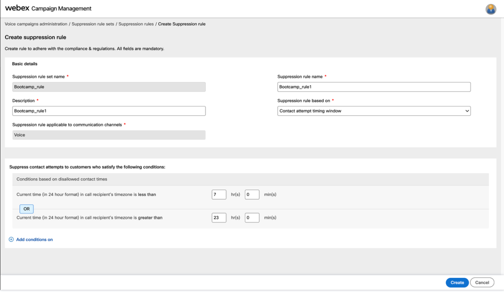
    </figure>

### Telephony Outcomes

A telephony outcome set is a collection of possible call outcomes received from the dialler when an attempt is made to contact a customer. These outcomes indicate whether a call was successfully connected, rejected, busy, or failed. You will need to duplicate the system-created one and leave the default values.

???+ webex "Duplicate the Telephony Outcome Set"

    1. Navigate to **Voice campaigns administration** → **Telephony outcome sets**.
    2. You will see the system default `Primary_telephony_outcome_set`.

    <figure markdown>
    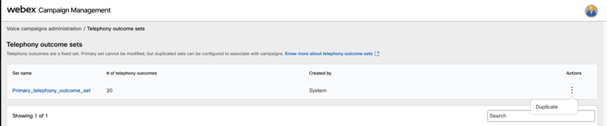
    </figure>

    3. Click the **⋮** menu and select **Duplicate**. Name the copy: <copy>`Bootcamp_Primary_telephony_outcome_set`</copy>
    4. Click **Duplicate**.

    You will see the one you just duplicated in the list:

    <figure markdown>
    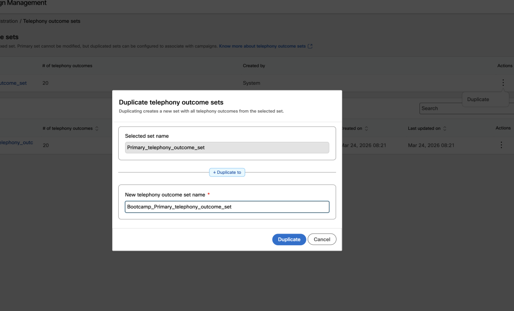
    </figure>

    If you click on it, you will see the different telephony outcomes. You will be able to edit them, but for the purpose of the bootcamp we will keep them as they are:

    <figure markdown>
    
    </figure>

### UI Users

Users are created and managed in Webex Control Hub. A user created in Control Hub with appropriate permissions will be able to access Webex Campaign.

Webex Campaign Management does not perform automatic user synchronisation from Webex Control Hub. User accounts are provisioned dynamically at runtime — specifically when a user first logs into Webex Campaign Management. At that point, the application performs a just-in-time (JIT) sync to create the user profile based on the role available in Webex Control Hub.

For more information refer to: [https://docs-campaign-for-contact-centers.webexcampaign.com/docs/ui-users](https://docs-campaign-for-contact-centers.webexcampaign.com/docs/ui-users)

<figure markdown>
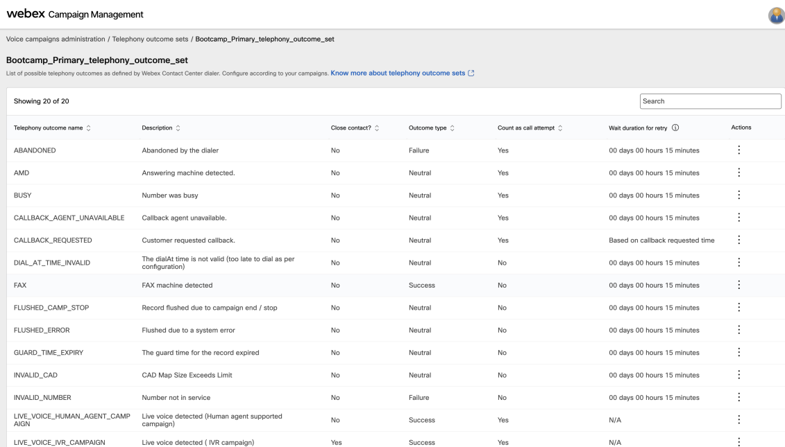
</figure>

### Wrap-up Code Sets

Wrap-up codes are the tags applied by agents after a call to categorise and record the outcome of each customer interaction. These codes are defined and managed in Control Hub. Although you can periodically fetch and update them in Webex Campaign, new wrap-up codes cannot be created directly within Webex Campaign. However, you can edit the configuration of these wrap-up codes to determine whether a contact should be considered for future campaigns.

Any changes made to a wrap-up code within Webex Campaign will not be overwritten during subsequent synchronisations with Control Hub. For the lab we will configure only one wrap-up code called ***debt***.

For more information refer to: [https://docs-campaign-for-contact-centers.webexcampaign.com/docs/wrap-up-code-sets](https://docs-campaign-for-contact-centers.webexcampaign.com/docs/wrap-up-code-sets)

<figure markdown>
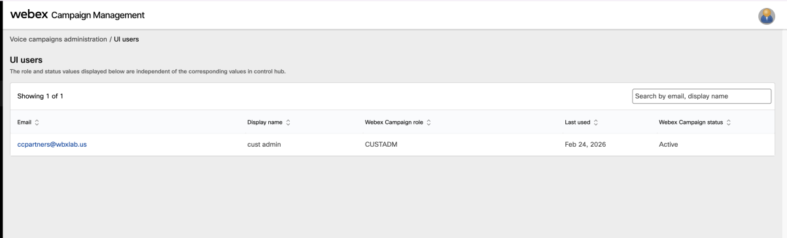
</figure>

---

## Lab 1.7 - Create and Configure the Campaign

A campaign group must be created to deploy a campaign. A campaign group is a "wrapper" within which campaigns are created. A single campaign group can be created to deploy multiple campaigns.

### Create a Campaign Group

???+ webex "Create Campaign Group"

    1. In Campaign Manager, navigate to **Campaign management** → **Campaign groups**.
    2. Click **Create campaign group**.

    <figure markdown>
    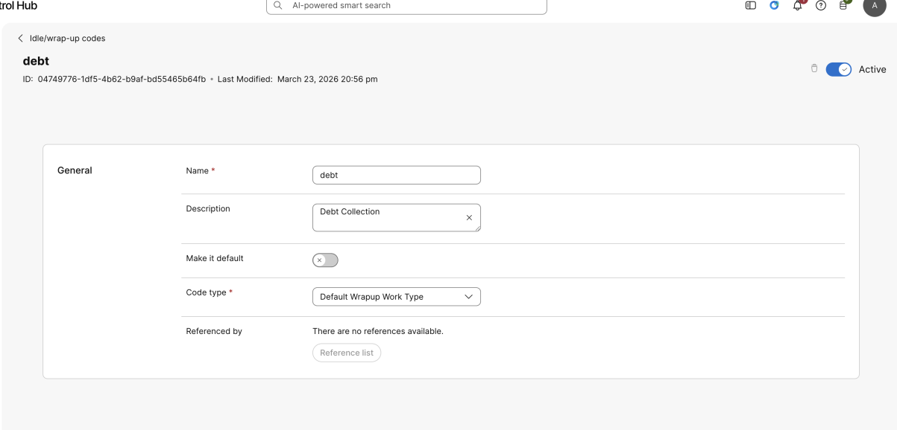
    </figure>

    3. The only mandatory field is the **Group Name** (e.g. `Bootcamp2026`). Click **Save & proceed**.

    <figure markdown>
    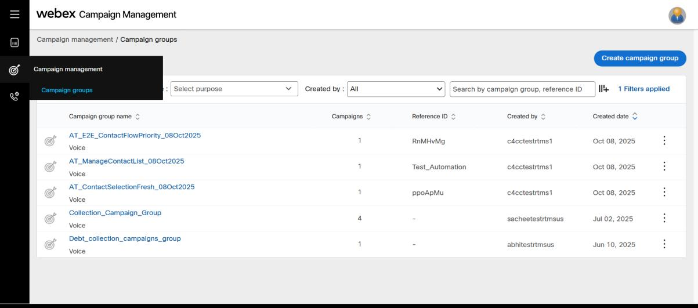
    </figure>

    After it is created you will see it listed:

    <figure markdown>
    
    </figure>

### Configure the Campaign

Click on the new campaign group to access the campaign configuration wizard.

For the first node **"Dialer configuration"** we will select the entry point and Outdial ANI created previously in Control Hub. We will use a **Progressive IVR** campaign and leave CPA parameters enabled.

???+ webex "Configure Dialer"

    <figure markdown>
    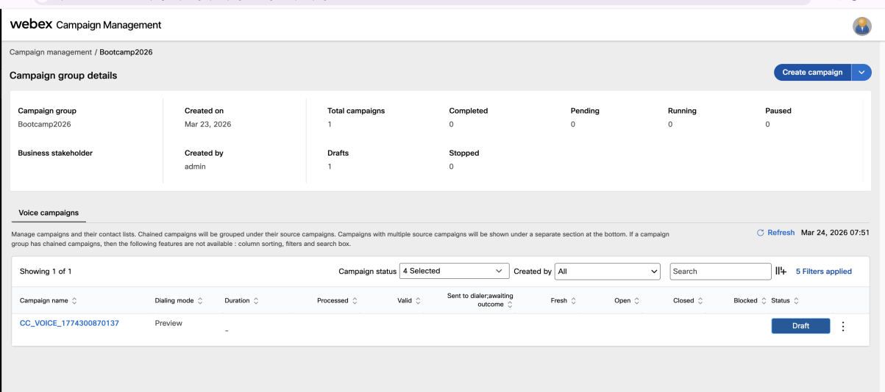
    </figure>

    <figure markdown>
    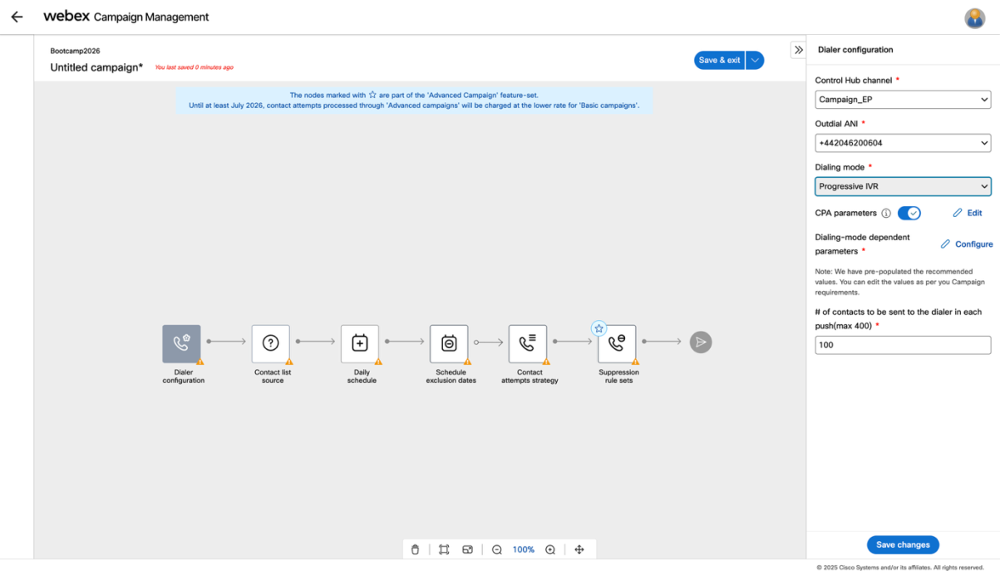
    </figure>

    Now it is time to configure the contact list source. We will upload it manually and select the field mapping created earlier.

    Configure the daily schedule — you can use the same values shown below. **Use your own TimeZone.**

    After that, select the schedule exclusion dates created previously.

    <figure markdown>
    
    </figure>

Configure the daily schedule and exclusion dates as shown, then move to the contact attempt strategy node.

???+ info
    Pages 27 of the PDF shows the daily schedule configuration without a screenshot — configure using the values shown in the node above. The exclusion date `31/12/2026` you created in Lab 1.6 will appear here for selection.

Next, we will configure the contact attempt strategy:

???+ webex "Configure Contact Attempt Strategy"

    <figure markdown>
    
    </figure>

    <figure markdown>
    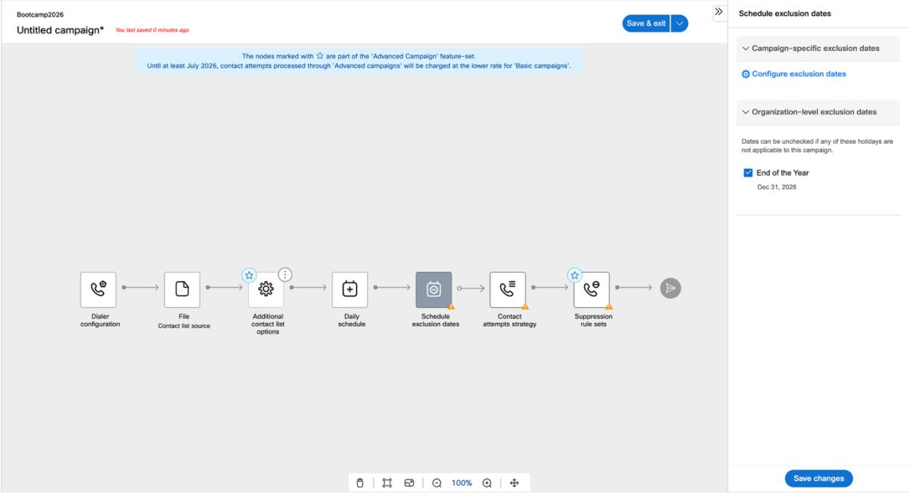
    </figure>

    <figure markdown>
    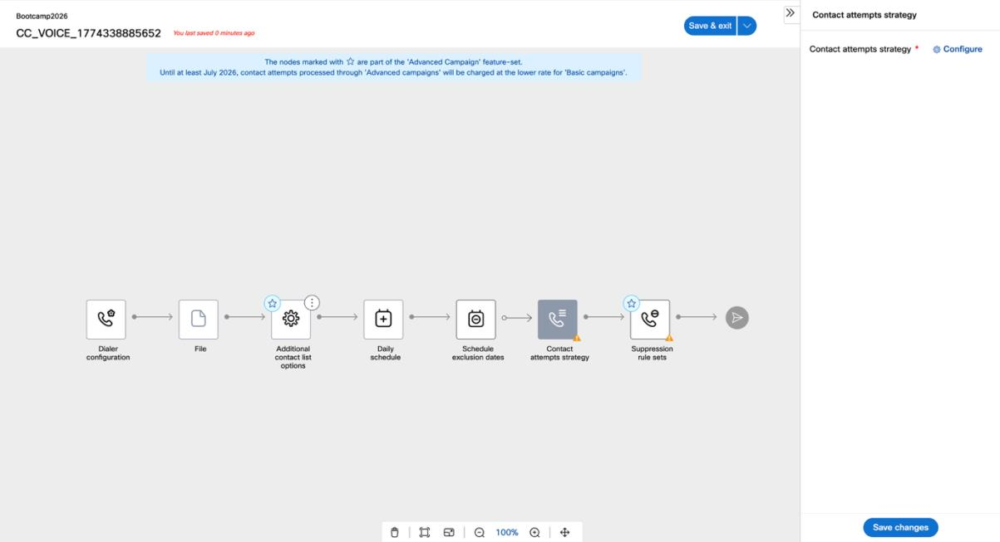
    </figure>

You will have to add a wrap-up code set and select the telephony outcome set. The contact modes are prepopulated based on the selected field mapping. Configure max attempts as per the exhibit below. For sequential dialling, disable the option and set `10` as the amount of contacts:

???+ webex "Set Max Attempts and Suppression"

    <figure markdown>
    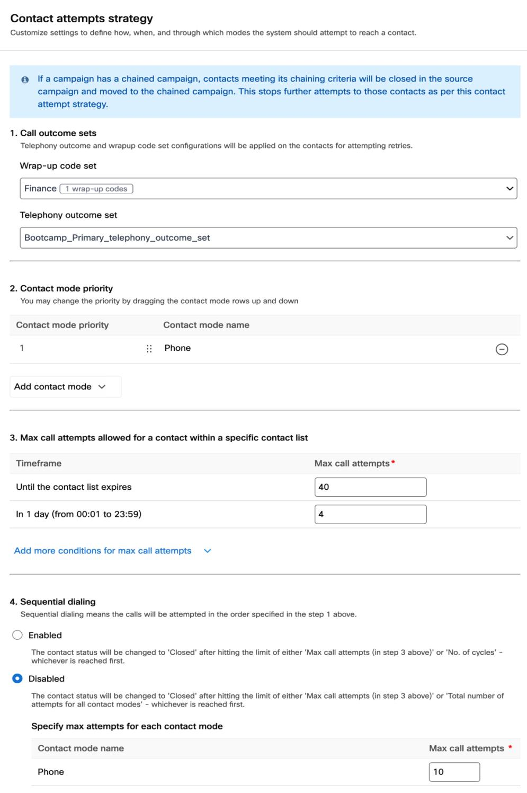
    </figure>

**Last node to configure is the suppression rule.** We will add the one we created previously. Then save the campaign.

???+ webex "Add Suppression Rule and Save Campaign"

    <figure markdown>
    
    </figure>

    **To save the campaign you will need to configure the final name and meta-tags created previously (P&L and Purpose):**

    <figure markdown>
    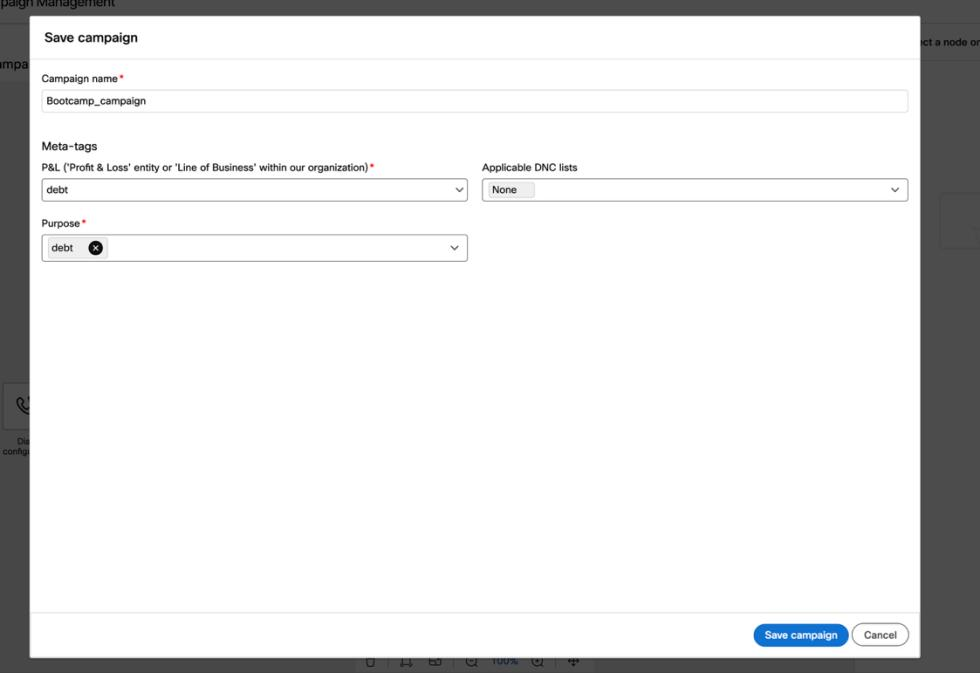
    </figure>

---

## Lab 1.8 - Activate the Campaign and Upload the Contact List

You can now activate the campaign:

???+ webex "Activate the Campaign"

    1. Find `Bootcamp_campaign` in the list and click the **⋮** menu → **Activate**.

    <figure markdown>
    
    </figure>

    <figure markdown>
    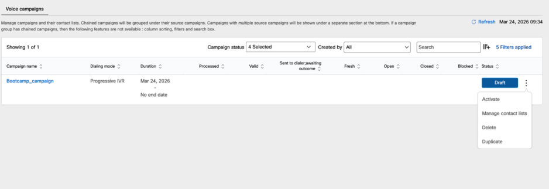
    </figure>

    2. The campaign status changes to **Running**.

    <figure markdown>
    
    </figure>

    <figure markdown>
    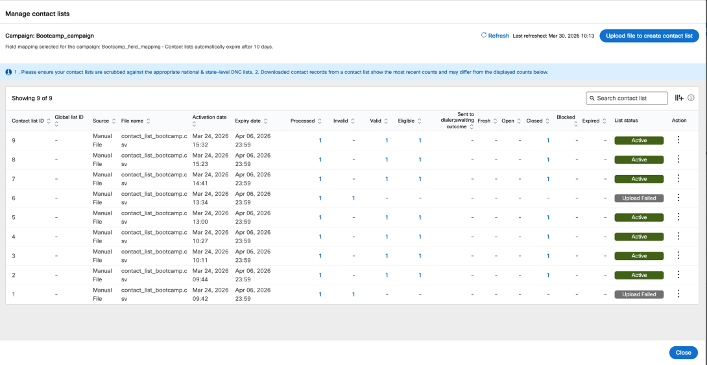
    </figure>

Now it is time to add the contact list. Contact lists can also be added using APIs — for more information visit the [Webex Campaign API documentation](https://docs-campaign-for-contact-centers.webexcampaign.com).

To create the contact list we will use the CSV file created previously. All configurations will remain as they are.

???+ webex "Upload the Contact List"

    1. In the campaign view, click **Manage contact lists** → **Upload file to create contact list**.
    2. Select your CSV, set **Field mapping** to `Bootcamp_field_mapping`, and set **Automatically activate** to `Immediately after upload`.
    3. Click **Save and proceed**.

    <figure markdown>
    
    </figure>

    The first status you will get is **Uploading**. If your file is OK it will be processed and shown as **Valid**. Now it will take between **2 to 5 minutes** to launch the call.

    ???+ warning
        If for any reason the file cannot be uploaded, it is likely a problem with the format. Check the CSV structure against the Field Mapping configuration.

---

## Testing 🧪

If everything went well, you will receive a call saying:

```text
Congratulations, you have completed lab 1.
```

???+ bug "Troubleshooting"

    If you do not receive a call within 5 minutes, check the following:

    - The campaign status is **Running** (not Paused or Pending)
    - The contact list status is **Valid/Active** (not Uploading or Failed)
    - The phone number in the CSV is in E.164 format with `+` (e.g. `+12025551234`)
    - The **Outdial ANI** is correctly associated with the Entry Point
    - The **Business Hours** schedule covers the current time in your time zone
    - The **Suppression Rule** is not blocking calls — calls are suppressed before 07:00 and after 23:00 in the recipient's timezone

---

## Lab Completion ✅

At this point, you have successfully:

- [x] Created a licensed agent user, team, out-dial queue, global variables, and a wrap-up code in **Control Hub**
- [x] Built a **dummy validation flow** (`Lab1_completed`) and an **outbound campaign flow** (`Outbound_DebtCollection`) with AMD, Abandoned, and Live Voice event handling
- [x] Configured an **Entry Point** (`Campaign_EP`) and **Outdial ANI** for outbound telephony
- [x] Set up all **Campaign Manager pre-requisites**: business days, contact modes, field mappings, org exclusions, purpose and P&L meta-tags, suppression rules, telephony outcomes, and wrap-up code sets
- [x] Created, activated, and validated a **Progressive IVR outbound campaign** (`Bootcamp_campaign`)

**Congratulations!** You now have a fully operational proactive outbound reach capability. The infrastructure built here is the foundation that the AI Agent in Lab 2 uses to handle every live answered call.

[Next Lab: Lab 2 - Automated Debt Collection](lab2_debt_ai_agent.md){ .md-button .md-button--primary }
