# Lab 1 - Proactive Outbound Reach 📞

## Lab Purpose

Proactive outbound communication is a key pillar of modern customer engagement. Rather than waiting for customers to call in, organisations can leverage **Webex Contact Center Campaign Manager** to initiate timely, context-rich outbound calls — automatically, at scale, and in full compliance with regulatory requirements.

In this lab, you will configure an **end-to-end outbound IVR campaign** using Webex Campaign Management. This includes setting up the necessary WxCC infrastructure (agents, teams, queues, flows, entry points) and then configuring all Campaign Manager prerequisites before launching a live Progressive IVR campaign targeting a debt collection use case.

???+ purpose "Lab Objectives"
    By the end of this lab, you will have configured the full stack required to run an outbound IVR campaign in Webex Contact Center. Key objectives include:

    - **WxCC Infrastructure Setup:** Configure teams, outdial queues, global variables, and entry points on Control Hub.
    - **Flow Design:** Build an outbound campaign flow with CPA-based routing and event flows, including Answer Machine Detection (AMD) and Live Voice handling.
    - **Campaign Manager Configuration:** Complete all prerequisite campaign administration settings including business days, contact modes, field mappings, suppression rules, and telephony outcomes.
    - **Campaign Activation:** Create a campaign group, configure and activate the campaign, and upload a contact list to trigger live calls.

???+ Challenge "Lab Outcome"
    By the end of Lab 1, you will have a fully operational outbound IVR campaign that:

    1. **Dials contacts** from an uploaded CSV contact list using Progressive IVR mode.
    2. **Detects call outcomes** (AMD, Abandoned, Live Voice) and routes them appropriately.
    3. **Plays a congratulatory message** ("Congratulations, you have completed Lab 1") to live voice contacts — confirming the end-to-end campaign flow is working.
    4. **Passes customer data** (first name, last name) as global variables to the destination flow, ready for Lab 2's AI Agent integration.

---

## Pre-requisites

In order to complete this lab, you must have:

* [x] Access to **Webex Control Hub** with Full Admin permissions
* [x] A **Webex Contact Center** tenant provisioned and licensed
* [x] Access to the **Webex Campaign Management** portal

---

## Lab Overview 📌

The diagram below illustrates the high-level architecture and the sequence of configuration steps you will follow throughout this lab:

<figure markdown>

<figcaption>High-level outbound campaign configuration workflow</figcaption>
</figure>

In this lab you will perform the following tasks:

1. Configure a team
2. Create an Outdial Queue
3. Configure Global Variables and Wrap-up Codes
4. Build the Outbound Campaign Flow (Main + Event flows)
5. Create the Outdial Entry Point (Channel) and Outdial ANI
6. Complete Campaign Manager prerequisites
7. Create, activate, and upload contacts to the Campaign

---

## Lab 1.1 - Configure a Team

### Create a Team
Even we won't use any agent to run the IVR campaign, the creation of a **team or agent** to assign to an **outdial queue** is mandatory. The **Entry Point** need to have that queue associated.

???+ webex "Create Team"

    1. In Control Hub, navigate to **Contact Center** → **Teams**.
    2. Click **Create a team** and fill in the following:

        | Field | Value |
        |---|---|
        | **Name** | `Bootcamp_Team` |
        | **Parent site** | `Site-1` |
        | **Team type** | `Agent-based` |
        | **Multimedia profile** | `Default_Multimedia_Profile` |
        | **Desktop layout** | `Global Layout` |

    3. Click **Create**.

    <figure markdown>
    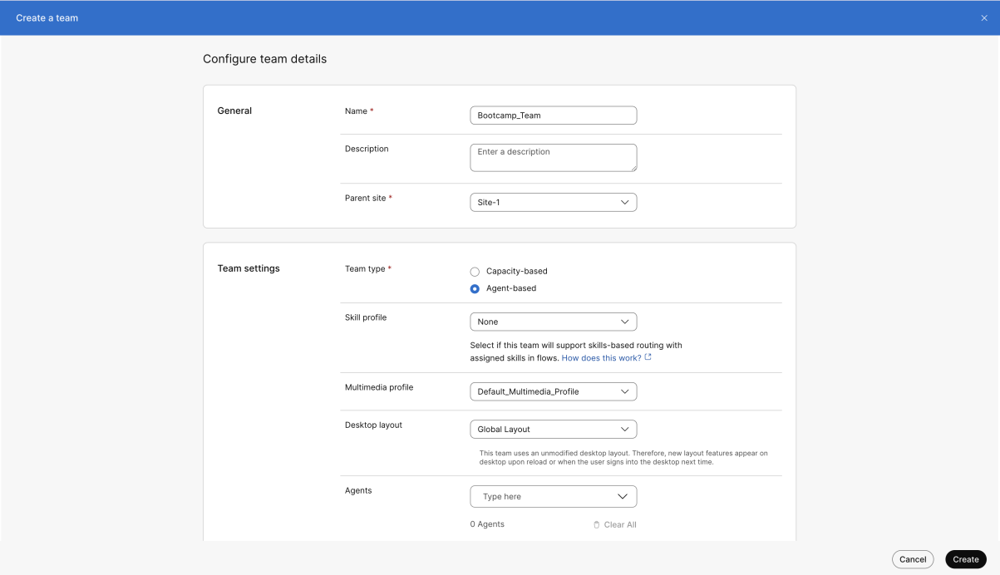
    <figcaption>Creating Bootcamp_Team with Agent-based type and Default Multimedia Profile</figcaption>
    </figure>

---

## Lab 1.2 - Create an Outdial Queue

The outdial queue is what connects your outbound campaign to the agent pool. It must be set to **Outbound queue** type and have the **Outbound campaign** toggle enabled.

???+ webex "Create Outdial Queue"

    1. In Control Hub, navigate to **Contact Center** → **Queues**.
    2. Click **Create a queue** and configure:

        | Field | Value |
        |---|---|
        | **Name** | `Bootcamp_OutVoiceQueue` |
        | **Contact direction** | `Outbound queue` |
        | **Channel type** | `Telephony` |
        | **Outbound campaign** | Enabled (toggle ON) |
        | **Agent assignment** | `Teams` → select `Bootcamp_Team` |

    3. Under **Call distribution**, click **Create a group**, expand it, and select `Bootcamp_Team`.
    4. Fill in the mandatory **Advanced settings**:

        - **Service level threshold**: *200*
        - **Maximum time in queue**: *120*
        - **Default music in queue**: *defaultmusic_on_hold.wav*

    4. Click **Create**.

    <figure markdown>
    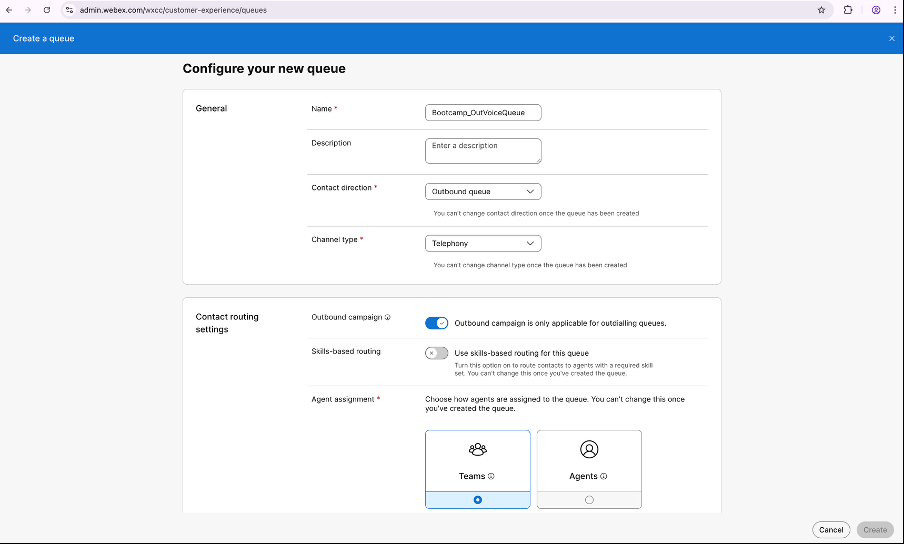
    <figcaption>Creating the Bootcamp_OutVoiceQueue with Outbound queue direction and Outbound campaign enabled</figcaption>
    </figure>

    !!! note
        The **Contact direction** and **Channel type** fields cannot be changed after the queue is created. Double-check these values before clicking Create.


---

## Lab 1.3 - Configure Global Variables and Wrap-up Codes

### Create Global Variables

Global Variables are used to carry customer data (from the contact list) through the campaign flow and display it on the Agent Desktop. You must create two variables: `firstName` and `lastName`.

???+ webex "Create Global Variables"

    1. In Control Hub, navigate to **Contact Center** → **Flows** → **Global Variables**.
    2. Click **Create a global variable** and configure the **firstName** variable:

        | Field | Value |
        |---|---|
        | **Name** | `firstName` |
        | **Description** | `firstName` |
        | **Variable type** | `String` |
        | **Make reportable** | Enabled |
        | **Make agent viewable** | Enabled |
        | **Desktop label** | `First Name` |
        | **Edit on desktop** | Disabled |

    3. Click **Create**.
    4. Repeat the process to create the **lastName** variable with the Desktop label `Last Name`.

    <figure markdown>
    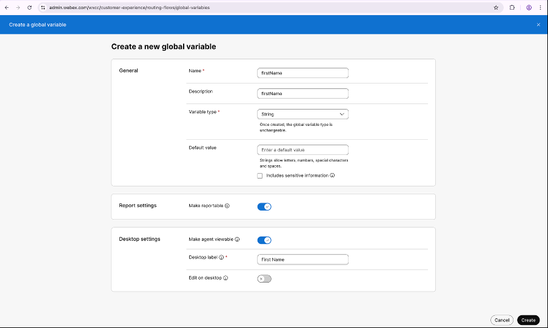
    <figcaption>Creating the firstName global variable with agent viewable and reportable settings enabled</figcaption>
    </figure>

    !!! important
        Both `firstName` and `lastName` must be added to all flows in this lab — both the dummy test flow and the outbound campaign flow — under **Global Flow Properties** → **Global Variables**.

### Create a Wrap-up Code

A wrap-up code is required by Campaign Manager when configuring the contact attempt strategy.

???+ webex "Create Wrap-up Code"

    1. In Control Hub, navigate to **Contact Center** → **Idle/wrap-up codes**.
    2. Click **Create** and configure:

        | Field | Value |
        |---|---|
        | **Name** | `debt` |
        | **Description** | `Debt Collection` |
        | **Make it default** | Enabled |
        | **Code type** | `Default Wrapup Work Type` |

    3. Click **Save**.

    <figure markdown>
    
    <figcaption>The debt wrap-up code configured in Control Hub</figcaption>
    </figure>

---

## Lab 1.4 - Build the Flows

### Create the "Lab2" Dummy Test Flow

Before building the full outbound campaign flow, create a simple **dummy flow** to validate the end-to-end campaign configuration. This same flow will be used as the starting point for **Lab 2** so name it as **AI_Agent_DebtCollection**

The flow plays a congratulatory TTS message when a live voice contact is detected, confirming Lab 1 is fully operational.

???+ webex "Create Lab2 dummy flow"

    1. In Control Hub, navigate to **Contact Center** → **Flows**.
    2. Click **Manage Flows -> Create Flows** 
    3. Select **Flow** and **Start from scratch** and click **Next**
    4. Name the flow <copy>`AI_Agent_DebtCollection`</copy>.
    3. In the **Global Flow Properties** panel on the right:
        - Under **Global Variables**, click **Add global variables** and add both `firstName` and `lastName`.
    4. From the **Activities Library**, drag a **Play Message** node onto the canvas and connect it to the **NewPhoneContact** Start node.

        ???+ Warning
            The **NewPhoneContact** event is being renamed into **NewContact**, so this might be the name you see in your start node.

    5. Configure the **Play Message** node:
        - **Activity Label**: `EndOfLab1`
        - Enable **Text-to-Speech**
        - **Connector**: `Cisco Cloud Text-to-Speech`
        - Add **Text-to-Speech Message**: <copy>`Congratulations, You have completed lab 1`</copy>
        - Remove the **Audio file** field.
    6. Drag and drop an **End Flow** node and connect the **Play Message** node to it.
    7. Enable the **Validation** slider at the bottom-right of the editor to validate the flow and then click **Publish Flow** (select **Latest** as the version label).

    <figure markdown>
    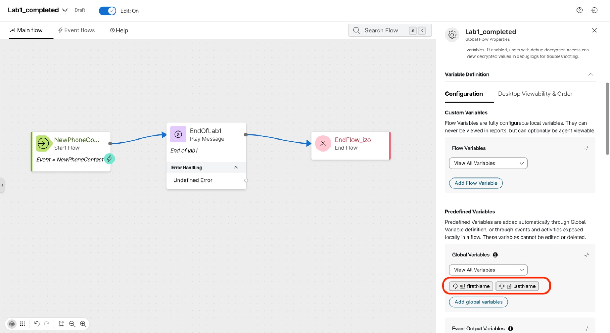
    <figcaption>Lab1_completed flow showing the Play Message node with the congratulatory TTS message and Global Variables added</figcaption>
    </figure>

    <figure markdown>
    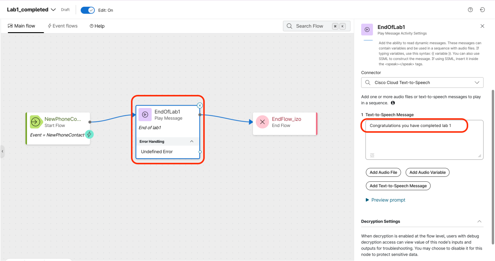
    <figcaption>Play Message node configured with Cisco Cloud Text-to-Speech playing "Congratulations, You have completed lab 1"</figcaption>
    </figure>

### Create the Outbound Campaign Flow

Now create the main outbound campaign flow. This flow handles the outbound dialling logic and routes calls based on the CPA (Call Progress Analysis) result.

???+ webex "Create Outbound_DebtCollection Flow"

    1. In Control Hub, navigate to **Contact Center** → **Flows**.
    2. Click **Manage Flows -> Create Flows** and select **Flow** and **Start from scratch** in the next window. Click **Next**
    3. Name it <copy>`Outbound_DebtCollection`</copy>.
    3. In the **Global Flow Properties** panel:
        - Under **Global Variables**, add both `firstName` and `lastName`.
    4. The Main flow canvas starts with a **NewPhoneContact** Start node.
    
        > Note the Start node might be **NewContact** instead.

        Connect it to an **End Flow** node as a placeholder — the actual logic is handled in Event flows.

    <figure markdown>
    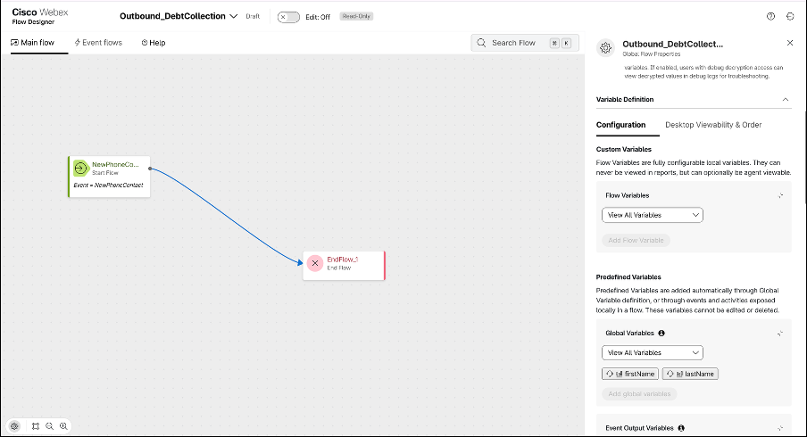
    <figcaption>Outbound_DebtCollection flow showing firstName and lastName Global Variables added to the flow configuration</figcaption>
    </figure>

#### Configure Event Flows

The campaign logic is driven by **Event flows**. Click on **Event flows** at the top of the flow builder to switch to the event flow canvas. You will configure one key event:

**OutboundCampaignCallResult**

This event fires when the dialler receives a CPA result for an outbound call attempt. It determines whether the call reached an answering machine, was abandoned, or reached a live conversation.

???+ webex "Configure OutboundCampaignCallResult Event"

    1. On the Event flows canvas, locate the **OutboundCampaignCallResult** event handler node.
    2. Drag a **Case** node onto the canvas and connect the **OutboundCampaignCallResult** event handler to it.
    3. Configure the **Case** node:
        - **Activity Label**: <copy>`Campaign_Results`</copy>
        - **Case variable**: `OutboundCampaignCallResult.CPAResult`
        - Add the following case outputs:

            | Case | Value |
            |---|---|
            | **AMD** | <copy>`AMD`</copy> |
            | **ABANDONED** | <copy>`ABANDONED`</copy> |
            | **LIVE_VOICE_IVR_CAM** | <copy>`LIVE_VOICE_IVR_CAM`</copy> |
            | **Default** | (default fallthrough) |

    <figure markdown style="width: 70%;">
    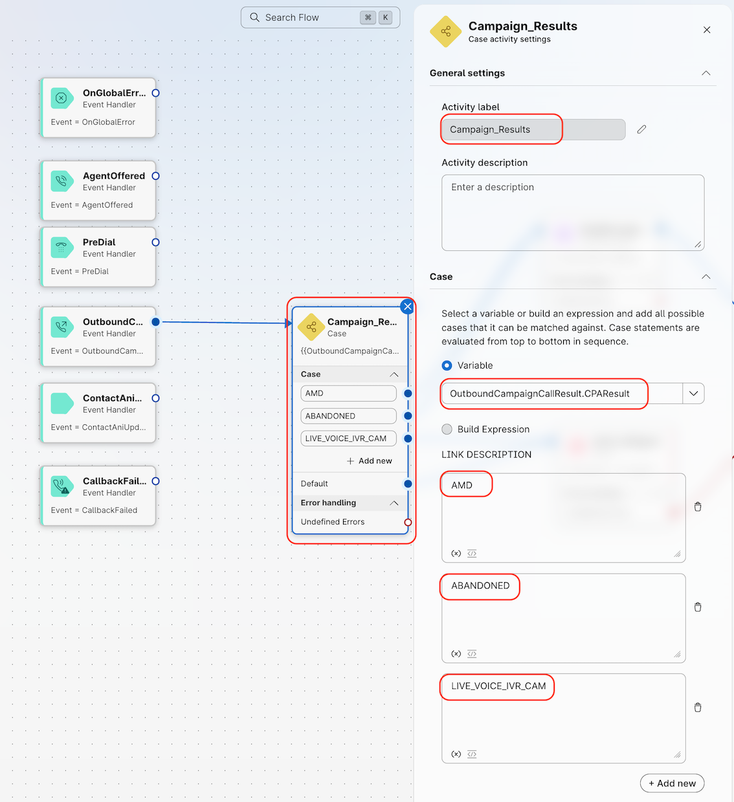
    <figcaption>Case node configured with CPAResult variable showing AMD, ABANDONED, and LIVE_VOICE_IVR_CAM outputs</figcaption>
    </figure>


**Handling AMD and Abandoned outcomes:**

???+ webex "Configure AMD and Abandoned Routing"

    1. Drag a **Play Message** node onto the canvas.
    2. Connect both the **AMD** and **ABANDONED** outputs of the Case node to this Play Message node.
    3. Configure the Play Message node:
        - Enable **Text-to-Speech**
        - **Connector**: `Cisco Cloud Text-to-Speech`
        - **Text-to-Speech Message**: `Goodbye`
    4. Drag and **End Flow** message to the canvas and connect the **Play Message** node to an **End Flow** node.

    <figure markdown>
    
    <figcaption>Play Message node configured with TTS "Goodbye" for AMD and Abandoned call outcomes</figcaption>
    </figure>

**Handling Live Voice (LIVE_VOICE_IVR_CAM) outcome:**

???+ webex "Configure Live Voice Routing"

    1. Drag a **Go To** node onto the canvas.
    2. Connect the **LIVE_VOICE_IVR_CAM** output of the **Case** node to the **Go To** node.
    3. Connect also the **Default** output of the **Case** node to the **Go To** node.
    3. Configure the **Go To** node:
        - **Activity Label**: `GoTo_AIAgent`
        - **Destination type**: `Flow`
        - **Flow type**: `Static Flow`
        - **Flow**: `AI_Agent_DebtCollection` *(this will be used in Lab 2)*
        - **Version Label**: `Latest`
    4. Under **Flow Variable Mapping**, map the global variables from the current flow to the destination flow:

        | Current variable | Destination variable |
        |---|---|
        | `firstName` | `firstName` |
        | `lastName` | `lastName` |

    5. Connect the **Undefined Errors** outlet of the **GoTo** node to the **End Flow** node.

        !!! important
            The **Flow Variable Mapping** is critical for Lab 2. This ensures that the customer's first and last name (loaded from the campaign contact list) are passed to the destination flow where the AI Agent will use them.

        <figure markdown>
            <figure markdown style="width: 80%;" >
            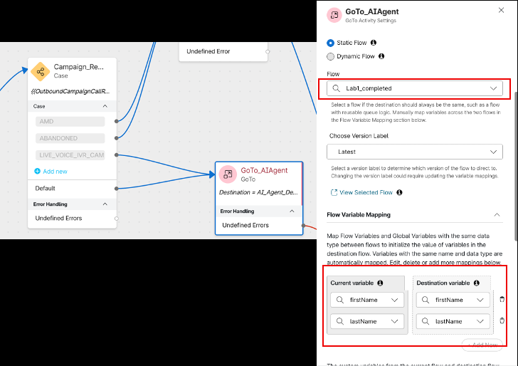
            <figure markdown style="width: 30%;" >
            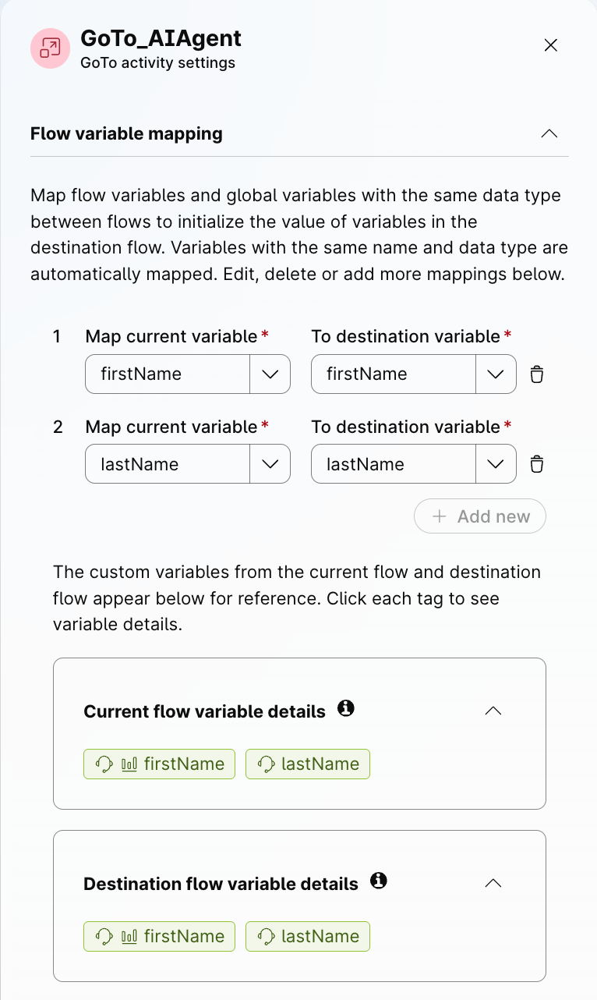
            <figcaption>Go To node pointing to the AI_Agent_DebtCollection flow with firstName and lastName mapped across flows</figcaption>
        </figure>


    6. Connect the **Undefined Errors** output of the **Case** node to the **End Flow** node.

    7. Enable the **Validation** slider to validate the flow and once validated, click **Publish Flow** to publish it. 

    Your **Outbound DebtCollection** flow is ready.  

---

## Lab 1.5 - Create the Outdial Entry Point (Channel) and Outdial ANI

### Create the Outdial Entry Point

The Entry Point (Channel) is the outbound telephony channel that ties together the flow, the outdial queue, and the dialling configuration.

???+ webex "Create Outdial Entry Point"

    1. In Control Hub, navigate to **Contact Center** → **Channels**.
    2. Click **Create a channel** and configure:

        | Field | Value |
        |---|---|
        | **Name** | `Campaign_EP` |
        | **Channel type** | `Outbound telephony` |
        | **Service level threshold** | `30` seconds |
        | **Timezone** | `Europe/London` *(use your local timezone)* |
        | **Routing flow** | `Outbound_DebtCollection` |
        | **Music on hold** | `defaultmusic_on_hold.wav` |
        | **Version label** | `Latest` |
        | **Outdial queue** | `Bootcamp_OutVoiceQueue` |

    3. Click **Create**.

    <figure markdown>
    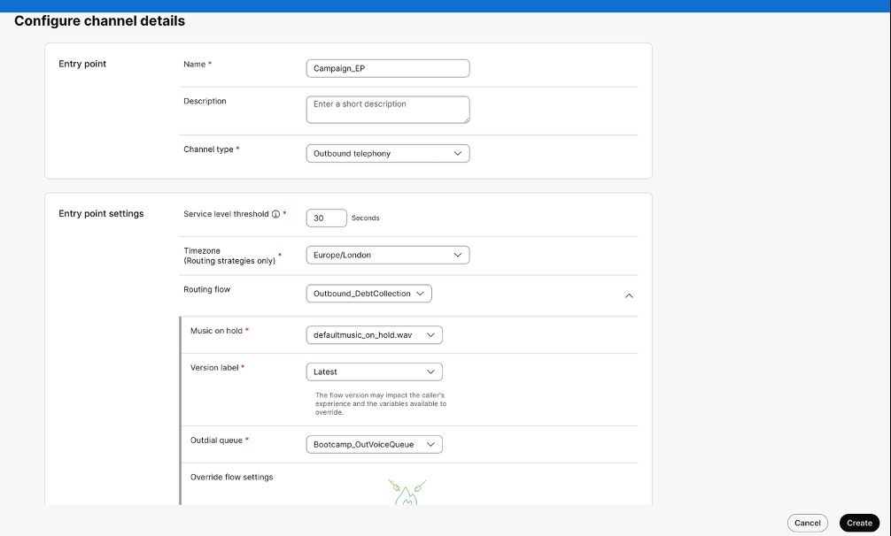
    <figcaption>Campaign_EP entry point configured with Outbound telephony, pointing to the Outbound_DebtCollection flow and Bootcamp_OutVoiceQueue</figcaption>
    </figure>

### Configure Outdial ANI

The Outdial ANI is the caller ID displayed to customers when they receive the outbound call. You can configure multiple ANIs for different regions.

???+ webex "Create Outdial ANI"

    1. In Control Hub, navigate to **Contact Center** → **Outdial ANI**.
    2. Click **Create** and configure:
        - **Name**: `Bootcamp_outANI`
    3. Under **Entry list**, click **Add More** and add your PSTN numbers:

        | Entry | Name | Contact number |
        |---|---|---|
        | 1 | `US-DIALOUT` | `+13502502108` |
        | 2 | `PSTN` | `+442046200604` |

    4. Click **Save**.

    <figure markdown>
    
    <figcaption>Bootcamp_outANI configured with US and UK PSTN numbers for outdial caller ID</figcaption>
    </figure>

---


## Lab 1.6 - Campaign Manager Configuration

Open the **Webex Campaign Management** portal. On first login, you will see the welcome screen outlining all the administration areas to configure before launching campaigns.

<figure markdown style="width: 70%;">

<figcaption>Welcome to Webex Campaign Management — administration checklist</figcaption>
</figure>

Complete each section in order as described below.

### Business Days

Business days are used solely for the purpose of contact list expiry calculation. They have no association with 'Business hours' on the Control Hub. We won't use this option as part of this lab.

### Contact Modes

Contact modes define the type of phone number in your contact list (e.g. Home, Office, Mobile). For this lab, we use a single contact mode mapped to the `phoneNumber` column in the CSV.

???+ webex "Create Contact Mode"

    1. Navigate to **Voice campaigns administration** → **Contact modes**.
    2. Click **Create contact mode** and fill in:

        | Field | Value |
        |---|---|
        | **Contact mode name** | `phone` |
        | **Contact mode type** | `Voice` |
        | **Description** | *(optional)* |
        | **Minimum length** | `7` |
        | **Maximum length** | `15` |

    3. Click **Create contact mode**.

    <figure markdown style="width: 60%;">
    
    <figcaption>Creating the phone contact mode with Voice type and default length constraints</figcaption>
    </figure>

### DNC Lists

Do Not Contact (DNC) lists prevent the campaign from calling restricted numbers. For this lab, **no DNC list will be configured**.

!!! info
    In production environments, you would upload DNC lists here to comply with regulatory requirements (e.g., national DNC registries). The campaign engine automatically suppresses any contacts matched against active DNC lists.

### Global Variables

Global variables are synced from Control Hub. They appear here for informational purposes — you cannot create or modify them in Campaign Manager.

???+ webex "Verify Global Variables"

    1. Navigate to **Voice campaigns administration** → **Global variables**.
    2. Verify that `firstName` and `lastName` are listed with **Status: Active** and **Agent view: Yes**.

        If you don´t see the variables, click *Refresh from Control Hub* at the top-right of the page

    !!! important
        Before you can use Global Variables in Campaign Manager, you must designate a **customer-unique-identifier** and **account-unique-identifier** for compliance with call attempt regulations. For this lab, since we are not configuring unique identifiers, this step is skipped.

    <figure markdown>
    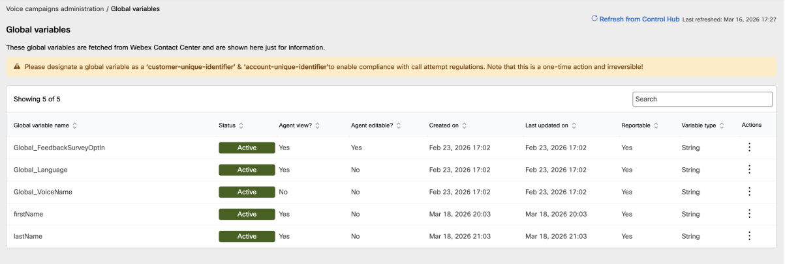
    <figcaption>Global variables list showing firstName and lastName as Active, agent-viewable, and reportable</figcaption>
    </figure>

### Field Mappings

Field mappings define how the columns in your CSV contact list map to the Campaign Manager's dialler system — including which column contains the phone number, which global variables carry the customer name, and the data types.

#### Prepare the Contact List CSV

Before creating the field mapping, create your contact list file.

???+ webex "Create Contact List CSV"

    Create or [download](./bcamp_files/contact_list_bootcamp.csv) a CSV file named `contact_list_bootcamp.csv` with the following header structure:

    ```csv
    firstName,lastName,phoneNumber
    John,Smith,+442012345678
    Jane,Doe,+442087654321
    ```

    !!! note
        - All phone numbers must use the E.164 format with the `+` prefix and country code (e.g. `+442012345678`).
        - All rows within a single file must use numbers from the **same country**.
        - Spaces, hyphens, or other special characters in phone numbers are not permitted.

    <figure markdown>
    
    <figcaption>contact_list_bootcamp.csv showing the three-column header: firstName, lastName, phoneNumber</figcaption>
    </figure>

#### Create the Field Mapping

???+ webex "Create Field Mapping"

    1. Navigate to **Voice campaigns administration** → **Field mappings**.
    2. Click **Create field mapping**.
    3. Enter a **Field mapping name**: `Bootcamp_field_mapping`

    **Step 1 — Upload sample file:**

    Click **Choose file** and select your `contact_list_bootcamp.csv`. Once uploaded, the system displays the detected headers: `firstName`, `lastName`, `phoneNumber`.

    <figure markdown>
    
    <figcaption>Field mapping showing Bootcamp_field_mapping with the uploaded CSV and 3 detected headers</figcaption>
    </figure>

    **Step 2 — Map contact modes:**

    In the **Map contact modes** section, map the `phoneNumber` column to the `Phone` contact mode you created earlier. Leave `firstName` and `lastName` as **Unmapped** at this stage.

    <figure markdown style="width: 60%;">
    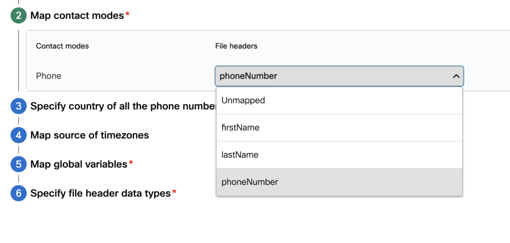
    <figcaption>Contact mode mapping showing phoneNumber mapped to the Phone contact mode</figcaption>
    </figure>

    **Step 3 — Specify country of all phone numbers:**

    Select **United Kingdom +44** (or the appropriate country for your numbers) and set the format to:
    `Prefixed with + sign and country code i.e. '+<country code><phone number>'`

    <figure markdown style="width: 80%;">
    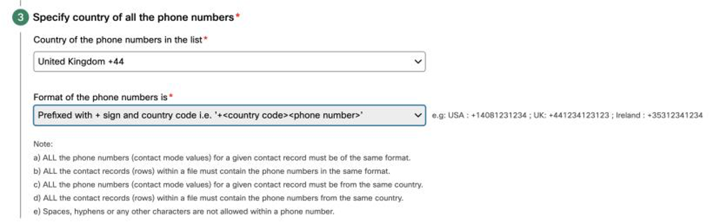
    <figcaption>Phone number format set to E.164 with + prefix and country code</figcaption>
    </figure>

    **Step 4 — Map source of timezones:**

    Keep the default configuration.

    **Step 5 — Map global variables:**

    Map each column in the CSV file to the corresponding Global Variable:

    | File header | Global variable | Data type |
    |---|---|---|
    | `firstName` | `firstName` | String |
    | `lastName` | `lastName` | String |
    | `phoneNumber` | Unmapped | N/A |

    <figure markdown>
    
    <figcaption>Global variable mapping</figcaption>
    </figure>

    **Step 6 — Specify file header data types:**

    Leave all columns as **String** data type. Enable **PII protection** for `phoneNumber` if required by your organisation's data handling policies.

    <figure markdown>
    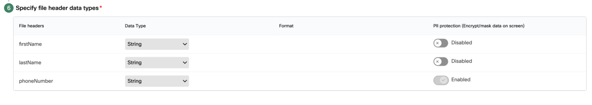
    <figcaption>File header data types: all set to String. PII protection enabled for phoneNumber</figcaption>
    </figure>

    Click **Save** to finalise the field mapping.

### Org Exclusion Dates

Organisation-level exclusion dates prevent campaigns from running on specific dates (e.g. national holidays). These exclusions apply to **all campaigns** in the organisation.

???+ webex "Create Org Exclusion Date"

    1. Navigate to **Voice campaigns administration** → **Org exclusion dates**.
    2. Click **Create exclusion date** and add:

        | Exclusion date | Comment |
        |---|---|
        | `Dec 31, 2026` | `End of the Year` |

    3. Click **Save**.

    <figure markdown>
    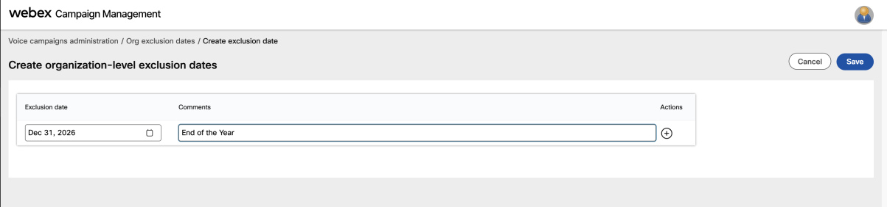
    <figcaption>Organisation-level exclusion date set for 31 December 2026</figcaption>
    </figure>

    !!! info
        When a campaign is running and an exclusion date is reached, the campaign status automatically changes to **Pending** and calling stops. Once the exclusion date passes, the campaign automatically resumes with **Running** status.

### Purpose Meta-tags

Purpose meta-tags allow you to categorise campaigns by business function. They are **mandatory for campaign activation** (though not required to save a campaign in draft).

???+ webex "Create Purpose Meta-tag"

    1. Navigate to **Voice campaigns administration** → **Purpose meta-tags**.
    2. Click **Create purpose meta-tag** and configure:
        - **Purpose meta-tag**: `debt`
        - **Purpose meta-tag group**: `DEFAULT`
    3. Click **Update purpose meta-tag**.

    <figure markdown style="width: 70%;">
    
    <figcaption>Creating the "debt" purpose meta-tag under the DEFAULT group</figcaption>
    </figure>

### P&L Meta-tags

P&L (Profit and Loss) meta-tags allow campaigns to be assigned to different business divisions or cost centres. Like purpose meta-tags, they are **mandatory for campaign activation**.

???+ webex "Create P&L Meta-tag"

    1. Navigate to **Voice campaigns administration** → **P&L meta-tags**.
    2. Click **Create P&L meta-tag** and configure:
        - **P&L meta-tag name**: `debt`
        - **P&L meta-tag description**: `Debt Department`
    3. Click **Save P&L meta-tag**.

    <figure markdown>
    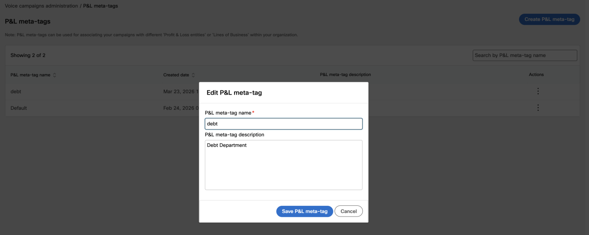
    <figcaption>P&L meta-tags list showing the debt tag created alongside the system Default tag</figcaption>
    </figure>

### Suppression Rules

Suppression rules prevent calls from being made to contacts during restricted time windows or under other compliance conditions. They are evaluated before each call attempt.

???+ webex "Create Suppression Rule Set and Rule"

    **Step 1 — Create the rule set:**

    1. Navigate to **Voice campaigns administration** → **Suppression rule sets**.
    2. Click **Create suppression rule set**.
    3. Enter the name: `Bootcamp_rule`
    4. Click **Save rule set**.

    <figure markdown>
    
    <figcaption>Creating the Bootcamp_rule suppression rule set</figcaption>
    </figure>

    Once saved, the rule set appears in the list. Click the **⋮ Actions** menu on the `Bootcamp_rule` row to access the option to create a rule within it.

    <figure markdown>
    
    <figcaption>Bootcamp_rule suppression rule set listed with Voice channel. Use the Actions menu to select "Create suppression rule"</figcaption>
    </figure>

    **Step 2 — Create the rule under the set:**

    1. Click on the **Bootcamp_rule** set.
    2. Click **Create suppression rule** and configure:

        | Field | Value |
        |---|---|
        | **Rule name** | `Bootcamp_rule1` |
        | **Description** | `Bootcamp_rule1` |
        | **Suppression rule based on** | `Contact attempt timing window` |
        | **Applicable channels** | `Voice` |

    3. Under **Suppress contact attempts to customers who satisfy the following conditions**, add:
        - *Current time (24hr format) in call recipient's timezone is **less than*** `7` hr(s) `0` min(s)
        - **OR** *Current time (24hr format) in call recipient's timezone is **greater than*** `23` hr(s) `0` min(s)

    4. Click **Create**.

    <figure markdown>
    
    <figcaption>Suppression rule configured to prevent calls before 07:00 and after 23:00 in the recipient's timezone</figcaption>
    </figure>

    !!! tip
        This rule ensures the campaign never dials contacts during overnight hours, protecting both customer experience and regulatory compliance.

### Telephony Outcomes

A telephony outcome set defines how each possible call result (Busy, No Answer, AMD, etc.) is treated by the campaign — including whether it counts as a contact attempt and how long to wait before retrying.

The system provides a **primary (read-only) outcome set**. You must **duplicate** it to create a configurable version for your campaign.

???+ webex "Duplicate Telephony Outcome Set"

    1. Navigate to **Voice campaigns administration** → **Telephony outcome sets**.
    2. On the `Primary_telephony_outcome_set` row, click the **⋮ Actions** menu and select **Duplicate**.
    3. Enter the new name: `Bootcamp_Primary_telephony_outcome_set`
    4. Click **Duplicate**.

    <figure markdown>
    
    <figcaption>Telephony outcome sets list showing the system Primary set and the Duplicate action</figcaption>
    </figure>

    <figure markdown>
    
    <figcaption>Duplicate dialog creating Bootcamp_Primary_telephony_outcome_set from the system primary set</figcaption>
    </figure>

    The duplicated set will appear in your list. You can click on it to view all 20 telephony outcomes. For this bootcamp, **leave all outcome values at their defaults**.

    <figure markdown>
    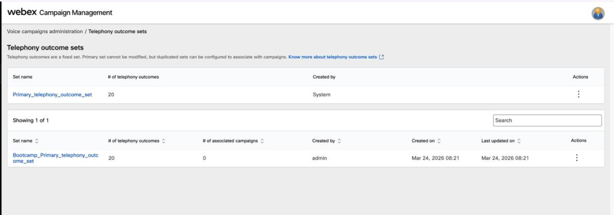

    
    <figcaption>Bootcamp_Primary_telephony_outcome_set showing all 20 telephony outcomes including AMD, ABANDONED, LIVE_VOICE_IVR_CAM, BUSY, INVALID_NUMBER, and others</figcaption>
    </figure>

### UI Users

Webex Campaign Management uses **just-in-time (JIT) provisioning** — user accounts are created automatically the first time a user logs in, based on their role in Control Hub. No manual user creation is required in Campaign Manager.

<figure markdown>

<figcaption>UI Users list showing the admin account provisioned via JIT sync from Control Hub</figcaption>
</figure>

For more information, refer to the [Campaign Management UI Users documentation](https://docs-campaign-for-contact-centers.webexcampaign.com/docs/ui-users).

### Wrap-up Code Sets

Wrap-up codes defined in Control Hub are synced to Campaign Manager. You can configure how each code affects future campaign contact attempts (e.g. whether a contact with a given wrap-up code should be retried).

???+ webex "Configure Wrap-up Code Set"

    1. Navigate to **Voice campaigns administration** → **Wrap-up code sets**. Create a new set.

        <figure markdown>
        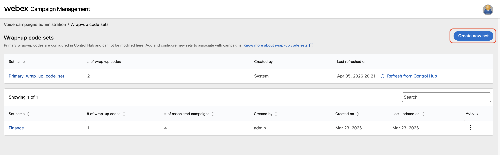
        </figure>

        <figure markdown style="width: 60%;">
        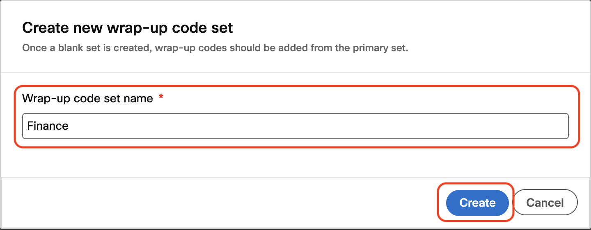
        </figure>

    2. Click on the new set and then **Add wrap-up codes** Locate the wrap-up codes synced from Control Hub. The `debt` wrap-up code created earlier should appear, select it.
    
        <figure markdown>
        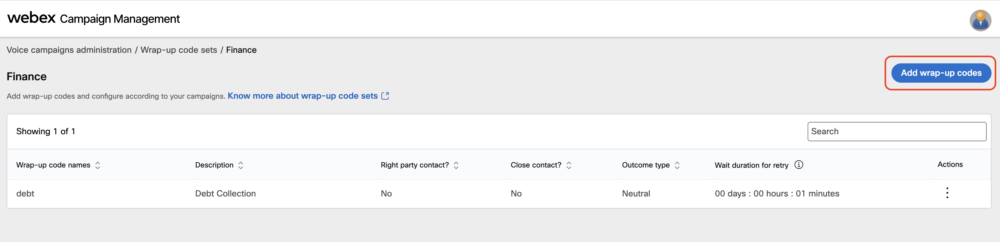
        </figure>

        <figure markdown style="width: 70%;">
        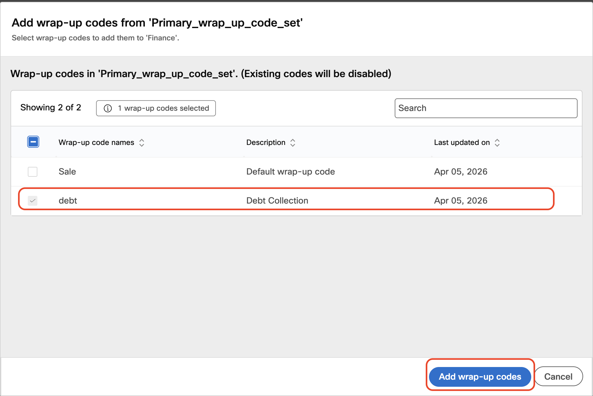
        </figure>


    For more information, refer to the [Wrap-up code sets documentation](https://docs-campaign-for-contact-centers.webexcampaign.com/docs/wrap-up-code-sets).

---

## Lab 1.7 - Campaign Management

With all prerequisites in place, you are ready to create the campaign group, configure the campaign, and activate it.

### Create a Campaign Group

A campaign group is a container (wrapper) for one or more campaigns. You must create the group first before creating any campaigns inside it.

???+ webex "Create Campaign Group"

    1. In Campaign Manager's left navigation panel, navigate to **Campaign management** → **Campaign groups**.
    2. Click **Create campaign group** and enter:
        - **Campaign group name**: `Bootcamp2026`
        - *(All other fields are optional)*
    3. Click **Save & proceed**.


    <figure markdown>
        
        <figcaption>Campaign groups list</figcaption>
    </figure>

    <figure markdown style="width: 80%;">
        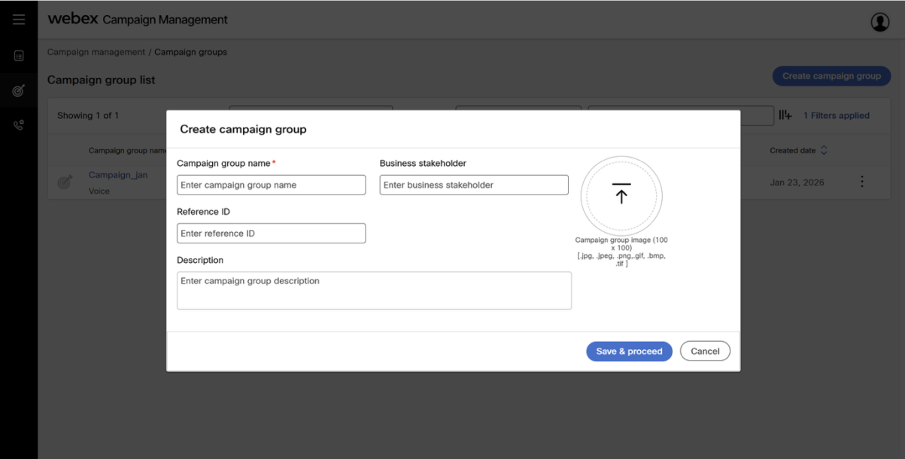
    </figure>

### Create and Configure the Campaign

???+ webex "Create Campaign"

    1. Click on the **Bootcamp2026** campaign group.
    2. Click **Create campaign** in the top-right corner.

        <figure markdown>
        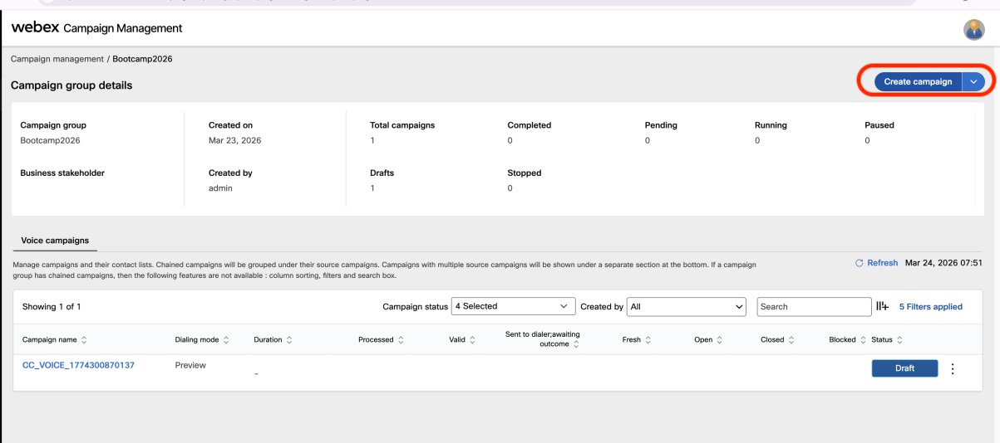
        </figure>

    3. An untitled campaign opens with a visual node-based configuration canvas. Work through each node from left to right.

**Node 1 — Dialer configuration:**

???+ webex "Configure Dialer"

    In the **Dialer configuration** panel on the right side:

    | Field | Value |
    |---|---|
    | **Control Hub channel** | `Campaign_EP` |
    | **Outdial ANI** | `+442046200604` *(select your PSTN ANI)* |
    | **Dialing mode** | `Progressive IVR` |
    | **CPA parameters** | Enabled (leave defaults) |
    | **# of contacts to be sent to the dialer in each push** | `100` |

    Click **Save changes**.

    <figure markdown>
    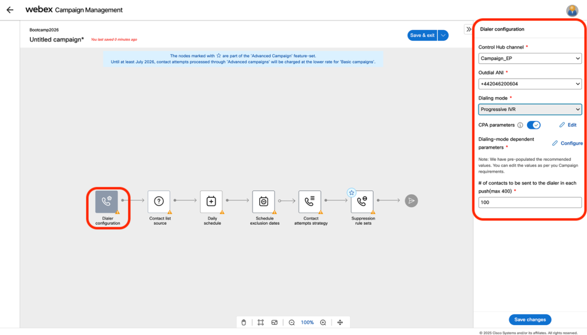
    </figure>

**Node 2 — Contact list source:**

???+ webex "Configure Contact List Source"

    1. Click the **Contact list source** node.
    2. Set **Select contact list source** to `Manual file upload`.
    3. Set **Select field mapping** to `Bootcamp_field_mapping`.
    4. Set the contact expiration to 10 days.
    4. Click **Save changes**.

    !!! note
        The actual contact list file will be uploaded after the campaign is activated. For now, just associate the field mapping.

    <figure markdown>
    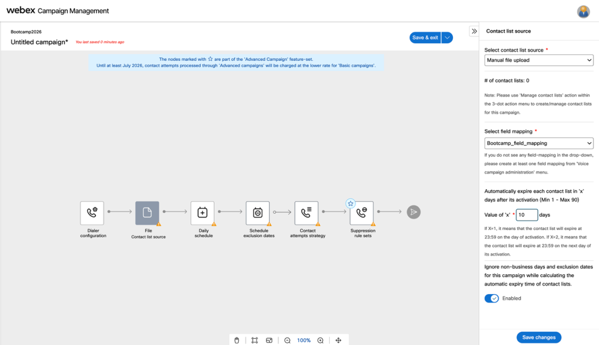
    </figure>

**Node 3 — Daily schedule:**

???+ webex "Configure Daily Schedule"

    1. Click the **Daily schedule** node.
    2. Configure the calling window using your local timezone.
    3. A typical bootcamp schedule runs:
        - **Start time**: `09:00`
        - **End time**: `21:00`
    4. Click **Save changes**.

    <figure markdown>
    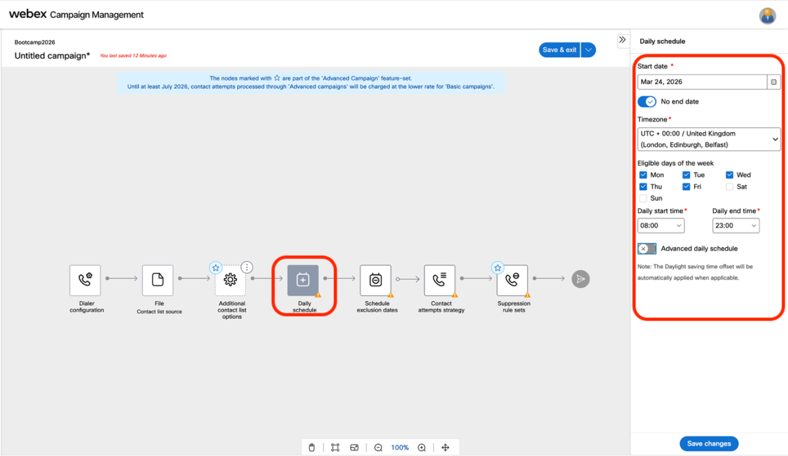
    </figure>

**Node 4 — Schedule exclusion dates:**

???+ webex "Configure Exclusion Dates"

    1. Click the **Schedule exclusion dates** node.
    2. Under **Organisation-level exclusion dates**, the `End of the Year (Dec 31, 2026)` date you created earlier should appear automatically.
    3. Leave it checked (enabled).
    4. Click **Save changes**.

    <figure markdown>
    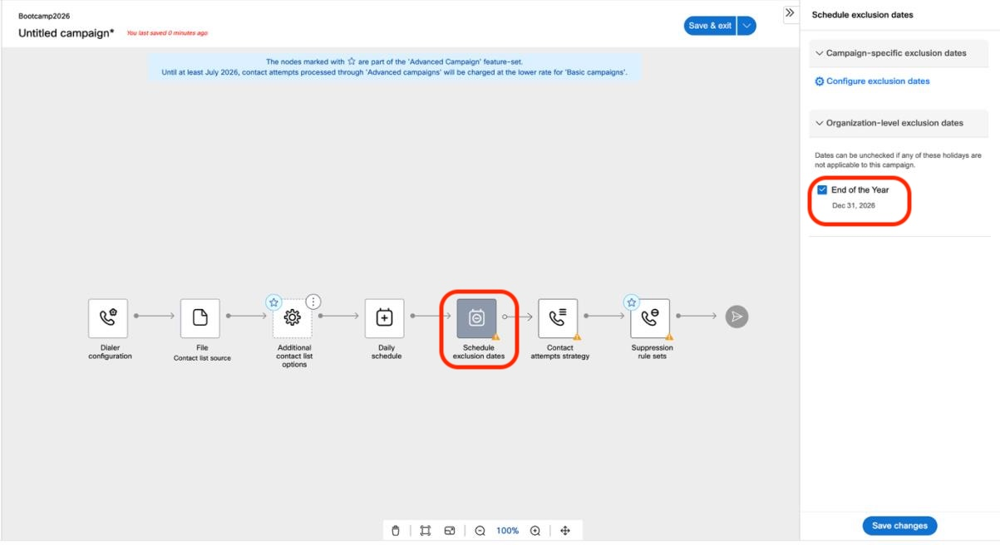
    </figure>

**Node 5 — Contact attempts strategy:**

???+ webex "Configure Contact Attempt Strategy"

    1. Click the **Contact attempts strategy** node, then click **Configure**.

        <figure markdown>
        
        </figure>

    2. Configure the following sections:

    **Section 1 — Call outcome sets:**

    | Field | Value |
    |---|---|
    | **Wrap-up code set** | `Finance` (with 1 wrap-up code) |
    | **Telephony outcome set** | `Bootcamp_Primary_telephony_outcome_set` |


    **Section 2 — Contact mode priority:**

    The `Phone` contact mode should be pre-populated from your field mapping. Leave priority at `1`.

    **Section 3 — Max call attempts:**

    | Timeframe | Max call attempts |
    |---|---|
    | Until the contact list expires | `40` |
    | In 1 day (from 00:01 to 23:59) | `4` |

    **Section 4 — Sequential dialling:**

    Disable sequential dialling and set the amount of contact to `10`.


    Click **Save**.

    <figure markdown style="width: 60%;">
    
    </figure>

    Back to the campaign flow canvas, click **Save changes** in the right panel. 

**Node 6 — Suppression rule sets:**

???+ webex "Configure Suppression Rules"

    1. Click the **Suppression rule sets** node.
    2. Under **Suppression rule sets**, select `Bootcamp_rule` (which includes `Bootcamp_rule1`).
    3. Click **Save changes**.

    <figure markdown>
    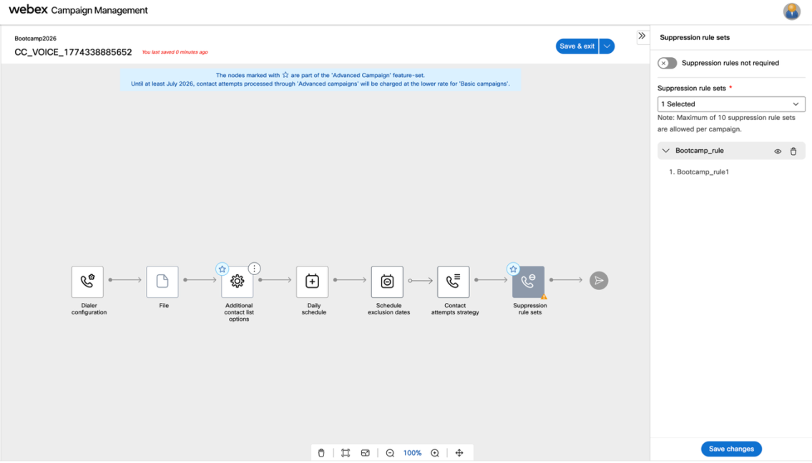
    </figure>

### Save and Activate the Campaign

???+ webex "Save Campaign"

    1. Click **Save & exit** (top right of the campaign flow canvas).
    2. In the **Save campaign** dialog, fill in:
        - **Campaign name**: `Bootcamp_campaign`
        - **P&L meta-tag**: `debt`
        - **Purpose meta-tag**: `debt`
        - **Applicable DNC lists**: `None`
    3. Click **Save**.

    <figure markdown>
    
    </figure>


???+ webex "Activate Campaign"

    1. Back in the Campaign group list, locate **Bootcamp_campaign** (status: **Draft**).
    2. Click the **⋮ Actions** menu and select **Activate**.
    3. In the confirmation dialog, click **Confirm**.

    The campaign status will change to **Pending** and then **Running**.

    <figure markdown>
    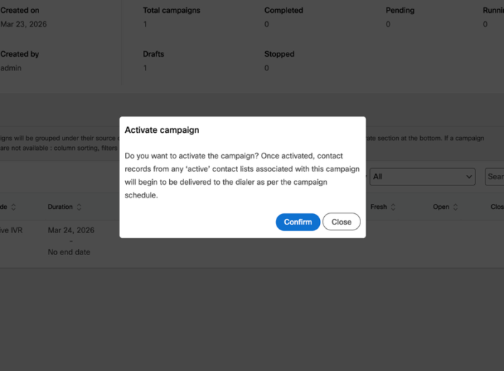
    </figure>

    ???+ tip 
        Campaign status is not refreshed in real time, so make sure you click on the **Refresh** button to get the updated status of the campaign.

---

## Lab 1.8 - Upload Contact List and Test

### Upload the Contact List

Now that the campaign is active, upload your contact list CSV to trigger the outbound calls.

???+ webex "Upload Contact List"

    1. In the campaign list, click the **⋮ Actions** menu on **Bootcamp_campaign** and select **Manage contact lists**.
        
        <figure markdown>
        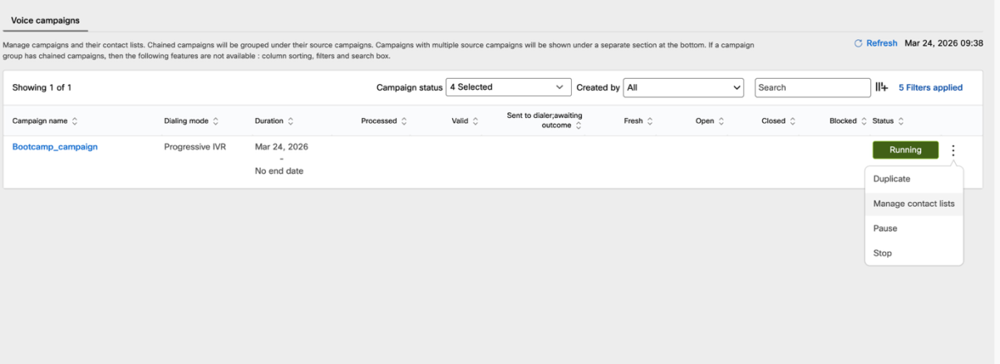
        </figure>

    2. Click **Upload file to create contact list**.

         <figure markdown>
        
        </figure>

    3. In the **Contact list from file upload** dialog:
        - **Supported channels**: Voice (pre-selected)
        - **Contact list type**: Static
        - **Field mapping**: `Bootcamp_field_mapping` (pre-selected)
        - Click **Browse** and select your `contact_list_bootcamp.csv`
        - **Automatically activate**: Immediately after upload
        - **In case of record issues**: Skip the particular record
    4. Click **Save and proceed**.


        <figure markdown style="width: 70%;">
        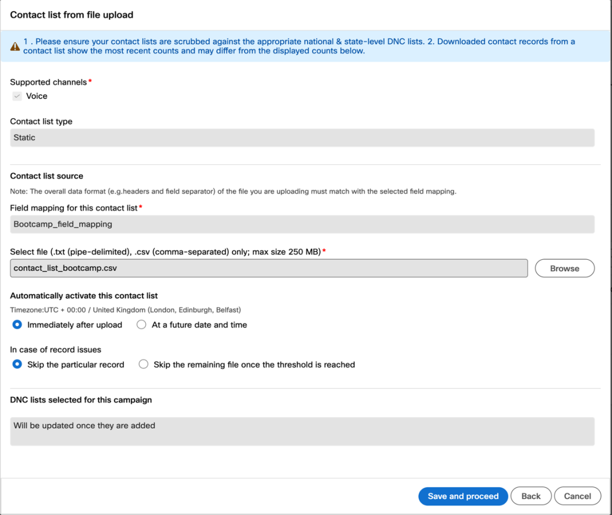
        <figcaption>Contact list upload form showing field mapping, file selection, and activation settings</figcaption>
        </figure>


### Monitor Upload Status

After uploading, the contact list will show a status of **Uploading**, then transition to **Active** once processed. You can see the processing going through different status: *Processed, Valid, Eligible...*. Make sure you click **Refresh** to see the latest status.


<figure markdown>

</figure>

<figure markdown>
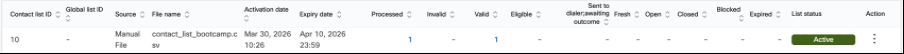
</figure>

!!! warning
    If your contact list fails to upload, the most likely cause is a **formatting issue** with the CSV file. Check that:

    - The column headers match **exactly** what was defined in the field mapping (`firstName`, `lastName`, `phoneNumber`)
    - Phone numbers use E.164 format with the `+` prefix (e.g. `+442012345678`)
    - All phone numbers in the file are from the **same country**
    - No spaces, hyphens, or special characters appear in the phone number field
    - The file is saved as a proper comma-separated CSV (not semicolon or tab-separated)

### Verify the Campaign is Running

Once the contact list is active, the Campaign Manager will begin pushing contacts to the dialler. **Allow 2–5 minutes** for the first calls to be generated.

<figure markdown>

<figcaption>Campaign in Running status with the contact list showing as Active and ready for dialling</figcaption>
</figure>

If everything is configured correctly, **you will receive a call** on the phone number specified in your contact list. When you answer, you will hear:

> *"Congratulations, You have completed lab 1"*

This confirms that the full end-to-end flow is working — from Campaign Manager initiating the call, through the CPA detection identifying a live voice, routing through the Go To node, and arriving at the `Lab1_completed` flow which plays the TTS message.

???+ Note
    Note that the **End Flow** node does not disconnect the call, so you must hang up manually after testing. We have chosen **End Flow** over **Disconnect Contact** because the call will eventually be routed to a queue in future exercises.

---

## Lab Completion ✅

At this point, you have successfully:

- [x] Configured an agent, team, and outdial queue in Webex Contact Center
- [x] Created `firstName` and `lastName` Global Variables for customer data propagation
- [x] Built the `AI_Agent_DebtCollection` test flow with a congratulatory TTS message
- [x] Built the `Outbound_DebtCollection` campaign flow with CPA-based routing (AMD, Abandoned, Live Voice)
- [x] Configured the outdial Entry Point (Channel) and Outdial ANI
- [x] Completed all Campaign Manager prerequisites (, contact modes, field mappings, suppression rules, telephony outcomes, wrap-up codes, meta-tags)
- [x] Created, configured, and activated the `Bootcamp_campaign` Progressive IVR campaign
- [x] Uploaded a contact list and received a live test call

**Congratulations!** You have completed Lab 1. The outbound campaign infrastructure is fully operational and ready to connect to the AI Agent in Lab 2.

[Next Lab: Lab 2 - Automating Debt Collection](./lab2_debt_ai_agent.md){ .md-button .md-button--primary }
