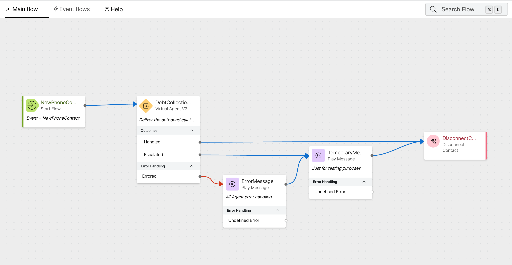
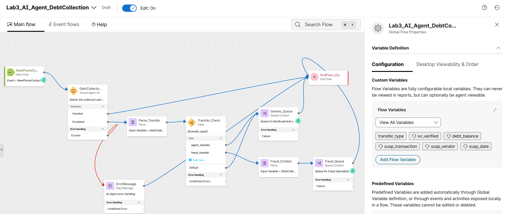
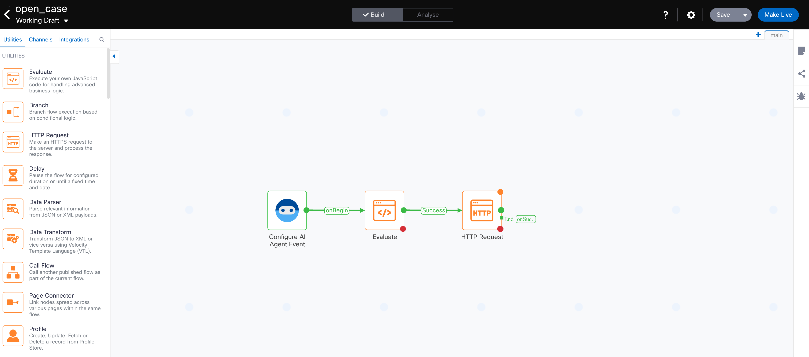
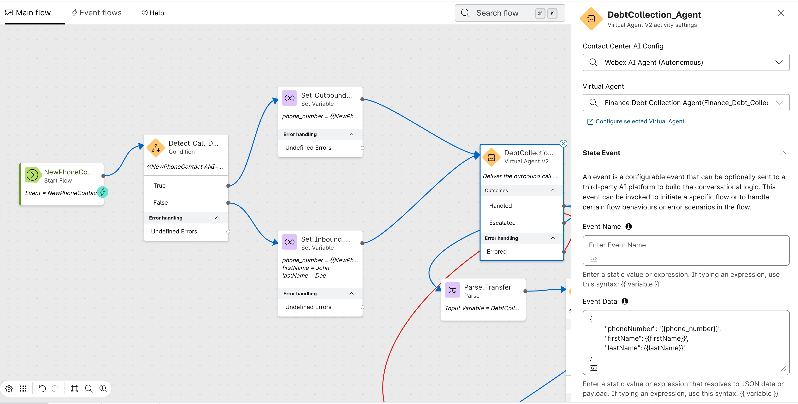

# Lab 3 - Human Escalation and RT Assist 

## Lab Purpose

In **Lab 2**, you successfully configured a **Webex AI Agent** to automate the collection of debts and handle customer inquiries regarding their accounts. 

In this lab we will focus on the transition from the Webex AI Agent to a fraud specialist, ensuring that the full context of the interaction is preserved during the transfer. We will explore key **Webex Contact Center AI Assistant** features, including **Summarization**, **Real-Time Assist (RTA)**, and **Real-Time Transcription (RTT)**. This guide covers the configuration required to extract data from the AI Agent metadata at the time of escalation, enable summarization and RTT, and configure an AI Assistant skill to support the agent during a fraud-related scenario.

???+ purpose "Lab Objectives"
    The purpose of this lab is to escalate a call from an AI Agent to a fraud specialist while maintaining full context and providing the agent with the tools necessary to deliver a consistent, seamless customer experience. 
    
    Key objectives include:

    *   **Context Management:** Configuring the flow to extract context from the AI Agent metadata and pass it to the fraud specialist, including a Virtual Agent (VA) transfer summary.
    *   **Enable RTT and Summarization Features:** Enhancing the fraud specialist workflow by enabling advanced AI-driven features.
    *   **Handle a Credit Card Fraud Scenario:** Providing real-time guidance based on the live conversation. This includes automating backend actions such as opening a case and locking a card, as well as retrieving relevant information from a Knowledge Base (KB).

???+ Challenge "Lab Outcome"
    By the end of this lab, you will have successfully implemented a sophisticated escalation workflow. Specifically, you will be able to:

    *   **Verify Contextual Handoff:** Confirm that the fraud specialist receives the full interaction history, including the VA transfer summary and relevant customer metadata, immediately upon call arrival.
    *   **Validate AI Assistant Functionality:** Observe the Real-Time Transcription (RTT) and Summarization features in action within the Agent Desktop, ensuring they accurately capture and distill the conversation.
    *   **Demonstrate Real-Time Guidance:** Successfully trigger and view automated guidance prompts when the conversation shifts to a "fraud" scenario, assisting the agent in taking the correct next steps.
    *   **Automate In-Call Actions:** Ensure that the system triggers backend workflows—such as case creation and card locking—in real-time during the conversation, reducing manual effort and improving response speed for the agent.
---

## Pre-requisites

In order to be able to complete this lab, you must: 

* [x] Have your **Airtable repositories** completed for the *Customer* and *Transactions* data.
* [x] Have completed [Lab 2 - Automating Debt Collection](lab2_debt_ai_agent.md)

--- 

## Lab Overview 📌 

In this lab you will perform the following tasks:

1. Configure Alex to transfer to a fraud specialist with context. 
2. Setup the call flow to extract context from the AI Agent metadata, escalate to a queue and configure Real-Time Transcription. 
3. Setup AI Assistant features in Control Hub. 
4. Confirm your Desktop Layout is setup correctly for AI Assistant. 
5. Setup an AI Assistant skill for Real-Time Assist. 
6. Test the complete scenario 

---

## Lab 3.1 Configure Alex to transfer to a fraud specialist with context. 

Our AI Agent for debt collection (Alex) can perform multiple tasks (check balance, authentication, check recent transaction, etc), when transferring to a human agent, its essential to make sure the data collected by Alex is not lost during the transfer. We will setup a custom transfer action and pass data in the form of entities into the flow. 

???+ webex "Alex Setup"
    1. From [Control Hub](https://admin.webex.com) navigate to **Contact Center** and under **Quick Links** click on the **Webex AI Agent** link. The Webex AI Agent studio will open in a new window. 
    2. In the **AI Agent Studio**, select your *Finance Debt Collection Agent*. 
    3. Go to the **Actions** tab, click on **+ Add Actions** and select **Transfer**
    5. Fill in the **General information** of your action
        - **Action name**: <copy>fraud_transfer</copy>
        - **Action description**: <copy>Action to transfer the call to a fraud specialist when a customer has concerns about a suspicious transaction</copy>
        <!-- - **Transfer visibility**: You can either enable or disable the **Announce transfer** toggle. -->
    6. Select the **+New input entity** option, fill out the entity details with this information: 
        
        | Entity Name | Type | Value | Description | Example | Required |
        | :----- | :--- | :--- | :--- | :--- | :--- |
        | <copy>`ivr_verified`</copy>  | `String` | | <copy>`Send a true or false value depending if the user was successfully authenticated before executing this action.`</copy> | <copy>`True, False`</copy> |`Yes` | 
        | <copy>`debt_balance`</copy>  | `Number` | | <copy>`User's debt balance. The value needs to include at least 2 decimals. If the value is 1000, we should use 1000.00`</copy> | <copy>`10000.00`</copy> |`No` | 
        | <copy>`susp_transaction`</copy>  | `Number` | | <copy>`Amount of the transaction identified as suspicious. The value needs to include at least 2 decimals. If the value is 1000, we should use 1000.00`</copy> | <copy>`10000.00`</copy> |`No` | 
        | <copy>`susp_vendor`</copy>  | `String` | | <copy>`Vendor of the transaction identified as suspicious`</copy> |  |`No` |
        | <copy>`susp_date`</copy>  | `Date` | `mm/dd/YY` | <copy>`Date of the transaction identified as suspicious`</copy> |  |`No` |
    7. Click **Add**.
    8. Go back to the **Profile** tab and add the following into the **Instructions**: 
    ```
    **Fraud Escalation Logic:**
    If fraud is suspected, pull the recent transactions using the **[fetch_transactions]** actions. Attempt to identify the suspicious transaction before escalating to a Fraud Specialist by using the **[fraud_transfer]** transfer action.
    ```
    9. Click **Save Changes** and **Publish**. 
    ???+ gif "Transfer Action Setup"
        <figure markdown>
        
        <figcaption>Transfer Action Configuration</figcaption>
        </figure>


## Lab 3.2 Setup Call Flow - AI Agent context, Queue escalation and RTT configuration 

In Lab 2, the *Escalated* outcome of the **Virtual Agent V2** node was connected to a temporary **Play Message** node. In this section, you will replace that temporary path with a production-ready escalation flow. This involves extracting the contextual data that Alex collected during the conversation, passing it to the human agent via the queue, and enabling Real-Time Transcription so the fraud specialist has a live view of the conversation from the moment it arrives

???+ webex "Prepare Call Flow"
    When Alex triggers the `fraud_transfer` action, the entities defined in that action (e.g., `ivr_verified`, `debt_balance`, `susp_transaction`) are passed into the flow within the metadata output variable from **Virtual Agent V2** node. You need to capture these into flow variables so they can be presented to the agent. 
    
    1. Go to **Control Hub** -> **Contact Center** -> **Flows**
    2. Open your flow **AI_Agent_DebtCollection**
    3. First, we need to create the flow variables that will hold the context from Alex. Click on the **Global Flow Properties** panel (the gear icon in the top-right of the flow editor).
    4. Under **Custom Flow Variables**, click the option **Create flow variable** and create the following variables:

        | Variable Name | Type | Default Value | Agent Viewable | Desktop Label |
        | :--- | :--- | :--- | :--- | :--- |
        | <copy>`transfer_type`</copy> | `String` | <copy>`agent_transfer`</copy> | No | N/A |
        | <copy>`ivr_verified`</copy> | `String` | <copy>`False`</copy> | Yes | <copy>`IVR Verified`</copy> | 
        | <copy>`debt_balance`</copy> | `Decimal` | <copy>`0.0`</copy> | Yes | <copy>`Debt Balance`</copy> |
        | <copy>`susp_transaction`</copy> | `Decimal` | <copy>`0.0`</copy> | Yes | <copy>`Transaction Amount`</copy> | 
        | <copy>`susp_vendor`</copy> | `String` | <copy>`Unknown`</copy> | Yes | <copy>`Transaction Vendor`</copy> |
        | <copy>`susp_date`</copy> | `String` | <copy>`N/A`</copy> | Yes | <copy>`Transaction Date`</copy> |

    5. Validate and save the flow, then select the **Publish Flow** option. A window to publish the flow will open up, simply click again on the **Publish Flow** button. 

    ???+ gif "Create Flow Variables"
        <figure markdown>
        
        <figcaption>Creating flow variables</figcaption>
        </figure>

???+ webex "Extract AI Agent Context"
    Now, you will extract the output from the **Virtual Agent V2** node and map it into the flow variables you just created.

    1. In your flow, click on the **Virtual Agent V2** node (named `DebtCollectionAgent`).

        ???+ inline end "Initial - Flow View"
            <figure markdown>
            
            </figure>
    2. In the **Activity Settings** panel on the right, scroll down to the **Output Variables** section. You will see the variables that the AI Agent passes back upon escalation, the MetaData variable contains the transfer action details. 
    3. Delete the temporary **Play Message** node connected to the *Escalated* outlet and connec the **Error Message** node to the **End Flow** node. 
    4. Drag and drop a **Parse** node onto the canvas and connect it to the *Escalated* path of the VAV2 node.
    5. Click the **Parse** node and rename it <copy>`Parse_Transfer`</copy>. 
    6. In the Description of the node, add the following: <copy>`Collects the transfer type.`</copy>
    6. Configure the Parse Settings: 
        * Input Variable = DebtCollection_Agent.MetaData
        * Content Type = JSON
        * Output Variable = transfer_type
        * Path Expression = <copy>`$.escalation_trigger`</copy>
        !!! info "AI Agent MetaData"
            The AI Agent MetaData variable contains the executed actions and collected variables during a session. When the AI Agent escalates the call, the **escalation_trigger** variable in the metadata will match the name of the
            transfer action used. In the previous step, we are collecting this value to decide how the call escalation needs to be routed. 
    7. Drag and drop a **Case** node in the canvas and connect it to the output of the **Parse** node.
    8. Rename it <copy>`Transfer_Check`</copy> and in the Description of the node, add the following: <copy>`Checks the transfer_type variable to route accordingly`</copy>
    9. Configure the **Case** node settings:
        * Variable = transfer_type
        * Case 1 = <copy>`agent_transfer`</copy>
        * Case 2 = <copy>`fraud_transfer`</copy>
        !!! info "Queue Setup"
            In the next steps you will be adding **Queue Contact** nodes to your flow. The queue you select is not critical for this lab, we simply need the call to be routed to an agent that can receive your call.
    10. Add a **Queue Contact** node for the standard agent_transfer and rename it <copy>`Generic_Queue`</copy>. 
    11. Connect the **agent_transfer** path from the **Case** node to the **Generic_Queue** node. 
    12. Click the **Generic_Queue** node and select any Queue in your tenant that routes to the agents you want to use for this lab. 
    12. Connect the **Generic_Queue** node output to the **End Flow** node. 
    12. Drag and drop a **Parse** node onto the canvas.
    13. Connect the *fraud_transfer* path of the **Case** node to the new **Parse** node. 
    14. Click the **Parse** node and rename it to <copy>`Fraud_Context`</copy> 
    15. Map your custom variables to a JSON path location from the Virtual Agent MetaData, you need to add a new variable and path expression for each one:
        
        * Input Variable = DebtCollection_Agent.MetaData
        * Content Type = JSON
        * Output Variable = ivr_verified
        * Path Expression = <copy>`$.actions.fraud_transfer[0].input.ivr_verified`</copy>
        * Output Variable = debt_balance
        * Path Expression = <copy>`$.actions.fraud_transfer[0].input.debt_balance`</copy>
        * Output Variable = susp_transaction
        * Path Expression = <copy>`$.actions.fraud_transfer[0].input.susp_transaction`</copy>
        * Output Variable = susp_vendor
        * Path Expression = <copy>`$.actions.fraud_transfer[0].input.susp_vendor`</copy>
        * Output Variable = susp_date
        * Path Expression = <copy>`$.actions.fraud_transfer[0].input.susp_date`</copy>
        ???+ inline end "Final - Flow View"
            <figure markdown>
            
            </figure>
        
        ???+ tip "Understanding the JSON Path"
            The path `$.actions.fraud_transfer[0].input.ivr_verified` tells the Parse node to navigate the MetaData JSON structure as follows:
            
            - `$.actions` → The collection of all actions executed during the AI Agent session.
            - `.fraud_transfer[0]` → The first instance of the `fraud_transfer` action.
            - `.input.ivr_verified` → The value of the `ivr_verified` entity that was passed into that action.
            
            This structure is consistent across all Webex AI Agent transfer actions.

    16. Add a **Queue Contact** node for the custom **fraud_transfer** and rename it <copy>`Fraud_Queue`</copy>. 
    17. Connect the **Parse** node output to the **Fraud_Queue** node. Connect the **Fraud_Queue** node output to the **End Flow** node.
    18. Click the **Fraud_Queue** node and select any Queue in your tenant that routes to the agents you want to use for this lab.
    19. Connect the *Default* path of the **Case** node to the **Generic_Queue** node.
    19. Validate and save the flow, then select the **Publish Flow** option. A window to publish the flow will open up, simply click again on the **Publish Flow** button. 
    ???+ gif "Extract AI Agent Context"
        <figure markdown>
        
        <figcaption>Extract AI Agent Context</figcaption>
        </figure>


???+ webex "Configure Real-Time Transcription"
    Real-Time Transcription(RTT) provides a live text feed of the conversation to the agent. This is essential for the fraud specialist, as it allows them to review what was said even if the audio quality is poor or the customer speaks quickly.
    In order to configure RTT, we will need to both enable the AI Assistant configuration in Control Hub and setup the flow to stream the media to the transcription service. In this section, we will focus on the flow configuration.

    1. In your flow, move from the **Main Flow** tab to the **Event Flows** tab. 
    2. Drag and drop the **Start Media Stream** node to the canvas. 
    3. Connect the **AgentAnswered** event node to the **Start Media Stream** node. 
    !!! info "Event Flow Nodes"
        Flow Designer is releasing an updated UX among other features, these new UX renamed the **AgentAnswered** event to **AgentAccepted**. Use either one of those events to start the media stream required for RTT. 
    4. Drag and drop an **End Flow** node to the canvas and connect it to the output path of the **Start Media Stream** node.
    5. Validate and save the flow, then select the **Publish Flow** option. A window to publish the flow will open up, simply click again on the **Publish Flow** button. 
    !!! info "RTT Conditional Enablement"
        In this lab we are enabling RTT for all the queue or agents involved in this flow, but you can also add a condition to control which queues within a flow get access to the RTT feature. You can find a step by step guide [HERE](https://help.webex.com/en-us/article/n5jhgdi/Enabling-media-streaming-for-specific-queues).
    ???+ gif "Configure RTT in Event Flows"
        <figure markdown>
        
        <figcaption>Real-Time Trancript Flow Configuration</figcaption>
        </figure>

## Lab 3.3 Control Hub Configuration of Contact Center AI Assistant and Desktop Layout Requirements
 There are several features associated with the Contact Center AI Assistant (AutoCSAT, Summarization, Agent Wellness, Real-Time Transcription, Real-Time Assist and Topic Analytics), and all of these features can easily be enabled from Control Hub. 
 In this lab, we will focus on the **Summarization**, **Real-Time Transcript** and  **Real-Time Assist** configuration. 

???+ webex "WxCC AI Assistant Configuration"
    1. Open **Control Hub** and navigate to Contact Center > AI Features. In some tenants the **AI Features** menu card might still show up as **AI Assistant**, the following configuration still applies. 
    2. The options for **Agent Wellbeing** and **AutoCSAT**, are not relevant for this lab. 
    3. Enable the **Generated Summaries**  toggle and select the check box for all of the different summarization types. 
    4. Summarization types are enabled at the global level, for the purpose of this lab, you can either select the **All queues** option or specify the **Individual queue** you will be using in this lab.

        ???+ tip "Summarization Scope"
            Selecting **All queues** is the quickest option for a lab environment. In a production deployment, you would typically scope summarization to specific queues to control costs and ensure relevance.
    5. Enable the Real-Time Transcription and the Real-Time Assist toggles. 
    6. Before we can **Assign AI Assistant skills** to a queue, we need to create the skill in the AI Agent studio. We will cover this topic in lab 3.4. 
    ???+ gif "AI Assistant Configuration in Control Hub"
        <figure markdown>
        
        <figcaption>Enabling Summarization, RTT, and RTA in Control Hub</figcaption>
        </figure>

???+ webex "Desktop Layout Setup"
    The AI Assistant is part of the default Desktop layout, however we understand that you might have your own layout that has been previously customized to include other widgets. 
    We will review the steps to make the necessary changes to a Desktop layout for the AI Assistant and the Real-Time Transcription window to show up on the Agent Desktop. 
    !!! download "Desktop Layout"
        If you don't need to update your own Desktop Layout, download a template [HERE](./bcamp_files/Finance_Desktop.json){:download="Finance_Desktop.json"} and ignore the next steps. 
    
    1. Open your JSON layout file using a text editor (Sublime, Notepad++, etc) or IDE (VS Code, etc). 
    2. Find the area section for each relevant persona (agent, supervisor, agent-supervisor). Inside the area section, locate the advancedHeader array.
    3. Add the AI Assistant component(**"comp": "ai-assistant"**) to the **advancedHeader** section, here's an example: 

        ```
        "advancedHeader": [
            {
              "comp": "digital-outbound",
              "script": "https://wc.imiengage.io/AIC/engage_aic.js",
              "attributes": {
                "darkmode": "$STORE.app.darkMode",
                "accessToken": "$STORE.auth.accessToken",
                "orgId": "$STORE.agent.orgId",
                "dataCenter": "$STORE.app.datacenter",
                "emailCount": "$STORE.agent.channels.emailCount",
                "socialCount": "$STORE.agent.channels.socialCount"
              }
            },
            {
              "comp": "agentx-webex"
            },
            {
              "comp": "ai-assistant"
            },
            {
              "comp": "agentx-outdial"
            },
            {
              "comp": "agentx-notification"
            },
            {
              "comp": "agentx-state-selector"
            }
          ],
        ```
    
    4. Now let's add the RTT window. Find the area section for each relevant persona (agent, supervisor, agent-supervisor). Inside the area section, locate the panel section.
    5. Within the panel section, ensure that the following code snippet (or a similar configuration for real-time transcription) is present:
    
        ```
        {
                "comp": "md-tab",
                "attributes": {
                  "slot": "tab",
                  "class": "widget-pane-tab"
                },
                "children": [
                  {
                    "comp": "slot",
                    "attributes": {
                      "name": "RT_TRANSCRIPT_TAB"
                    }
                  }
                ],
                "visibility": "RT_TRANSCRIPT"
              },
              {
                "comp": "md-tab-panel",
                "attributes": {
                  "slot": "panel",
                  "class": "widget-pane"
                },
                "children": [
                  {
                    "comp": "slot",
                    "attributes": {
                      "name": "RT_TRANSCRIPT"
                    }
                  }
                ],
                "visibility": "RT_TRANSCRIPT"
              },
        ```
    6. Assign the Desktop Layout to the Team of the agent you will be using to receive the call. 

## Lab 3.4 Setup an AI Assistant skill for Real-Time Assist.
Now that the AI Assistant features are enabled we can proceed with the configuration of Real-Time Assist (RTA). This feature monitors the live transcription of the call and, when specific keywords or intents are detected, it presents the agent with suggestions from a KB or triggers automated actions. 
During this lab section we will focus on how to effectively setup an AI Assistant Skill, including how to define the prompt and how to setup actions.

???+ webex "Configure Knowledge Base for Real-Time Assist"
    Before creating the AI Assistant skill, you need a Knowledge Base that contains the fraud-handling policies and procedures that the skill will reference when providing guidance to the agent.

    !!! download "Knowledge base document"
        Download the Knowledge Base file from [HERE](./bcamp_files/Fraud_KB.docx).

    1. In the **AI Agent Studio**, click on the **Knowledge** icon in the left navigation panel.
    2. Click the **+ Create Knowledge base** option on the top right corner. 
    3. Enter the name <copy>`Fraud_KB`</copy> and a brief description. 
    2. Click on **Add source** in the top-right and select **Files**
    3. Drag and drop or use the **Add File** option to upload the `Fraud_KB.docx` document.
    4. Click on **Process Files**
    5. The system will take some minutes to process the file. Once completed, you can see your KB file under the **Processed files** section in the next window. Meanwhile, click on **Close and keep processing** to return to your Knowledge Base configuration page. 

        ???+ tip "What to include in a Fraud KB"
            The Knowledge Base should include information such as:
            
            - Fraud dispute procedures and timelines.
            - Card locking and replacement policies.
            - Customer communication guidelines during fraud scenarios.
            - Escalation paths for high-value fraud cases.
            - Regulatory requirements for fraud reporting.

            Consider this if you want to create your own Fraud KB. 

    6. Wait for the source to reach the **Processed** state before proceeding.

    ???+ gif "Configure Fraud Knowledge Base"
        <figure markdown>
        
        <figcaption>Creating a Knowledge Base for fraud handling policies</figcaption>
        </figure>

???+ webex "Configure Fulfillment Actions for Real-Time Assist"

    In this section, you will build the Webex Connect flow that the AI Assistant's `open_case` action will trigger. This flow receives the Customer ID and Transaction ID from the AI Assistant, generates a unique Case ID, and creates a new fraud case record in your Airtable base.

    1. Go to your *Webex Finance Bootcamp* Service in Webex Connect
    2. Click on **Flows** to create your new flow
        - Click on **Create Flow**
        - Give your flow a name <copy>`open_case`</copy>
        - Select **New Flow** under **Method**
        - Select **Start from Scratch**
        - Click on **Create**

    3. Configure the **Start Node** to trigger the flow from the AI Agent

        - Select the **AI Agent Event**
        - Set the **SAMPLE JSON** to the below one
            ```json
            {
                "CustomerID": "CUST-001",
                "TransactionID": ""
            }
            ```

        ???+ info
            The variable names in the JSON sample must match the corresponding entity names in the AI Assistant skill action (`CustomerID` and `TransactionID`).

        - Click on **[Parse]**
        - Click on **[Save]**
        - Save the flow

    4. Next, we need to generate a unique Case ID for the fraud case. We will use an **Evaluate** node.

        - Drag and drop an **Evaluate** node to the canvas beside the **Start Node**
        - Connect the green outlet of the **Start Node** to the new **Evaluate** node.
        - Double click on the **Evaluate** node
        - Rename the node to <copy>`Generate Case ID`</copy>
        - Copy the below JavaScript code in the code editor of the node:

            ```javascript
            var randomId = Math.floor(100000 + Math.random() * 900000);

            // This variable can be used in subsequent nodes
            caseID = randomId.toString();

            1;
            ```

            ???+ info
                This code generates a random 6-digit number between 100000 and 999999 and converts it to a string. The resulting `caseID` variable will be passed to the Airtable API in the next step to create the fraud case record.

        - Set the **Script Output** value to `1`
        - Set the **Branch Name** value to <copy>`Success`</copy>
        - Click on **[Save]**
        - Save the flow


    5. Now we will create the fraud case record in your Airtable base using an **HTTP Request** node.

        ???+ Important
            This step uses the Airtable API to create a new record in a **FraudCases** table. Before proceeding, ensure you have:

            - A **FraudCases** table created in your Airtable base with the following fields: `CaseID` (Single line text), `Status` (Single line text), `CustomerID` (Link to Customers table), and `TransactionID` (Link to Transactions table).
            - Your [Airtable API](https://airtable.com/developers/web/api/introduction) base ID handy.
            - Your [Personal Access Token](https://airtable.com/create/tokens) created with write permissions.

        - Drag and drop an **HTTP Request** node to the canvas beside the **Evaluate** node
        - Connect the green outlet of the **Evaluate** node to the new **HTTP Request** node.
        - Double click on the **HTTP Request** node
        - Rename the node to <copy>`Create Fraud Case`</copy>
        - Fill in the parameters as follows:

            | Parameter | Value | Notes |
            | :--- | :--- | :--- |
            | **Method** | `POST` | |
            | **Endpoint URL** | <copy>`https://api.airtable.com/v0/<yourBaseID>/FraudCases`</copy> | Replace `<yourBaseID>` with the value of your Airtable Base |
            | **Header** | <copy>`Authorization`</copy> | |
            | **Value** | `Bearer <yourPersonalToken>` | Enter `yourPersonalToken` from [Airtable](https://airtable.com/create/tokens) |
            | **Header** | <copy>`Content-Type`</copy> | Click **+ Add Another Header** |
            | **Value** | <copy>`application/json`</copy> | |
            | **Body** | See below | |
            | **Connection Timeout** | <copy>`10000`</copy> | |
            | **Request Timeout** | <copy>`10000`</copy> | |

        - Copy the following into the **Body** field:

            ```json
            {
              "fields": {
                "CaseID": "$(caseID)",
                "Status": "New",
                "CustomerID": [
                  "$(n2.aiAgent.CustomerID)"
                ],
                "TransactionID": [
                  "$(n2.aiAgent.TransactionID)"
                ]
              },
              "typecast": true
            }
            ```

            ???+ warning
                Make sure the variables `$(n2.aiAgent.CustomerID)`, and `$(n2.aiAgent.TransactionID)` correspond to the correct node numbers in your flow. You can verify them by selecting the variables from the **Input Variables** right panel:
                
                - `$(n2.aiAgent.CustomerID)` → from the **Start** node
                - `$(n2.aiAgent.TransactionID)` → from the **Start** node

            ???+ info "Why `typecast: true`?"
                The `typecast` parameter tells the Airtable API to automatically convert the input values to match the field types in your table. This is particularly important for the `CustomerID` and `TransactionID` fields, which are **Link to another record** fields in Airtable. By passing them as arrays and enabling typecast, Airtable will correctly resolve the record links.

        - Click on **[Save]**

        - To complete the node, click on the green outlet at the right and drag it to the canvas. Release it to open the **End** dialogue:

            - Set the **Node Event** value to `onSuccess`
            - Set the **Flow Result** value to `101 - Successfully completed flow [Success]`
            - Click on **[Save]**

        - Save the flow!

    6. To finish the flow, pass the Case ID back to the AI Assistant through the **Flow Outcomes**.

        ???+ inline end "Final - Flow View"
            <figure markdown>
            
            </figure>

        - Click on the :fontawesome-solid-gear: button at the top right of the flow editor.
        - Click on the **Flow Outcomes** tab
        - Open the `Last Execution Status` Outcome. The `Notify AI Agent` radio button is enabled by default for the start node with `AI Agent` as the trigger.
        - Click on **+ Add New** to add another entry, in the Key field type **Response**. Click the Value field and select the **http.responseBody** variable from the HTTP Request section in the Input Variables. 

            | Key | Value |
            | :--- | :--- |
            | <copy>`Response`</copy> | <copy>`$(n4.http.responseBody)`</copy> |

        - Click on **[Save]**
        - Save the flow!!

    Your **open_case** flow is now completed.
    Before leaving the flow editor, make sure you **[Make Live]** the flow, otherwise it will not be visible to the AI Agent Studio.

    ???+ gif "Complete open_case Flow"
        <figure markdown>
        
        <figcaption>The completed open_case fulfillment flow</figcaption>
        </figure>

???+ webex "Configure Real-Time Assist"
    This feature is what makes our WxCC AI Assistant an Agentic AI solution, this is why you will find it very similar to our Webex AI Agents. The configuration is done in the same portal, our AI Agent Studio, and most of the settings are the same. However, the way to write the prompts between an AI Agent and 
    an AI Assistant is very different. On the AI Agent side you have to ask tell it how to reply to a customer, in the AI Assistant you have to tell it how to guide the agent. This is a key difference to keep in mind as you are building your instructions. Let's start the configuration: 

    1. From [Control Hub](https://admin.webex.com) navigate to **[Contact Center]** and under **Quick Links** click on the **Webex AI Agent** link. The Webex AI Agent studio will open in a new window. 
    2. On the left navigation menu, the name of each option shows up when you hover over the icons, select the AI Assistant Skill icon. 
    3. Click the option **+ Create Skill**. Select the option **Start from scratch** and click **Next**. 
    4. Enter the **Skill name** <copy>`Counter_Fraud_Assistant`</copy> and enter the following in the **Goal** section: 
        <copy>`You are an ai assistant working for Webex Financial Group. You will be assisting human agents that are specialized in handling fraud scenarios for our customers. Provide timely recommendations about our fraud prevention and dispute transaction policies.`</copy>

        ???+ tip "Best Practices for AI Assistant Instructions"
            To ensure your AI Assistant provides high-quality, reliable guidance, follow these guidelines:

            1. **Agent-Guidance Style**: Frame instructions as guidance for the human agent (e.g., "Guide the agent to collect the customer ID") rather than direct commands.
            2. **Be Specific and Unambiguous**: Clearly state the assistant's role, required fields, and the exact conditions under which an action should be triggered.
            3. **Define Required Fields**: Specify the exact fields needed for each action; avoid vague terms like "relevant information."
            4. **Validation Rules**: Define formats (e.g., regex) and validation logic clearly. If a field has a specific pattern (like a Customer ID), state it so the assistant can validate it before triggering an action.
    5.  Click **Create** and the main configuration page for the AI Assistant skill comes up, add the following prompt to the **Instructions** section: 
    ```
    # AI Assistant Action Orchestration

    Before asking the AGENT to collect any data from the CUSTOMER, check the conversation history. If the data was already provided, reuse it instead of asking again.
    If the AGENT has acknowledged the CUSTOMER's intent but has not yet asked for the specific required data, do not repeat or pre-empt the suggestion. Allow the conversation to progress.
    When calling tools: Use ONLY values the customer explicitly provided. NEVER infer, construct, extract digits from other fields, use example values, add UNKNOWN or use default/placeholder values (like "00:00", "0", etc.). Missing required parameter = ASK user. Missing optional parameter = OMIT it entirely. NO exceptions.

    The CustomerID format is CUST-001, agent only needs to collect the last 3 digits. 

    ## Collect Recent Transactions

    **Always follow these instructions before moving to the "Identify Fraudulent Transaction" section.**: 

    1. **Fetch Recent Transactions**: Ask the AGENT to get the CUSTOMER ID at the beginning of the call. Use the CUSTOMER ID  to execute [fetch_transactions] action to get the recent transactions. 
    2. **Provide Transaction Details**: Once transactions are fetched, provide the AGENT with the following details for each transaction:
       - Transaction Amount
       - Transaction Vendor
       - Transaction City
       - Transaction Date
    3. **Error Handling**: If there are no transactions available, instruct the AGENT to check the banking system manually. If the banking system is unresponsive, advise the agent to escalate the issue.

    ## Identify Fraudulent Transaction

    1. **Guide the AGENT**: Confirm if the transaction identified as suspicious could have been made by someone else with access to the account or if the CUSTOMER recognizes the amount but not the vendor. Prompt the agent to ask the customer if they have any recent transactions that they do recognize.
    2. **CUSTOMER confirms the transaction is fraudulent**: Explain to the AGENT that they need to open a dispute case to investigate the transaction. Guide the agent to inform the customer that opening the case will automatically lock the CUSTOMER's credit card and ship a new one to the address on file. The AGENT needs to get confirmation from the CUSTOMER before the case is opened.
    3. **Once the CUSTOMER confirms**: Execute the [open_case] action. **If the CUSTOMER declines**: If the CUSTOMER has a reason to decline their card getting locked, guide the agent to ask them to provide a reason and look for alternative options.. Shipment of the credit card can be expedited from 5 days to 2 days in case of travel or other time sensitive activities.
    4. **Provide Case ID**: Once the case is opened, provide the AGENT with the case ID that is returned by the action. Guide the agent to share the case ID to the customer and explain its important to keep track of their dispute.

    ### Additional Considerations

    - **User Experience**: Ensure that the language used is empathetic and supportive, as customers may be distressed about potential fraud.
    ```
    6. Go to the **Knowledge** tab and select the **FraudKB** you created. Click **Save Changes**. 
    7. Navigate to the **Actions** tab and click on **+ New Action**.
    8. Fill in the **General information** of your action
        - **Action name**: <copy>*fetch_transactions*</copy>
        - **Action description**: copy and paste the following description.
        ```
        Use this action to get recent transactions on the account by providing the CustomerID. 
        ```
        - **Action Scope**: Slot filling and fulfillment
    9. Under **Slot filling** click on **[New input entity]**
    10. In the **Add a new input entity** dialogue window, populate: 

        | Entity Name | Type | Value | Description | Example | Display Name | Required | Agent Review | 
        | :--- | :--- | :--- | :--- | :--- | :--- | :--- | :--- |
        | <copy>`CustomerID`</copy> | `regex` | <copy>`CUST-\d{3}`</copy> | <copy>CustomerID provided by the customer or agent during the call. Always starts with "CUST-", only need to collect the last 3 digits.</copy> | <copy>`CUST-001`</copy> | Customer ID | `Yes` | `Yes` |
        ???+ info "Agent Review"
            Setting **Agent Review** to `Yes` means the AI Assistant will present the value to the human agent for confirmation before executing the action. This is a critical safety mechanism—it ensures the agent can verify the Customer ID before a database query is made, preventing accidental lookups on the wrong account.
    11. Associate the action flow in the **Webex Connect Flow Builder Fulfillment** section:
        - Select the Webex Connect Service `Webex Finance Bootcamp`
        - Select the flow `fetch_transactions`
    12. Click on **Add**
    13. Select the **+ New Action** option.
    13. Fill in the **General information** of your action
        - **Action name**: <copy>*open_case*</copy>
        - **Action description**: copy and paste the following description.
        ```
        Opens a fraud case, locks the customer card and ships a new card.
        ```
        - **Action Scope**: Slot filling and fulfillment
    14. Under **Slot filling** click on **[New input entity]**
    15. In the **Add a new input entity** dialogue window, populate: 

        | Entity Name | Type | Value | Description | Example | Required | Agent Review |
        | :--- | :--- | :--- | :--- | :--- | :--- | :--- |
        | <copy>`CustomerID`</copy> | `regex` | <copy>`CUST-\d{3}`</copy> | <copy>`CustomerID provided by the customer or agent.`</copy> | <copy>`CUST-020`</copy> |`Yes` | `No`|
        | <copy>`TransactionID`</copy> | `String` | NA | <copy>`**Do not request this value from the Agent or Customer**. This is the TransactionID received when the [fetch_transactions] actions was executed. Each pending transaction had a unique TransactionID.`</copy> | <copy>`101010`</copy> | `Yes` | `No`|
        ???+ warning "TransactionID Entity Description"
            Pay close attention to the description of the `TransactionID` entity. The instruction **"Do not request this value from the Agent or Customer"** is a guardrail embedded directly into the entity definition. This tells the LLM to extract the TransactionID from the output of the previous `fetch_transactions` action rather than asking the human agent to provide it manually. This reduces friction and prevents errors.
    16. Associate the action flow in the **Webex Connect Flow Builder Fulfillment** section:
        - Select the Webex Connect Service `Webex Finance Bootcamp`
        - Select the flow `open_case`
    17. Click on **Add**. 
    18. You are ready to Publish your skill. Select the **Publish** option and enter a comment in the Publish window. Click **Publish** again. 
    ???+ gif "AI Assistant Skill Configuration"
        <figure markdown>
        
        <figcaption>AI Assistant Skill Configuration</figcaption>
        </figure>

???+ webex "Assign AI Assistant Skill to a Queue"
    With the skill created, you need to assign it to the queue that your fraud specialists are monitoring.

    1. Go back to **Control Hub** > **Contact Center** > **AI Assistant**.
    2. Scroll down to the **Real-Time Assist** section.
    3. Click on **Assign AI Assistant Skills**.
    4. From the available skills, select **Counter_Fraud_Assistant**.
    5. Click **Add queues** and select the queue you are using for fraud escalation (e.g., `Fraud_Queue`).
    6. Click **[Save]**.

    ???+ info "Skill-to-Queue Mapping"
        AI Assistant skills are assigned at the **queue level**, not at the agent level. This means any agent who receives a call from the assigned queue will automatically have the RTA skill active during that interaction. If an agent handles calls from multiple queues, different skills can be applied depending on which queue the call originated from.

    ???+ gif "Assign Skill to Queue"
        <figure markdown>
        
        <figcaption>Assigning the Counter Fraud Assistant skill to the Fraud Queue</figcaption>
        </figure>

## Testing :test_tube:

### Inbound/Outbound Detection for Faster Testing

During the outbound campaign flow, calls are initiated by the Campaign Manager and can take 2-5 minutes to be generated. To speed up testing during this lab, you will add a simple check at the start of the flow to detect whether the call is outbound (initiated by the campaign) or inbound (you calling the entry point directly from your phone). This allows you to test the AI Agent immediately without waiting for the dialer.

The logic is straightforward: if the ANI (the number that initiated the call) matches the campaign outdial number, the call is outbound and we use the DNIS (the customer's number) as the phone number sent to the AI Agent. If it does not match, the call is inbound and we use the ANI (your phone number) instead.

???+ webex "Configure Call Direction Detection"

    1. In the `AI_Agent_DebtCollection` flow, click on **Global Flow Properties** (gear icon).
    2. Under **Custom Flow Variables**, click **Create flow variable** and add:

        | Variable Name | Type | Default Value |
        |---|---|---|
        | `phone_number` | `String` | *(empty)* |

    3. On the canvas, drag a **Condition** node immediately after the `NewPhoneContact` start node.
    4. Rename the node to <copy>`Detect_Call_Direction`</copy>.
    5. Configure the condition expression:

        - **Expression**: <copy>`{{NewPhoneContact.ANI=="+XXXXXXXXXXX"}}`</copy>

        Replace `+XXXXXXXXXXX` with the outdial ANI number configured in your campaign (Lab 1.5). Also, make sure that the **NewPhoneContact.ANI** variable is correct, changes in flow designer have made this show up as **NewContact.ANI**. 

    6. **True Path (Outbound)**:
        - Drag a **Set Variable** node onto the canvas and connect it to the **True** output of the Condition node.
        - Rename the node to <copy>`Set_Outbound_Phone`</copy>.
        - **Variable**: select `phone_number`
        - **Set Value**: `{{NewPhoneContact.DNIS}}`

    7. **False Path (Inbound)**:
    
        ???+ inline end "Inbound Test - Flow View"
            <figure markdown>
            
            </figure>
        - Drag a **Set Variable** node onto the canvas and connect it to the **False** output of the Condition node.
        - Rename the node to <copy>`Set_Inbound_Phone`</copy>.
        - Configure the following variables within this node:

            | Variable | Set Value |
            |---|---|
            | `phone_number` | `{{NewPhoneContact.ANI}}` |
            | `firstName` | `John` |
            | `lastName` | `Doe` |

        Replace `John` and `Doe` with the first name and last name of the test customer in your Airtable Customers table.

    8. Connect both **Set Variable** nodes to the **Virtual Agent V2** node (`DebtCollectionAgent`).

        !!! note "Dynamic Customer Lookup for Inbound Calls"
            For this lab, hardcoding the customer name is sufficient for testing. In a production environment, you would add an **HTTP Request** node after this Set Variable node to dynamically fetch the customer name from Airtable using the `phone_number` variable. The configuration would be similar to the `Fetch Customer Info` HTTP Request node used in the `fetch_balance` Webex Connect flow (Lab 2.3):

            - **Method**: `GET`
            - **Endpoint URL**: `https://api.airtable.com/v0/<yourBaseID>/Customers?filterByFormula={PhoneNumber}="{{phone_number}}"`
            - **Header**: `Authorization` â `Bearer <yourPersonalToken>`

            You would then use the **Parse** settings within the **HTTP Request** node to map the response values to the `firstName` and `lastName` global variables.
        


???+ webex "Preparation"
    Before testing, ensure the following:

    * [x] Your **AI Agent** (Alex) has been published with the `fraud_transfer` action (Lab 3.1).
    * [x] Your **flow** has been published with the escalation path, context parsing, and RTT enabled (Lab 3.2).
    * [x] The **AI Assistant** features (Summarization, RTT, RTA) are enabled in Control Hub (Lab 3.3).
    * [x] Your **Desktop Layout** includes the AI Assistant and RTT components (Lab 3.3).
    * [x] The **Counter_Fraud_Assistant** skill is assigned to the correct queue (Lab 3.4).
    * [x] A fraud specialist agent is **logged into the Agent Desktop** and is in an **Available** state.
    * [x] Your **Airtable** has a test customer with transaction data.

???+ webex "Execute the Test"

    1. **Initiate the Call**: Trigger an outbound call via the Campaign Manager, or call directly into your entry point to reach Alex.
    2. **Authenticate with Alex**: Go through the standard name verification and PIN authentication flow.
    3. **Trigger the Fraud Scenario**: Once authenticated, ask Alex about your recent transactions. When Alex presents them, say something like:
        
        <copy>"I don't recognize that transaction."</copy>

    4. **Observe Alex's Behavior**: Alex should:
        - Acknowledge the concern.
        - Collect the suspicious transaction details (amount, vendor, date).
        - Execute the `fraud_transfer` action, passing all collected entities.
        - Inform the customer that they are being transferred to a specialist.

    5. **Accept the Call as the Fraud Specialist**: Switch to your Agent Desktop.
        - **VA Transfer Summary**: Check the AI Assistant widget for the Virtual Agent conversation summary. This gives you the full history of what Alex discussed with the customer.
        - **Real-Time Transcription**: As you speak with the customer, verify that the live transcript appears in the transcript tab.
        - **Real-Time Assist**: During the conversation, when fraud-related topics come up, observe the AI Assistant widget for guidance cards from the `Counter_Fraud_Assistant` skill.

    6. **Follow the RTA Guidance**: The AI Assistant should prompt you to:
        - Fetch the customer's recent transactions (triggering the `fetch_transactions` action).
        - Confirm the fraudulent transaction with the customer.
        - Open a fraud case (triggering the `open_case` action).
        - Communicate the Case ID to the customer.

    7. **Wrap Up**: End the call and check the **Conversation Summary** in the wrap-up panel.

???+ webex "Validation Checklist"

    | Step | Expected Result | Status |
    | :--- | :--- | :--- |
    | Alex collects fraud details | Entities are populated with transaction info | ☐ |
    | Alex triggers `fraud_transfer` | Call is escalated to the Fraud Queue | ☐ |
    | VA Transfer Summary displayed | Full AI Agent conversation history visible | ☐ |
    | RTT active during human call | Live transcript visible in the Transcript tab | ☐ |
    | RTA skill provides guidance | Counter Fraud Assistant suggests next steps | ☐ |
    | `fetch_transactions` action executes | Agent sees recent transactions in the RTA widget | ☐ |
    | `open_case` action executes | Case ID is returned and communicated to customer | ☐ |
    | Conversation Summary generated | Accurate summary appears at wrap-up | ☐ |
---

## Lab Completion ✅

At this point, you have successfully:

- [x] Configured a contextual transfer action in Alex with fraud-specific entities.
- [x] Built an escalation flow that extracts AI Agent MetaData and routes based on the transfer type.
- [x] Enabled Real-Time Transcription (RTT) in both the flow and Control Hub.
- [x] Configured Summarization and Real-Time Assist in Control Hub.
- [x] Verified the Agent Desktop Layout includes the AI Assistant and RTT components.
- [x] Created a Real-Time Assist skill (`Counter_Fraud_Assistant`) with fraud-handling instructions, a Knowledge Base, and fulfillment actions.
- [x] Assigned the AI Assistant skill to the appropriate queue.
- [x] Tested the complete end-to-end scenario from AI Agent escalation to human-assisted fraud resolution.

**Congratulations!** You have successfully completed Lab 3 You are now ready to move on to the next section.


[Next Lab: Lab 4 - Cross-skill multi-agent orchestration](./lab4_ai_agent_transfer.md){ .md-button .md-button--primary }