# Airtable Base

## Introduction to Data Repositories: Airtable 

[Airtable](https://airtable.com/) is a cloud-based platform that blends the intuitive interface of a spreadsheet with the advanced capabilities of a relational database. It allows users to create **Bases**—highly customizable databases—to organize, manage, and collaborate on complex data sets. For our purposes, Airtable provides a robust **REST API** that enables the AI Agent to programmatically access and manipulate data in real-time.

During this bootcamp, you will implement a financial service use case for **Webex Bank**. Airtable serves as our centralized *"Headless Database"*, providing the backend logic required to power the AI Agent’s decision-making. 

Rather than just manual data entry, you will leverage the **Airtable API** to transform static records into dynamic conversational triggers. This allows your AI Agent to perform sophisticated logic—such as verifying a caller's identity or fetching a 7-day transaction history—effectively bridging the gap between AI orchestration and external data repositories.

Each Airtable base includes interactive, auto-generated API documentation tailored to its specific structure. For the scope of these labs:

- Authentication: Access is secured via **Personal Access Tokens** (PAT).
- Capacity: The Airtable Free Plan supports up to 1,000 records and 1GB of storage per base.
- API Limits: The workspace supports up to 1,000 API calls per month, which is ample for our lab exercises.

The following sections will guide you through constructing your Airtable base and optionally configuring Postman to validate that your API collection is ready for integration.

???+ tip
    Airtable is a versatile asset for customer demonstrations, enabling you to build bespoke datasets that align perfectly with a client's specific use case. By integrating this data, you can demonstrate highly personalized Webex Contact Center (WxCC) flows that not only retrieve information in real-time but also dynamically update the database based on customer interactions. With its ready-to-use API, Airtable allows you to visualize and prove the power of a data-driven customer experience with minimal configuration.

---


## Webex Bank — Airtable Database Documentation

### Overview

The **Webex Bank** Airtable base is the data backbone for the CX Bootcamp 2026 use cases. It stores all customer, financial transaction, and investment portfolio data required to build the use case.

The base consists of **five tables** with two primary relationship chains. 

- **Customers**: For identity verification, profile management and debt status.
- **Transactions**: For retrieving recent account activity and resolving disputes.
- **Investment**: For providing real-time portfolio updates and financial advice.
- **Positions**: For investment positions containing the individual stock positions.
- **FraudCases**: For logging fraud cases and its status.

The relationships are the following: 

- **Customers ↔ Transactions ↔ FraudCases** — a one-to-many relationship tracking account activity and fraudulent transacions.
- **Customers ↔ Investment ↔ Positions** — a two-level hierarchy linking customers to their investment accounts and individual stock positions.

---

### Entity Relationship Diagram

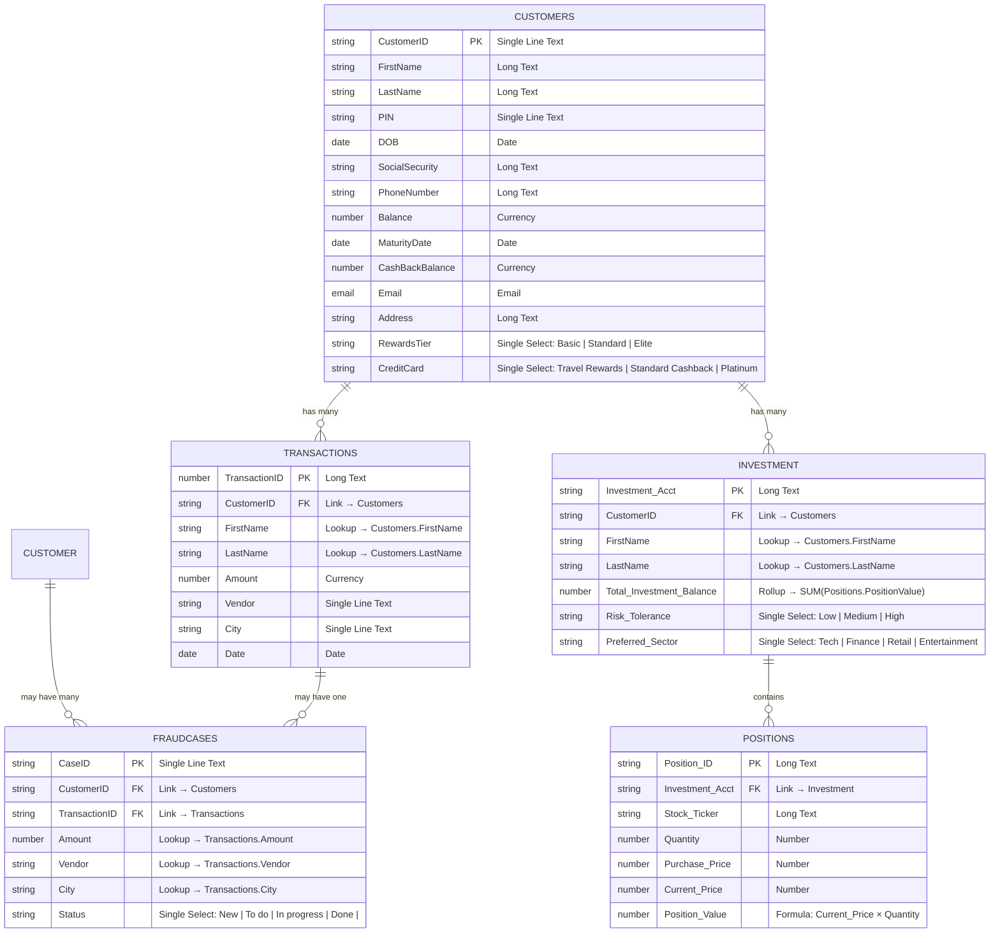

---

### Relationship Overview Diagram

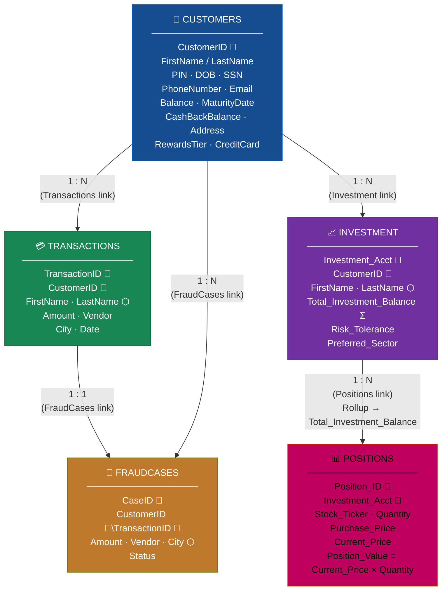

---

### Table References

???+ info "Customers"

    The central table of the base. Every other table links back to a **Customers** record. It holds all personal, financial, and account preference data needed by the AI Agent to authenticate, inform, and serve the customer.

    | Field | Type | Description |
    | :--- | :--- | :--- |
    | `CustomerID` | Single Line Text | **Primary key.** Unique identifier for each customer record. Referenced by Transactions and Investment as a foreign key. |
    | `FirstName` | Long Text | Customer's first name. Looked up by child tables to avoid duplication. |
    | `LastName` | Long Text | Customer's last name. Looked up by child tables to avoid duplication. |
    | `PIN` | Single Line Text | 4-digit PIN used for the challenge-response authentication in the `authenticate_user` action. **Never disclosed to the customer.** |
    | `DOB` | Date | Date of birth. Used for identity verification. |
    | `SocialSecurity` | Long Text | Social security number. Sensitive field — handle with care. |
    | `PhoneNumber` | Long Text | Primary contact number. Used by the `fetch_balance` action to look up the customer record from the outbound call's DNIS. |
    | `Balance` | Currency | Current outstanding debt balance. Disclosed to the customer after authentication and used in the payment negotiation step. |
    | `MaturityDate` | Date | The date the debt matures. Used to communicate urgency during the debt collection call. |
    | `CashBackBalance` | Currency | Accumulated cashback reward balance. Provided on request via `fetch_balance`. |
    | `Email` | Email | Customer email address. Used by `payment_session` to deliver the NovaPay payment URL. |
    | `Address` | Long Text | Registered address. Available for identity verification purposes. |
    | `RewardsTier` | Single Select | Rewards programme tier: **Basic**, **Standard**, or **Elite**. |
    | `CreditCard` | Single Select | Card type held by the customer: **Travel Rewards**, **Standard Cashback**, or **Platinum**. |
    | `Transactions` | Link | Linked records in the **Transactions** table. One customer → many transactions. |
    | `FraudCases` | Link | Linked records in the **FraudCases** table. One customer → many fraud cases. |
    | `Investment` | Link | Linked records in the **Investment** table. One customer → many investment accounts. |

---

???+ info "Transactions"

    Records individual card transactions associated with a customer account. 

    | Field | Type | Description |
    | :--- | :--- | :--- |
    | `TransactionID` | Long Text | **Primary key.** Unique identifier for each transaction. |
    | `CustomerID` | Link → Customers | **Foreign key.** Links this transaction to the parent customer record. |
    | `FirstName` | Lookup → Customers | Pulled automatically from the linked Customers record. Read-only in this table. |
    | `LastName` | Lookup → Customers | Pulled automatically from the linked Customers record. Read-only in this table. |
    | `Amount` | Currency | Transaction amount. |
    | `Vendor` | Single Line Text | Merchant or vendor name (e.g. `Amazon`, `Shell`, `Tesco`). |
    | `City` | Single Line Text | City where the transaction occurred. |
    | `Date` | Date | Date of the transaction. |
    | `FraudCases` | Link | Linked records in the **FraudCases** table. One transaction → one fraud cases. |

---

???+ info "FraudCases"

    Records logged fraud casess for contested card transactions associated with a customer account. 

    | Field | Type | Description |
    | :--- | :--- | :--- |
    | `CaseID` | Single Line Text | **Primary key.** Unique identifier for each fraud case. |
    | `CustomerID` | Link → Customers | **Foreign key.** Links this fraud case to the parent customer record. |
    | `TransactionID` | Link → Transactions | **Foreign key.** Links this fraud case to the contested transaction. |
    | `Amount` | Lookup → Transactions | Pulled automatically from the linked Transaction record. Read-only in this table. |
    | `Vendor` | Lookup → Transactions | Pulled automatically from the linked Transaction record. Read-only in this table. |
    | `City` | Lookup → Transactions | Pulled automatically from the linked Transaction record. Read-only in this table. |
    | `Status` | Single Select | Case status: **New**, **To do**, **In Progress** or **Done**.|

---

???+ info "Investment"

    Represents an investment account linked to a customer. A customer may hold multiple investment accounts. The `Total_Investment_Balance` field is automatically computed as the sum of all linked **Positions** values.

    | Field | Type | Description |
    | :--- | :--- | :--- |
    | `Investment_Acct` | Long Text | **Primary key.** Unique investment account identifier. |
    | `CustomerID` | Link → Customers | **Foreign key.** Links this account to the parent customer record. |
    | `FirstName` | Lookup → Customers | Pulled automatically from the linked Customers record. |
    | `LastName` | Lookup → Customers | Pulled automatically from the linked Customers record. |
    | `Total_Investment_Balance` | Rollup | **Computed field.** Aggregates `Position_Value` across all linked Positions records using `SUM(values)`. Updates automatically when any linked position changes. |
    | `Risk_Tolerance` | Single Select | Investment risk profile: **Low**, **Medium**, or **High**. Used to tailor investment-related conversations. |
    | `Preferred_Sector` | Single Select | Customer's preferred investment sectors: **Tech**, **Finance**, **Retail**, **Entertainment**  |
    | `Positions` | Link | Linked records in the **Positions** table. One investment account → many positions. |

---

???+ info "Positions"

    Represents an individual stock holding within an investment account. The `Position_Value` is a computed formula field that reflects the current market value of the holding.

    | Field | Type | Description |
    | :--- | :--- | :--- |
    | `Position_ID` | Long Text | **Primary key.** Unique identifier for each position. |
    | `Investment_Acct` | Link → Investment | **Foreign key.** Links this position to its parent investment account. |
    | `Stock_Ticker` | Long Text | Stock ticker symbol (e.g. `AAPL`, `MSFT`, `NVDA`). |
    | `Quantity` | Number | Number of shares held. |
    | `Purchase_Price` | Number | Price per share at time of purchase (cost basis). |
    | `Current_Price` | Number | Current market price per share. Updated to reflect current valuation. |
    | `Position_Value` | Formula | **Computed field.** `{Current_Price} × {Quantity}`. Represents the current market value of the holding. This value is rolled up into `Total_Investment_Balance` in the parent Investment record. |

---

### Computed & Derived Fields Summary

The following fields are automatically maintained by Airtable — they should never be manually edited:

| Table | Field | Type | Derivation |
| :--- | :--- | :--- | :--- |
| Transactions | `FirstName` | Lookup | Pulled from linked `Customers.FirstName` |
| Transactions | `LastName` | Lookup | Pulled from linked `Customers.LastName` |
| Investment | `FirstName` | Lookup | Pulled from linked `Customers.FirstName` |
| Investment | `LastName` | Lookup | Pulled from linked `Customers.LastName` |
| Investment | `Total_Investment_Balance` | Rollup | `SUM(Positions.Position_Value)` |
| Positions | `Position_Value` | Formula | `{Current_Price} × {Quantity}` |


---

### Airtable API Usage in the Bootcamp

During the Bootocamp, you will create a number of action flows that will enable the interaction with this Airtable base via the REST API. Some examples below:

| Action | Table | Operation | Filter / Key |
| :--- | :--- | :--- | :--- |
| `fetch customer balance` | Customers | `GET` | `filterByFormula={PhoneNumber}="<normalized_number>"` |
| `confirm debt payment` | Customers | `PATCH` | Record ID from Customers — updates `Balance` field |
| `fetch card transactions` | Transactions | `GET` | `filterByFormula={CustomerID}="<id>"` + sort by Date desc + maxRecords=5 |

???+ warning "API Credentials"
    Each flow requires your **Airtable Personal Access Token** and **Base ID**. Once the Airtable base is created, you can find your Base API documentation at:
    ```
    https://airtable.com/<yourBaseID>/api/docs
    ```
    Personal Access Tokens are created at [https://airtable.com/create/tokens](https://airtable.com/create/tokens).

---

### Data Population Guidelines

When populating the base for Bootcamp testing, observe the following rules:

- **Customers table**: Every customer record must have a valid `PhoneNumber` (the number you will call from the Contact Center) and a working `Email` (where the Contact Center can send information to the customer). All other fields can use realistic but fake data.

    - **PIN field**: Set a 4-digit PIN for each test customer. This value is used to authenticate users before any query or any operation on their account can be done.

- **Transactions table**: Populate at least 1 transaction per test customer to enable meaningful `fetch transactions` responses during the call.
- **Investment & Positions tables**: Populate at least 1 investment entry with one position for the test customer. Required to test investment-related customer queries.


---

##  Build your Airtable base

Let´s start building your Airtable Base

???+ Webex "Create your free account in Airtable"

    **You can skip this step if you have already an account**.

    Go to <https://www.airtable.com/> and click on "Sign up for free".

    ???+ inline end "Create Airtable account"

        <figure markdown>
        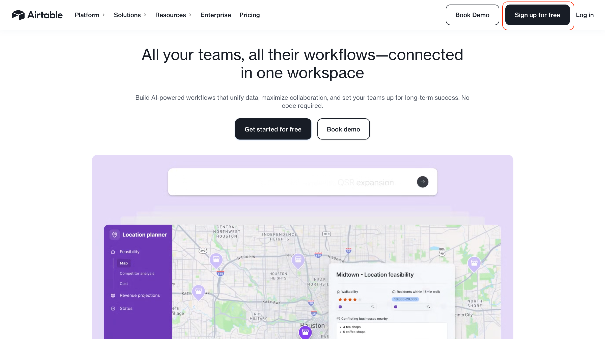
        </figure>

    Complete the steps to create your new account. You can skip creating your first app with the Assistant by clicking on
    the "x" at the upper-right corner of the screen and move to create a blank app. 
    
    After all this process, you will land into a brand new empty Base. A **Base** is the fundamental organizational unit---think of it as a database for a specific project or purpose. A Base is a container that holds all the tables, fields, records, views, and automations related to a single project or workflow. It\'s similar to a spreadsheet
    workbook or a relational database, but with a more visual and user-friendly interface.
    
    ???+ inline end "Create Airtable Base"

        <figure markdown>
        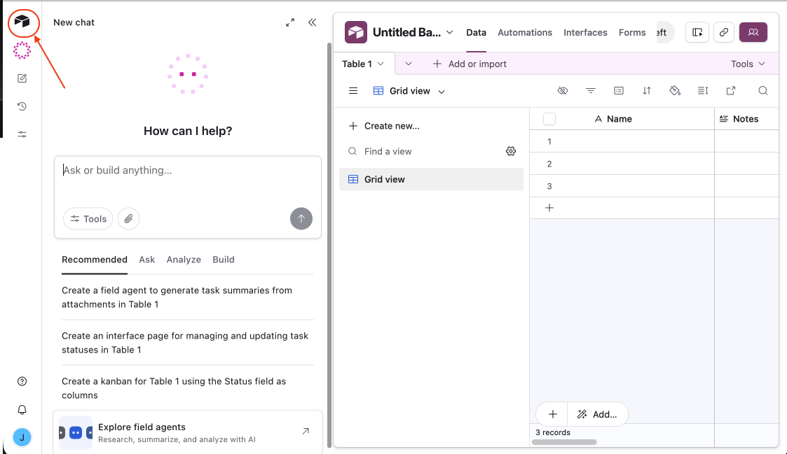
        </figure>

    Before building our Base, we will setup some other entities in Airtable. Click on the upper-left Airtable logo to "go home".

???+ Webex "Create your first Workspace"

    ???+ inline end "Create Workspace"
         <figure markdown>
        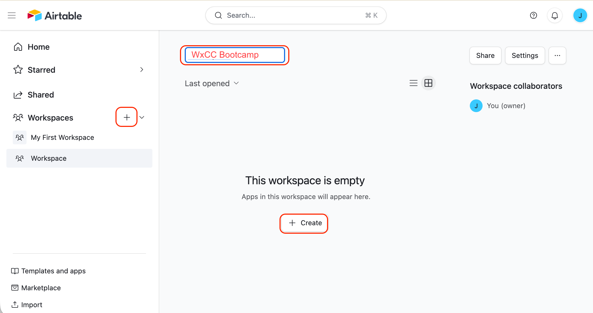
        </figure>
    
    Click on the "+" sign besides the "All workspaces"
    
    In the next window, give your Workspace a name. Say "WxCC Bootcamp".
    Then click on **[+ Create]** and in the next dialogue select **Build an app on your own**. Your are now ready to create your Base. 
    

### Create your **Bootcamp Base**

???+ gif inline end "Create your Base"
    <figure markdown>
    
    </figure>


Let´s build our base. After the previous step, you land into an empty grid view.


First, give it a name, changing the "Untitled Base" into a meaningful name: "Webex Bank". For that, click in the "Untitle Base" and provide the new name. 

Next we will need to create four tables for our Webex Bank: **Customers**, **Transactions**, **Investment** and **Positions**. We will proceed the same way for all of them: 

1. Import a csv file with the table template
2. Rename the table
2. Change the field types to the appropiate ones (the export to csv and import process converts all field types into simple data types and removes some complex types)

### Create the **Customers** table

???+ Webex "***Customers*** table"

    !!! download "Customers Table"
        Download the csv file for the [Customers Table](./bcamp_files/airtable_Customers.csv).

    1. Once you have downloaded your .csv file, click on **+ Add or import** and select **CSV file**. Drop or select your `airtable_Customers.csv` file and click **[Upload 1 file]**

    2. In the **Import your file** dialogue, select *+ Create a new table* and click **[Next]**

        ???+ info "Note on Sample Data"

            Each table includes pre-populated sample records to demonstrate the required data formats and schema standards. For security and flexibility, the **PhoneNumber** and **Email** fields have been intentionally left blank. You may populate these with your own test credentials during the Bootcamp; this allows you to leverage the existing example data for testing without the need to create a new customer profile from scratch.

    2. In the next window, you will need to adjust the type of some of the fields. Click the chevron next to the field name to expand the properties menu, then select the correct field type for the following fields: 

        |   Field   | Type       |
        | :----     | :----     |
        | CustomerID | `Single line text` |
        | PIN      | `Single line text` |
        | Balance   |   `Currency`|
        | CashbackBalance |  `Currency`|
        | Email | `Email` |
        | RewardsTier | `Single select`|
        | CreditCard    | `Single select`|

        Now, click **[Import]**

    3. Change the name of the Imported table to **Customers**: click on the chevron `v` besides the **Imported table** table name  and select *Rename table*. Type **Customers** and click **[Save]**

    4. Make sure the Date type fields have a proper date configuration (**DOB** and **MaturityDate**). Click  the chevron in the field, select **Edit field** and under **Date format** select *Local* and make sure the **include time* option is deactivated. Click **[Save]*

    4. Now populate the values for the *Single select* field types: 

        - Click the chevron besides the **RewardsTier** field, click **Edit field** and then **+ Add option** to add the following options:   
                
            <br><copy>Basic</copy>
            <br><copy>Standard</copy>
            <br><copy>Elite</copy>
                
            <br>Select *Basic* as the **Default** value and click **[Save]**

        - Do the same for the **CreditCard** field with the following values: 

            <br><copy>Standard Cashback</copy>
            <br><copy>Travel Rewards Card</copy>
            <br><copy>Platinum Card</copy>

            <br>Select *Standard Cashback* as the **Default** value and click **[Save]** 

    Your **Customers** table is ready.     

### Create the **Transactions** table

???+ Webex "***Transactions*** table"

    !!! download "Transactions Table"
        Download the csv file for the [Transactions Table](./bcamp_files/airtable_Transactions.csv).

    Now proceed as in the **Customers** table to import the csv file of the **Transactions** table.
    
    1. Once you have downloaded your .csv file, click on **+ Add or import** and select **CSV file**. Drop or select your `airtable_Transactions.csv` file and click **[Upload 1 file]**

    2. In the **Import your file** dialogue, select *+ Create a new table* and click **[Next]** and adjust the field types for the following fields: 

    |   Field   | Type       |
    | :----     | :----     |
    | Amount      | `Currency`  |
    | Vendor       |   `Single line text`  |
    | City       |   `Single line text`  |
    
    Click **[Import]**
    
    3. Change the name of the Imported table to **Transactions**: Click on the chevron besides the table name *Imported table* and select *Rename table*. Type **Transactions** and click **[Save]**
    
    We still need to adjust a few fields: 

    - In the **CustomerID** field, click the chevron, select **Edit field** and change the type to *Link to another record*. From the existing tables list, select **Customers** and click **[Save]**.
        - In the next dialogue window, select the fields we want to import from the **Customers** table: **FirstName** and **LastName**. Click **[Add 2 fields]**. This will create two new columns in your table.
    
    This will keep both tables connected and consistent. You will see in your Customers table a new field called **Transactions**. it will contain links to all the transactions associated to the customer. 
    
    ???+ example "Example population" 
    
        To complete the example population, add the transaction to the customer profile: 

        In the **Customers** table, click the `+`symbol in the *Transactions* empty cell of the customer record and add the *TRAN-001* to the customer record. 
        
        If you come back to the **Transactions** table, you will see the CustomerID, the FirstName and the LastName of the customer populated in the transaction record. 

    Your **Transactions** table is now ready.

### Create the **FraudCases** table

???+ Webex "***FraudCases*** table"

    !!! download "FraudCases Table"
        Download the csv file for the [FraudCases Table](./bcamp_files/airtable_FraudCases.csv).

    Now proceed as in previous table to import the csv file of the **FraudCases** table.
    
    1. Once you have downloaded your .csv file, click on **+ Add or import** and select **CSV file**. Drop or select your `airtable_FraudCases.csv` file and click **[Upload 1 file]**

    2. In the **Import your file** dialogue, select *+ Create a new table* and click **[Next]** and adjust the field types for the following fields: 

    |   Field   | Type       |
    | :----     | :----     |
    | CaseID      | `Single Line Text`  |
    | Status       |   `Single Select`  |

    
    Click **[Import]**
    
    3. Change the name of the Imported table to **FraudCases**: Click on the chevron besides the table name *Imported table* and select *Rename table*. Type **FraudCases** and click **[Save]**
    
    We still need to adjust a few fields: 

    - In the **CustomerID** field, click the chevron, select **Edit field** and change the type to *Link to another record*. From the existing tables list, select **Customers** and click **[Save]**.
        - In the next dialogue window, click **[Skip]**. We are not importing any field from the Customer table in this one. 

    - In the **TransactionID** field, click the chevron, select **Edit field** and change the type to *Link to another record*. From the existing tables list, select **Transactions** and click **[Save]**.
        - In the next dialogue window, select the fields we want to import from the **Transactions** table: **Amount**, **Vendor** and **City**. Click **[Add 3 fields]**. This will create three new columns in your table.
    
    This will keep the tables connected and consistent. You will see in your Customers and Transactions tables a new field called **FraudCases**. it will contain links to all the fraud cases associated to the customer and its transactions. 

    - In the **Status** field, click the chevron to edit the field and then click **+ Add option** to add the following options: New, To do, In Progress or Done
                
        <br><copy>New</copy>
        <br><copy>To do</copy>
        <br><copy>In Progress</copy>
        <br><copy>Done</copy>
            
        Select *New* as the **Default** value and click **[Save]**
    
    ???+ example "Example population" 
    
        To complete the example population, add the customer and the transaction to the fraud case: 

        In the **Customers** table, click the `+`symbol in the *FraudCases* empty cell of the customer record and add the *TRAN-001* to the customer record. 

        Proceed the same in the **Transactions** table. 
        
        If you come back to the **FraudCases** table, you will see the CustomerID, the TransactionID and the imported Ammount, Vendor and City values populated in the fraud case record. 

    Your **FraudCase** table is now ready.

### Create the **Investment** table

???+ Webex "***Investment*** table"

    !!! download "Investment Table"
        Download the csv file for the [Investment Table](./bcamp_files/airtable_Investment.csv).


    1. Once you have downloaded your .csv file, click on **+ Add or import** and select **CSV file**. Drop or select your `airtable_Investment.csv` file and click **[Upload 1 file]**

    2. In the **Import your file** dialogue, select *+ Create a new table* and click **[Next]**

    3. Now click the chevron beside the imported fields to edit the field data type and change the type to the below values for the following fields: 

         |   Field   | Type       |
        | :----     | :----     |
        | Risk_Tolerance      | `Single select`  |
        | Preferred_Sector    | `Single select`  |

    3. Click **[Import]**

    4. Change the name of the Imported table to **Investment**: Click on the chevron besides the table name *Imported table* and select *Rename table*. Type **Investment** and click **[Save]**
    
    Now proceed as in the previous tables to adjust the field types for the following fields: 

    - In the **CustomerID** field, click the chevron, select **Edit field** and change the type to *Link to another record*. From the existing tables list, select **Customers** and click **[Save]**.  
        - In the next dialogue window, select the fields we want to import from the **Customers** table: **FirstName** and **LastName**. Click **[Add 2 fields]**. This will create two new columns in your table.
    This will keep both tables connected and consistent. You will see in your Customers table a new field called **Investment** that will contain links to all the investments associated to the customer. 

    - In the **Risk_Tolerance** field, click the chevron to edit the field and then click **+ Add option** to add the following options: 
            
                
        <br><copy>Low</copy>
        <br><copy>Medium</copy>
        <br><copy>High</copy>
            
        Select *Medium* as the **Default** value and click **[Save]**
    
    - In the **Preferred_Sector** field, click the chevron to edit the field and then click **+ Add option** to add the following options: 
            
                
        <br><copy>Tech</copy>
        <br><copy>Finance</copy>
        <br><copy>Retail</copy>
        <br><copy>Entertainment</copy>
            
        Select *Tech* as the **Default** value and click **[Save]**

    The Investment table is not yet fully configured. You will need to return to it later to set the **Total_Investment_Balance** with the correct data type.

    However, since the field value depends on the **Positions** table content, you must first create the **Positions** table before completing this configuration.

    ???+ example "Example population" 
    
        To complete the example population in your Investment table, you can link the investment account to the customer: 

        In the **Investment** table, click the `+`symbol in the *CustomerID* empty cell of the investment record and add the *CUST-001* to the investment record. 
        
        That will populate the CustomerID, and import the FirstName and the LastName of the customer from the Customer table. 
    
### Create the **Positions** table

???+ Webex "***Positions*** table"

    !!! download "Positions Table"
        Download the csv file for the [Positions Table](./bcamp_files/airtable_Positions.csv).


    1. Once you have downloaded your .csv file, click on **+ Add or import** and select **CSV file**. Drop or select your `airtable_Positions.csv` file and click **[Upload 1 file]**

    2. In the **Import your file** dialogue, select *+ Create a new table* and click **[Next]**

    3. Click **[Import]**

    4. Change the name of the Imported table to **Positions**: Click on the chevron besides the table name *Imported table* and select *Rename table*. Type **Positions** and click **[Save]**
    
        Now you need to adjust the field types for the following fields: 

    5. In the **Investment_Acct** field, edit the field and change the data type to *Link to another record*. From the existing tables list, select **Investment** and click **[Save]**.  If you are asked to confirm the change, click **[Confirm change]**.
        - In the next dialogue window where you are asked to **Add lookup fields**, just **[Skip]**. We do not need additional fields here. 

        This will keep both tables connected and consistent. You will see in your **Investment** table a new field called **Positions** that contains links to all the investment positions associated to the investment account.


    6. In the **Position Value** field, change the field data type to *Formula*. Then, set the **Formula** to: 

        ```
        {Current_Price} * {Quantity}
        ``` 
        If you are asked for confirmation, **[Confirm change]**

    
    Your **Positions** table is ready. 

    Now you need to come back to your **Investment** table to complete the configuration of the pending field data types. 

    - Edit the **Total_Investment_Balance** field and change the data type to *Rollup*. In the **rollup source** field, select the field **Positions**, and in the **Positions field you want to roll up** option, select the field **Position Value**. 
    
        - Leave the **Aggregation formula** at the end as `SUM(values)`. This field calculates the total value of all the investment positions of the customer. 

    Click **[Save]**.

    Now your **Investment** table is also completed. 

    ???+ example "Example population" 
    
        To complete the example population in your Investments and Positions tables, you must link the positions to the investment account: 

        In the **Investment** table, click the `+`symbol in the *Positions* empty cell of the investment record and add the *POS-001* to the investment record. Repeate the process and add *POS-002*. 
        
        You will see now those two positions linked to the investment record in the **Positions** field and the **Total_Investment_Balance** value updated. 
        
        In the **Positions** table, you will see the **Investment_Acc** field updated with the investment record linked to every position. 

        


Your Airtable Base is now ready for the Bootcamp!!! Let´s now setup the API that will allow you to access your data from your flows.


## Setting up your Airtable API

Airtable's API uses token-based authentication, allowing users to
authenticate API requests by inputting their tokens into the HTTP
authorization bearer token header. Two type of tokens are supported:
personal access tokens and OAuth access tokens. As this is for a demo
environment, we will use [Personal Access
Tokens](https://airtable.com/developers/web/guides/personal-access-tokens)
(PAT).

???+ Webex "Create a Personal Access Token"

    1. To create your PAT, go to <https://airtable.com/create/tokens> and click
    on "Create token".

    ???+ gif inline end "Create your Token"
        <figure markdown>
        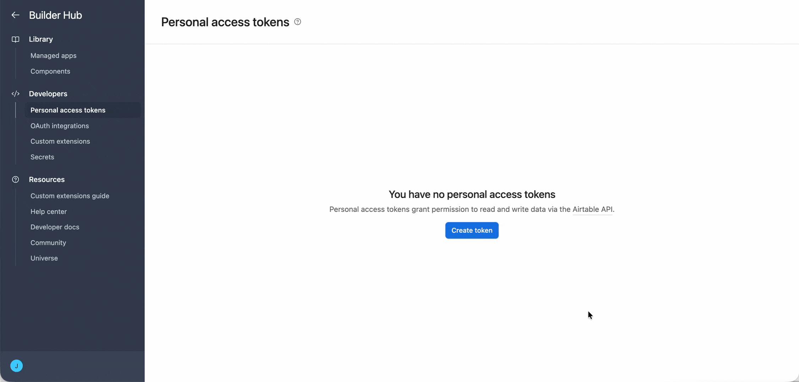
        </figure>

    2. Give your token a name: "Webex Bank PAT".

    3. Define the Scope for your token. You will need to select **data.records:read** and **data.records:write**, as we will need R/W access to the data.

    4. Click **+ Add a base** and select your workspace to enable API access to your database.

    5. Click on "Create Token"

    6. You should see a confirmation panel with your newly created token. This   will be the only time you will see your token, it will never be shown again, so make sure you copy it in a safe place for further use. Once saved, you can click on "Done".

    Now you will see your new token in your Personal access token site:

???+ Webex "APi Documentation"

    ???+ inline end "Create your Token"
        <figure markdown>
        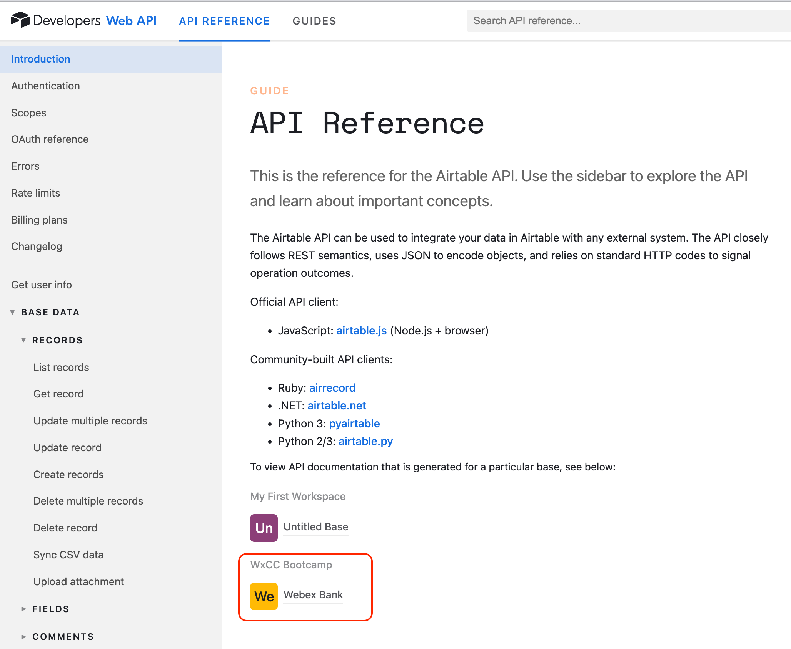
        </figure>
    
    Let's now generate the API documentation for your Airtable Base:

    1.  Go to <https://airtable.com/api>. This is Airtable's official API documentation portal.

    2.  Log into your Airtable account (if you're not already logged in).

    3.  You'll see the list of **Bases** you have access to. Click on your **Base**.

    
    4.  Airtable will generate **auto-documented API reference** for that Base, which includes:

        - Authentication setup

        - Endpoints for each **Table**

        - Example **GET**, **POST**, **PATCH**, and **DELETE** requests

        - Field names and data types

        - Sample code snippets (e.g., using curl, JavaScript, etc.)

    ???+ inline end "API Documentation"
        <figure markdown>
        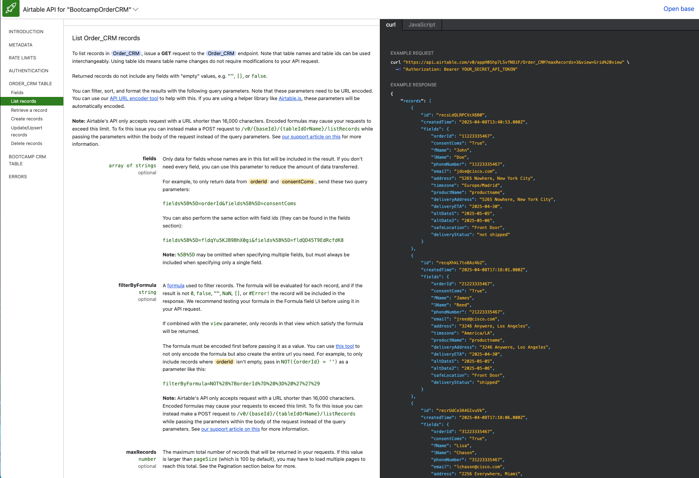
        </figure>


    ???+ Tip
        Make sure you have populated at least one entry in your tables so that the API documentation includes examples.

    Bookmark this page as it will be your API reference for your base.

    As you can see on the documentation, The **Airtable API URL** to access a base's content is constructed using a specific format that includes your **Base ID**, **Table Name (or ID)**, and the **API version**:

        https://api.airtable.com/v0/{{baseId}}/{{tableId}}

    - {{baseId}} -- A unique identifier for your base (e.g. app1234567890abcdef).

    - {{tableId}} -- The unique identity of the table. (e.g., tblABCDsGD34DS49J2). The tableId can be replaced by the
    {{tableName}}. If the table name contains spaces or special characters, it should be **URL-encoded** (e.g., My%20Table). To avoid formatting issues, we recommend you to use {{tableld}}

    ???+ inline end "API URL components"
        <figure markdown>
        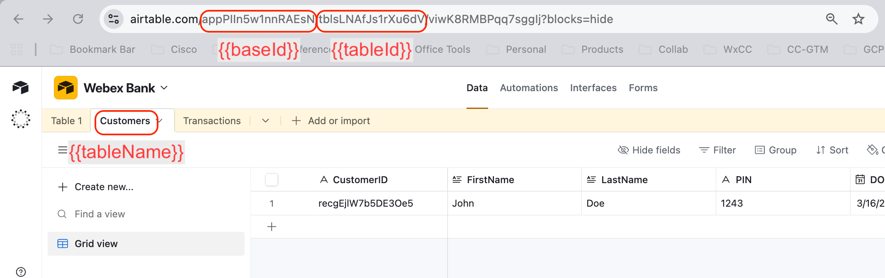
        </figure>
    
    Where you can find this information? This is detailed in the generated API documentation for your base, but it is also available in your base page. See the picture on the right.

    Take note of those values.

---

???+ Challenge "Test your Airtable API with Postman"

    While you can manage records and visualize data directly through the Airtable Web Interface (GUI), defining an Airtable API collection in Postman is a valuable step for this Bootcamp. Although not strictly required for basic data entry, a Postman collection allows you to verify your API configuration and ensure your endpoints are responsive. Since our automated flows will rely on this API to read and write data, setting up your collection now will guarantee your base is fully optimized and "integration-ready."

## Pre-Lab Check: Verifying Airtable Field Name Integrity

Before starting any lab exercise that interacts with Airtable tables via the API, it is essential to verify that all field names in your base are free of **hidden special characters**. These characters are silently introduced when tables are created by importing CSV files, and while they are invisible in the Airtable UI, they cause hard-to-diagnose errors when accessing or modifying data through the API. Although the .csv files have been cleaned up, the problem may exist in your Airtable base if you created it before the clean up. 

This guide explains the problem, how to detect it, and how to fix it automatically — with a step-by-step setup guide for both macOS and Windows.

---

### The Problem: Hidden Characters in CSV-Imported Field Names

When Airtable tables are created by importing CSV files, column headers are used as field names. CSV files — especially those exported from Excel, Google Sheets, or other tools — frequently embed invisible characters in those headers without any visible indication. The most common offenders are:

| Character | Unicode | Typical origin |
|---|---|---|
| Byte Order Mark (BOM) | `U+FEFF` | Excel / CSV exports |
| Non-breaking space | `U+00A0` | Copy-paste from web or Word |
| Zero-width space | `U+200B` | Web copy-paste |
| Zero-width non-joiner | `U+200C` | Word processors |
| Zero-width joiner | `U+200D` | Word processors |
| Soft hyphen | `U+00AD` | Word processors |
| Left-to-right mark | `U+200E` | RTL/LTR mixed text |
| Right-to-left mark | `U+200F` | RTL/LTR mixed text |
| ASCII control characters | `U+0000`–`U+001F` | Corrupt or malformed CSV |
| Leading / trailing whitespace | space, tab, newline | CSV column header formatting |

These characters are **completely invisible** in the Airtable interface. A field named `Temperature` and a field named `​Temperature` (with a hidden BOM at the start) look identical on screen. However, when your code references the field by name — for example, when filtering records, updating values, or building formulas — Airtable treats them as different names and the API call fails or returns unexpected results.

---

### The Solution: A Pre-Flight Checker Script

A Python script is provided that connects to the Airtable **Metadata API**, inspects every field name in every table of your base, detects any hidden or non-printable characters, and optionally renames the offending fields automatically.

The script has two modes:

- **Check mode** (read-only, safe): scans all field names and reports any issues without making changes.
- **Fix mode**: automatically renames all dirty fields to their clean equivalents.

???+ Recommendation
    Run the script in **Check mode** at the start of the Bootcamp. Only use **Fix mode** if issues are found.

---

???+ webex "Prerequisites"

    1. Python 3.10 or higher

        **macOS** — open Terminal and run:
        ```bash
        python3 --version
        ```

        **Windows** — open Command Prompt or PowerShell and run:
        ```cmd
        python --version
        ```

        If no version is shown, download and install Python from [python.org/downloads](https://python.org/downloads).  
        > <br> ⚠️ **Windows users:** during installation, make sure to tick **"Add Python to PATH"**.
        <br>
        <br>


    2. The `requests` library

        **macOS:**
        ```bash
        pip3 install requests
        ```

        **Windows:**
        ```cmd
        pip install requests
        ```


    3. The checker script

        !!! download Check Script
            Download the [Check Airtable Fields](./bcamp_files/check_airtable_fields.py){:download="check_airtable_fields.py"} file and save it into a folder you can easily navigate to, for example:

            - macOS: `~/Documents/lab-tools/`
            - Windows: `C:\Users\YourName\Documents\lab-tools\`

    4. Setting Up Airtable Credentials

        The script requires two credentials: the **Personal Access Token** (PAT) and your **Base ID**.

        Remember the Base ID is visible in the URL:

        ```
        https://airtable.com/appXXXXXXXXXXXXXX/tblYYYYYYYYYYYYYY/...
                             ^^^^^^^^^^^^^^^^^
                             This is your Base ID (starts with "app")
        ```

        ???+ info inline end "Update Token scope"
            <figure markdown>
            
            </figure> 


        At this stage you have already created your PAT and saved it. In order to make sure we can access the metadata API, you need to add a new scope to your token: 

        1. Go to [airtable.com/create/tokens](https://airtable.com/create/tokens)
        2. Click on your token
        4. Click on **+ Add a scope** and add:
            - `schema:bases:read` — required to inspect field names
            - `schema:bases:write` — required only if you want to auto-fix field names
        5. Click **[Save changes]**

            > ⚠️ **Important:** Both scopes and base access must be configured. A token that is missing either will be rejected with a `403` error, even if the token itself is valid. See the [Troubleshooting](#troubleshooting) section for details.

    Now you have everything you need for your verification script. 

???+ Webex "Configuring the Script"

    The script reads your credentials from **environment variables**. Set them as follows before running the script. Use your Airtable Base ID and PAT. 

    **macOS (Terminal)**

    ```bash
    export AIRTABLE_TOKEN="patXXXXXXXXXXXXXX"
    export AIRTABLE_BASE_ID="appXXXXXXXXXXXXXX"
    ```

    > These variables last only for the current Terminal session. 

    **Windows — Command Prompt**

    ```cmd
    set AIRTABLE_TOKEN=patXXXXXXXXXXXXXX
    set AIRTABLE_BASE_ID=appXXXXXXXXXXXXXX
    ```

    **Windows — PowerShell**

    ```powershell
    $env:AIRTABLE_TOKEN="patXXXXXXXXXXXXXX"
    $env:AIRTABLE_BASE_ID="appXXXXXXXXXXXXXX"
    ```

---

???+ Webex "Running the Script"

    Open a terminal, navigate to the folder where `check_airtable_fields.py` is saved, and run the appropriate command.

    1. Navigate to the script folder

        **macOS:**
        ```bash
        cd ~/Documents/lab-tools
        ```

        **Windows:**
        ```cmd
        cd C:\Users\YourName\Documents\lab-tools
        ```

    2. Check mode (always run this first)

        **macOS:**
        ```bash
        python3 check_airtable_fields.py
        ```

        **Windows:**
        ```cmd
        python check_airtable_fields.py
        ```

    3. Fix mode (only if issues are found)

        **macOS:**
        ```bash
        python3 check_airtable_fields.py --fix
        ```

        **Windows:**
        ```cmd
        python check_airtable_fields.py --fix
        ```

---

### Understanding the Output

For clean tables, the output from the check script will look like: 

```
==============================================================
  Airtable field-name checker  |  base: appcyTYF3nQqgReHR
  Mode: CHECK only (read-only)
==============================================================

Found 5 table(s).

  Table: 'Customers'  (17 fields)
  -------------------------------
    ✓  'CustomerID'
    ✓  'FirstName'
    ✓  'LastName'
    ✓  'PIN'
    ✓  'DOB'
    ✓  'SocialSecurity'
    ✓  'PhoneNumber'
    ✓  'Balance'
    ✓  'MaturityDate'
    ✓  'CashbackBalance'
    ✓  'Email'
    ✓  'Address'
    ✓  'RewardsTier'
    ✓  'CreditCard'
    ✓  'Transactions'
    ✓  'InvestmentAccount'
    ✓  'FraudCases'
    All fields look clean.

  Table: 'Transactions'  (9 fields)
  ---------------------------------
    ✓  'TransactionID'
    ✓  'CustomerID'
    ✓  'Amount'
    ✓  'Vendor'
    ✓  'City'
    ✓  'FirstName (from FirstName)'
    ✓  'LastName'
    ✓  'Date'
    ✓  'FraudCases'
    All fields look clean.

  Table: 'Investment'  (8 fields)
  -------------------------------
    ✓  'Investment_Acct'
    ✓  'CustomerID'
    ✓  'FirstName (from CustomerID)'
    ✓  'LastName (from CustomerID)'
    ✓  'Total_Investment_Balance'
    ✓  'Risk_Tolerance'
    ✓  'Preferred_Sector'
    ✓  'Positions'
    All fields look clean.

  Table: 'Positions'  (7 fields)
  ------------------------------
    ✓  'Position_ID'
    ✓  'Investment_Acct'
    ✓  'Stock_Ticker'
    ✓  'Quantity'
    ✓  'Purchase_Price'
    ✓  'Current_Price'
    ✓  'Position_Value'
    All fields look clean.

  Table: 'FraudCases'  (7 fields)
  -------------------------------
    ✓  'CaseID'
    ✓  'CustomerID'
    ✓  'TransactionID'
    ✓  'Amount (from Assignee)'
    ✓  'Vendor (from Assignee)'
    ✓  'City (from Assignee)'
    ✓  'Status'
    All fields look clean.

==============================================================
SUMMARY
==============================================================
  Tables checked  : 5
  Fields checked  : 48
  Dirty fields    : 0

✔  All field names are clean. Safe to start lab exercises.
```

In case of dirty fields are present in any of the tables, the output of the script will look like: 

``` 
==============================================================
  Airtable field-name checker  |  base: appcyTYF3nQqgReHR
  Mode: CHECK only (read-only)
==============================================================

Found 5 table(s).

  Table: 'Customers'  (17 fields)
  -------------------------------
    ✓  'CustomerID'
    ✓  'FirstName'
    ✓  'LastName'
    ✓  'PIN'
    ✓  'DOB'
    ✓  'SocialSecurity'
    ✓  'PhoneNumber'
    ✓  'Balance'
    ✓  'MaturityDate'
    ✓  'CashbackBalance'
    ✓  'Email'
    ✓  'Address'
    ✓  'RewardsTier'
    ✗  '\ufeffCreditCard'
       ↳ U+FEFF (ZERO WIDTH NO-BREAK SPACE)
       → suggested clean name: 'CreditCard'
    ✓  'Transactions'
    ✓  'InvestmentAccount'
    ✓  'FraudCases'

  Table: 'Transactions'  (9 fields)
  ---------------------------------
    ✓  'TransactionID'
    ✓  'CustomerID'
    ✓  'Amount'
    ✓  'Vendor'
    ✓  'City'
    ✓  'FirstName (from FirstName)'
    ✓  'LastName'
    ✓  'Date'
    ✓  'FraudCases'
    All fields look clean.

  Table: 'Investment'  (8 fields)
  -------------------------------
    ✓  'Investment_Acct'
    ✓  'CustomerID'
    ✓  'FirstName (from CustomerID)'
    ✓  'LastName (from CustomerID)'
    ✓  'Total_Investment_Balance'
    ✓  'Risk_Tolerance'
    ✓  'Preferred_Sector'
    ✓  'Positions'
    All fields look clean.

  Table: 'Positions'  (7 fields)
  ------------------------------
    ✓  'Position_ID'
    ✓  'Investment_Acct'
    ✓  'Stock_Ticker'
    ✓  'Quantity'
    ✓  'Purchase_Price'
    ✓  'Current_Price'
    ✓  'Position_Value'
    All fields look clean.

  Table: 'FraudCases'  (7 fields)
  -------------------------------
    ✓  'CaseID'
    ✓  'CustomerID'
    ✓  'TransactionID'
    ✓  'Amount (from Assignee)'
    ✓  'Vendor (from Assignee)'
    ✓  'City (from Assignee)'
    ✓  'Status'
    All fields look clean.

==============================================================
SUMMARY
==============================================================
  Tables checked  : 5
  Fields checked  : 48
  Dirty fields    : 1

⚠  1 dirty field(s) found. Re-run with --fix to rename them automatically.

  Detailed report written to: field_issues_report.txt
``` 


#### Clean field

<figure markdown>
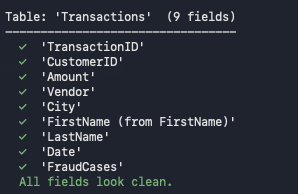
</figure> 

A green tick means the field name contains no hidden characters and is safe to use.

#### Dirty field


<figure markdown>
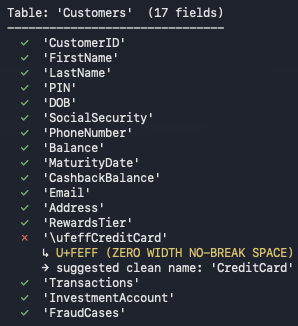
</figure> 

A red cross means the field name contains one or more hidden characters. The script shows the exact character(s) found and the suggested clean name.

#### Summary block

<figure markdown>
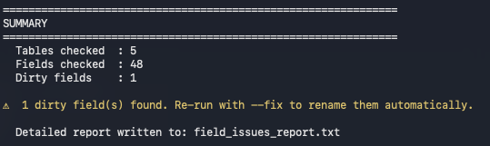
</figure>

If you get dirty fields reported, either re-run the script with the --fix option or manually remove and re-edit the field name in your Airtable. 

If all fields are clean, you will see:

<figure markdown>
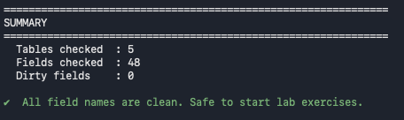
</figure>

In this case, you are good to go with the Bootcamp labs!!!!

#### Report file

If any issues are found, the script also writes a plain-text file called `field_issues_report.txt` in the same folder, which lists every problem found — useful to keep as an audit record.

---

### Troubleshooting

#### `403 INVALID_PERMISSIONS_OR_MODEL_NOT_FOUND`

This is the most common error. It means the token reached Airtable but was rejected. It does **not** mean the token is invalid. Check the following on your token settings page at [airtable.com/create/tokens](https://airtable.com/create/tokens):

| Check | What to look for |
|---|---|
| Scopes | `schema:bases:read` must be listed |
| Access | Your base ID must be explicitly added |

> **Note:** The Metadata API (`/v0/meta/bases/...`) requires `schema:bases:read` specifically. A token that works on the regular data API (`/v0/{baseId}/{tableName}`) — for example one tested in Postman — will still fail on the Metadata API if this scope is missing.

---

#### Environment variable not set

If the script exits with `ERROR: Set AIRTABLE_TOKEN`, the variable was not found in the environment. This commonly happens after opening a new Terminal window.

Verify the variable is set:
```bash
# macOS / Linux
echo $AIRTABLE_TOKEN

# Windows Command Prompt
echo %AIRTABLE_TOKEN%

# Windows PowerShell
echo $env:AIRTABLE_TOKEN
```

If nothing is printed, re-run the `export` / `set` command from the **Configuring the Script** section.

---

#### Token contains hidden characters

If the token was copy-pasted with surrounding spaces or invisible characters, the script will be sending a malformed `Authorization` header. Run the debug snippet below to inspect it:

```python
import os
TOKEN = os.getenv("AIRTABLE_TOKEN", "")
print(f"Length : {len(TOKEN)}")
print(f"Repr   : {repr(TOKEN[:15])}")
```

A valid token should look like:
```
Length : 82
Repr   : 'patHV74kWm....'
```

If `repr()` shows any `\n`, `\r`, `\ufeff`, or unexpected spaces around the value, unset the variable and re-set it carefully.

---

#### `ModuleNotFoundError: No module named 'requests'`

The `requests` library is not installed. Run:

```bash
# macOS
pip3 install requests

# Windows
pip install requests
```

---

### Quick-Reference Cheat Sheet

| Step | macOS | Windows |
|---|---|---|
| Check Python | `python3 --version` | `python --version` |
| Install library | `pip3 install requests` | `pip install requests` |
| Set token | `export AIRTABLE_TOKEN="..."` | `set AIRTABLE_TOKEN=...` |
| Set base ID | `export AIRTABLE_BASE_ID="..."` | `set AIRTABLE_BASE_ID=...` |
| Run check | `python3 check_airtable_fields.py` | `python check_airtable_fields.py` |
| Run fix | `python3 check_airtable_fields.py --fix` | `python check_airtable_fields.py --fix` |
| Verify env var | `echo $AIRTABLE_TOKEN` | `echo %AIRTABLE_TOKEN%` |